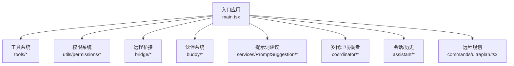
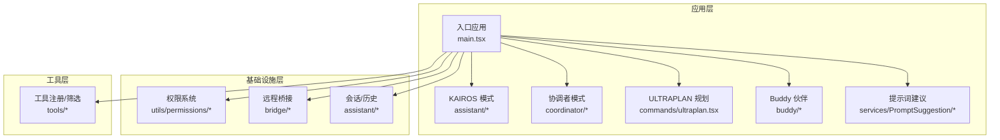
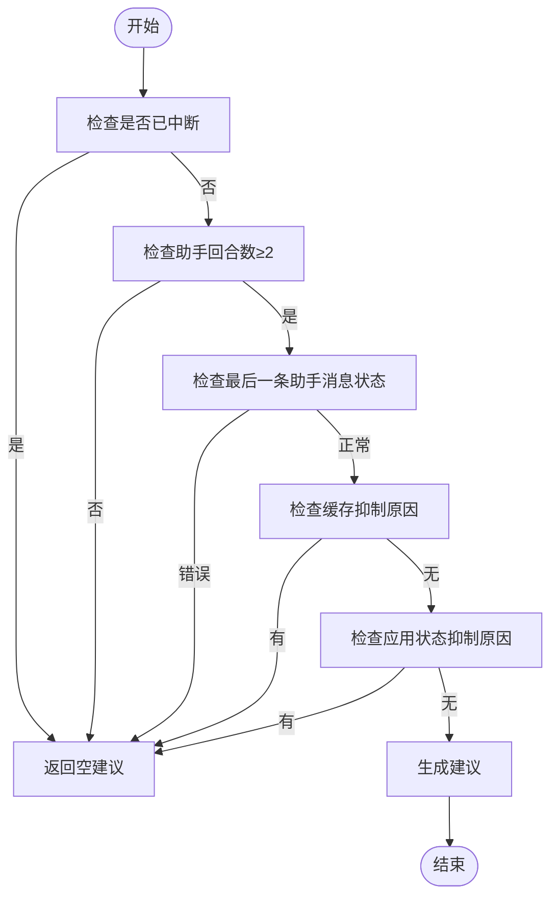
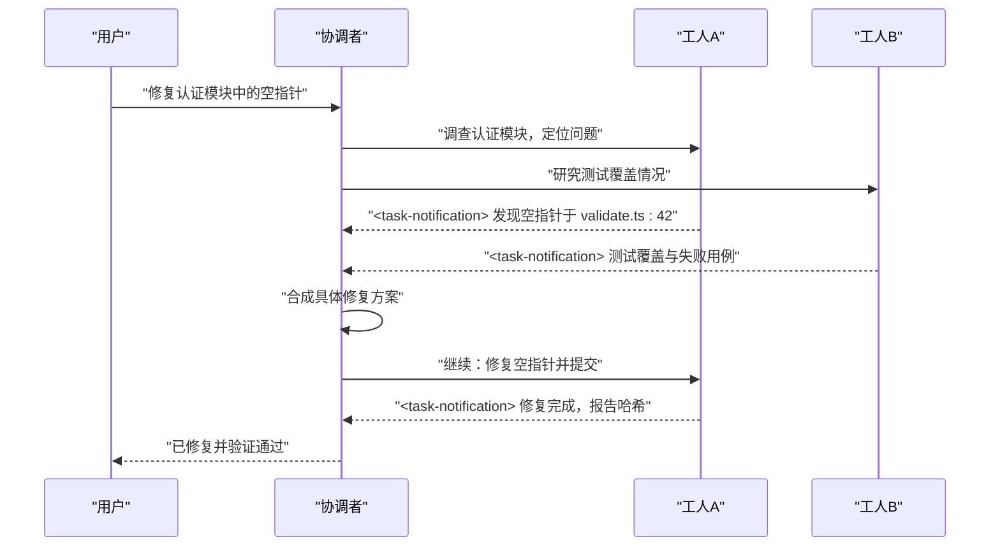
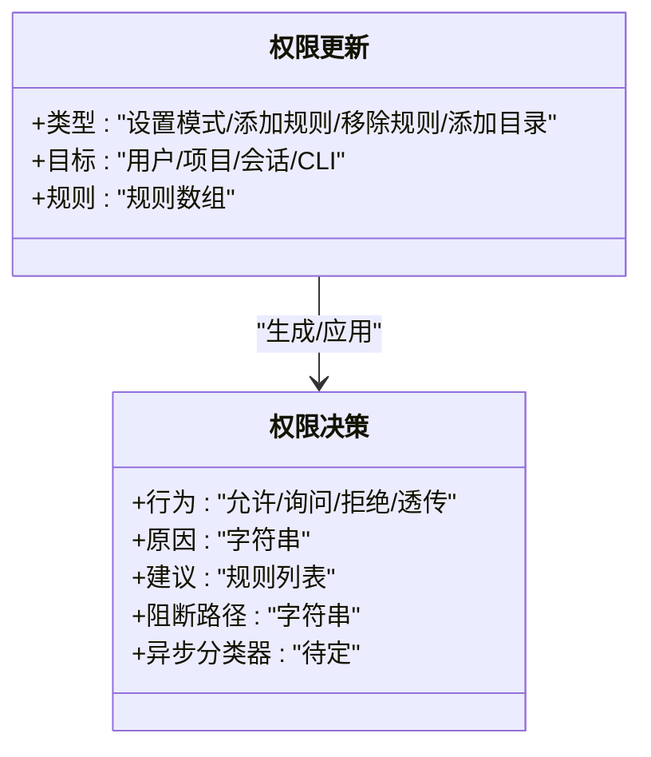
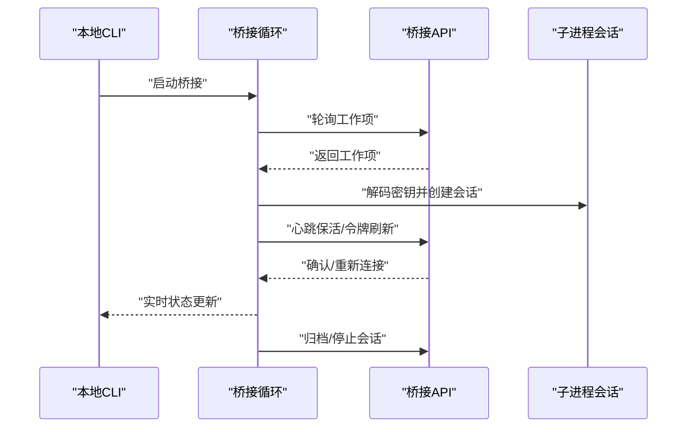
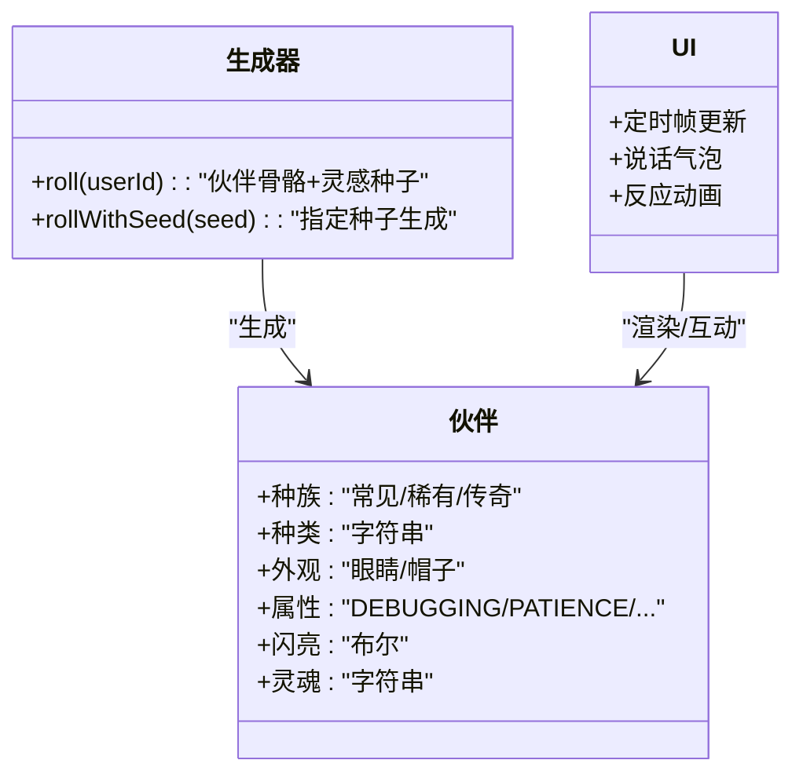
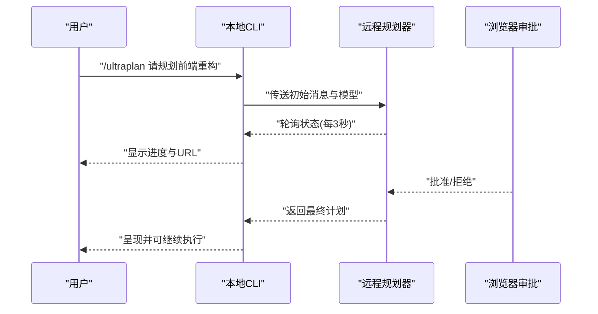
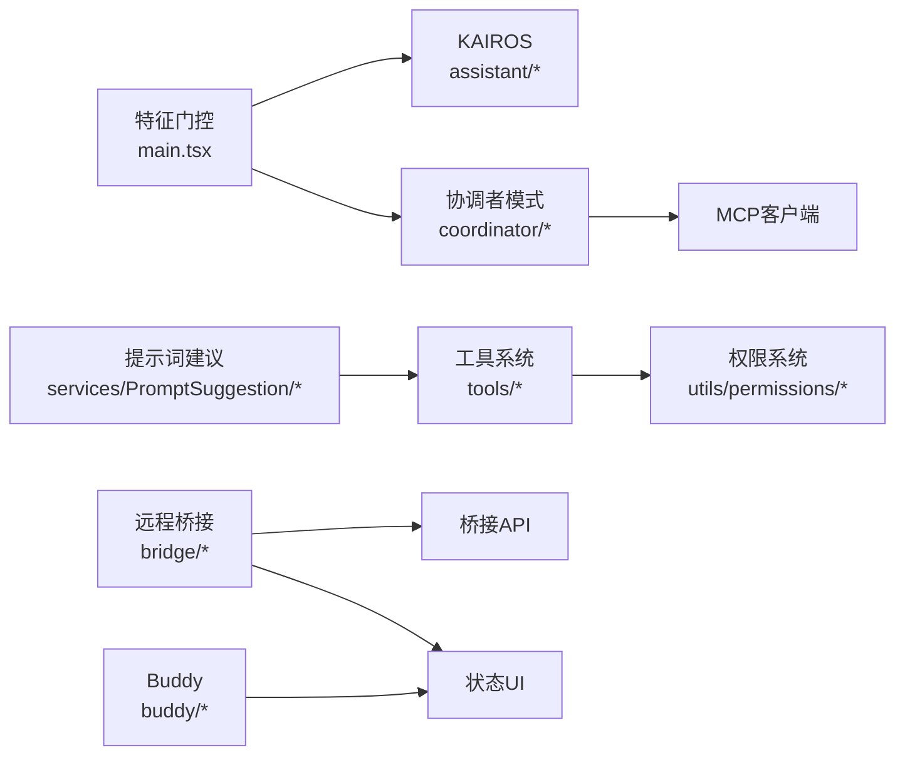

# 核心特性

<cite>
**本文引用的文件**
- [README.md](file://README.md)
- [main.tsx](file://main.tsx)
- [coordinatorMode.ts](file://coordinator/coordinatorMode.ts)
- [assistant/sessionHistory.ts](file://assistant/sessionHistory.ts)
- [ultraplan.tsx](file://commands/ultraplan.tsx)
- [keyword.ts](file://utils/ultraplan/keyword.ts)
- [bridgeMain.ts](file://bridge/bridgeMain.ts)
- [bridgeConfig.ts](file://bridge/bridgeConfig.ts)
- [bridge.tsx](file://commands/bridge/bridge.tsx)
- [index.ts](file://commands/bridge/index.ts)
- [companion.ts](file://buddy/companion.ts)
- [CompanionSprite.tsx](file://buddy/CompanionSprite.tsx)
- [useBuddyNotification.tsx](file://buddy/useBuddyNotification.tsx)
- [prompt.ts](file://buddy/prompt.ts)
- [promptSuggestion.ts](file://services/PromptSuggestion/promptSuggestion.ts)
- [TeamCreateTool.ts](file://tools/TeamCreateTool/TeamCreateTool.ts)
- [permissions.ts](file://types/permissions.ts)
- [BashPermissionRequest.tsx](file://components/permissions/BashPermissionRequest/BashPermissionRequest.tsx)
- [permissions.tsx](file://commands/permissions/permissions.tsx)
- [PermissionUpdate.ts](file://utils/permissions/PermissionUpdate.ts)
- [shellRuleMatching.ts](file://utils/permissions/shellRuleMatching.ts)
- [settings.ts](file://utils/settings/mdm/settings.ts)
- [leaderPermissionBridge.ts](file://utils/swarm/leaderPermissionBridge.ts)
- [useSwarmPermissionPoller.ts](file://hooks/useSwarmPermissionPoller.ts)
</cite>

## 目录
1. [引言](#引言)
2. [项目结构](#项目结构)
3. [核心组件](#核心组件)
4. [架构总览](#架构总览)
5. [详细组件分析](#详细组件分析)
6. [依赖分析](#依赖分析)
7. [性能考虑](#性能考虑)
8. [故障排查指南](#故障排查指南)
9. [结论](#结论)
10. [附录：特性对比表](#附录特性对比表)

## 引言
本文件面向 Claude Code 项目的使用者与开发者，系统性梳理并阐释其核心特性：智能代码补全、多代理协作（协调者模式）、权限控制系统、远程桥接、Buddy 伙伴系统、KAIROS 持续助手、ULTRAPLAN 远程规划等。文档从设计原理、实现方式、使用场景到特性间的协同关系进行深入解析，并提供最佳实践与排障建议，帮助读者高效构建“AI 编程助手生态系统”。

## 项目结构
Claude Code 的整体结构围绕“入口应用 + 工具系统 + 多子系统”展开：
- 入口与条件加载：通过特征门控按需加载 KAIROS、协调者模式等模块，避免外部构建包含内部特性。
- 工具系统：内置 40+ 工具，覆盖文件操作、终端执行、网络访问、计划与任务管理、MCP 资源访问等。
- 子系统：权限控制、远程桥接、伙伴系统、提示词建议、多代理编队与协作、历史与会话管理、远程规划等。

图示来源
- [main.tsx:68-82](file://main.tsx#L68-L82)
- [coordinatorMode.ts:1-370](file://coordinator/coordinatorMode.ts#L1-L370)
- [bridgeMain.ts:1-800](file://bridge/bridgeMain.ts#L1-L800)
- [companion.ts:1-134](file://buddy/companion.ts#L1-L134)
- [promptSuggestion.ts:121-299](file://services/PromptSuggestion/promptSuggestion.ts#L121-L299)

章节来源
- [main.tsx:68-82](file://main.tsx#L68-L82)

## 核心组件
- 智能代码补全：基于对话上下文与缓存抑制策略生成“下一步建议”，避免过早或错误触发，提升交互连贯性。
- 多代理协作：协调者模式下，主代理负责研究、合成与验证，工人代理并行执行具体任务；支持跨代理知识共享与持续跟进。
- 权限控制系统：多层级权限模式（默认/自动/豁免/严格），风险分级与规则匹配，保护敏感文件与路径，提供解释与建议。
- 远程桥接：通过 JWT 认证与心跳机制在本地与云端环境间建立稳定连接，支持多会话并发与容量唤醒。
- Buddy 伙伴系统：确定性随机生成伙伴，带属性、外观与“灵魂描述”，在终端中以动画气泡互动。
- KAIROS 持续助手：常驻日志观察与主动行动，配合简要输出模式，提供“不打扰”的持续协助。
- ULTRAPLAN 远程规划：将复杂规划任务外发至远程容器运行时，本地轮询结果并通过浏览器审批，实现“远程深思，本地决策”。

章节来源
- [promptSuggestion.ts:121-299](file://services/PromptSuggestion/promptSuggestion.ts#L121-L299)
- [coordinatorMode.ts:111-370](file://coordinator/coordinatorMode.ts#L111-L370)
- [permissions.ts:238-266](file://types/permissions.ts#L238-L266)
- [bridgeMain.ts:141-800](file://bridge/bridgeMain.ts#L141-L800)
- [companion.ts:1-134](file://buddy/companion.ts#L1-L134)
- [assistant/sessionHistory.ts:1-88](file://assistant/sessionHistory.ts#L1-L88)
- [ultraplan.tsx:196-412](file://commands/ultraplan.tsx#L196-L412)

## 架构总览
Claude Code 的运行时由“入口应用 + 特征门控 + 工具调度 + 权限与安全 + 远程桥接 + 伙伴与提示词 + 协作与规划”构成。入口根据特征门控决定是否加载 KAIROS、协调者模式等模块；工具系统统一注册与筛选；权限系统贯穿所有工具调用；远程桥接提供跨环境能力；伙伴与提示词增强用户体验；协作与规划模块提升复杂任务处理能力。

图示来源
- [main.tsx:68-82](file://main.tsx#L68-L82)
- [coordinatorMode.ts:36-78](file://coordinator/coordinatorMode.ts#L36-L78)
- [bridgeMain.ts:141-800](file://bridge/bridgeMain.ts#L141-L800)
- [ultraplan.tsx:234-412](file://commands/ultraplan.tsx#L234-L412)
- [companion.ts:1-134](file://buddy/companion.ts#L1-L134)
- [promptSuggestion.ts:121-299](file://services/PromptSuggestion/promptSuggestion.ts#L121-L299)

## 详细组件分析

### 组件一：智能代码补全（提示词建议）
- 设计原理：基于对话回合数、上一条助手消息状态、缓存抑制原因与应用状态，过滤掉不适合生成建议的时机，确保建议“贴合用户意图”且“简洁明确”。
- 实现要点：
  - 建议生成前的多层抑制检查（早期对话、API 错误、缓存抑制）。
  - 使用预置提示模板与缓存安全参数，保证一致性与可复用性。
- 使用场景：在用户输入前后提供“下一步”建议，减少思考成本，提升迭代效率。
- 最佳实践：保持建议短小精悍、与用户风格一致；避免评价性、问题式或新想法类内容。

图示来源
- [promptSuggestion.ts:121-299](file://services/PromptSuggestion/promptSuggestion.ts#L121-L299)

章节来源
- [promptSuggestion.ts:121-299](file://services/PromptSuggestion/promptSuggestion.ts#L121-L299)

### 组件二：多代理协作（协调者模式）
- 设计原理：将复杂任务拆分为“研究—合成—实现—验证”四阶段，主代理统筹并行工人代理，避免串行瓶颈；工人代理通过专用工具与 MCP 服务器协作。
- 实现要点：
  - 系统提示词定义角色、工具集、任务流程与并发策略。
  - 支持“继续/新建”两种推进方式，依据上下文重叠度选择最优路径。
  - 可选“草稿板目录”用于跨代理持久化知识。
- 使用场景：重构、多模块并行开发、跨语言/框架迁移、CI 验证与 PR 准备。
- 最佳实践：先合成再实现，避免“基于发现”式的懒惰委托；对失败的工人继续而非替换，优先保留上下文。

图示来源
- [coordinatorMode.ts:111-370](file://coordinator/coordinatorMode.ts#L111-L370)

章节来源
- [coordinatorMode.ts:1-370](file://coordinator/coordinatorMode.ts#L1-L370)

### 组件三：权限控制系统
- 设计原理：多模式（默认/自动/豁免/严格）+ 风险分级（低/中/高）+ 规则匹配（精确/前缀/通配），结合 ML 自动审批与人工解释，实现“最小授权 + 可解释”。
- 实现要点：
  - 权限更新支持添加/移除规则、目录白名单、模式切换与持久化。
  - 提供规则建议（精确命令、前缀、通配），并可生成解释说明。
  - MDM 设置解析与无效规则过滤，保障企业级配置稳定性。
- 使用场景：自动化脚本执行、批量文件修改、MCP 资源访问、团队协作中的权限治理。
- 最佳实践：优先使用精确规则；对危险规则进行“剥离-恢复”管理；在自动模式下谨慎放宽策略。

图示来源
- [permissions.ts:238-266](file://types/permissions.ts#L238-L266)
- [PermissionUpdate.ts:45-83](file://utils/permissions/PermissionUpdate.ts#L45-L83)
- [shellRuleMatching.ts:153-228](file://utils/permissions/shellRuleMatching.ts#L153-L228)
- [settings.ts:178-222](file://utils/settings/mdm/settings.ts#L178-L222)

章节来源
- [permissions.ts:238-266](file://types/permissions.ts#L238-L266)
- [PermissionUpdate.ts:45-83](file://utils/permissions/PermissionUpdate.ts#L45-L83)
- [shellRuleMatching.ts:153-228](file://utils/permissions/shellRuleMatching.ts#L153-L228)
- [settings.ts:178-222](file://utils/settings/mdm/settings.ts#L178-L222)

### 组件四：远程桥接（远程控制）
- 设计原理：通过 JWT 认证与心跳保活，在本地与云端环境之间建立稳定通道；支持多会话并发、容量唤醒与工作树隔离。
- 实现要点：
  - 池化轮询与退避策略，区分连接错误与一般错误，具备“重新连接”与“致命错误”处理。
  - 令牌刷新与 v2 环境的“重新连接”机制，避免会话静默死亡。
  - UI 层实时显示会话数量、活动与状态，支持单/多会话模式。
- 使用场景：远程调试、跨设备协作、云端资源编排、大规模并发任务调度。
- 最佳实践：合理设置最大会话数与轮询间隔；关注令牌刷新与认证失败路径；在多会话模式下启用容量唤醒。

图示来源
- [bridgeMain.ts:141-800](file://bridge/bridgeMain.ts#L141-L800)
- [bridgeConfig.ts:1-49](file://bridge/bridgeConfig.ts#L1-L49)
- [bridge.tsx:142-193](file://commands/bridge/bridge.tsx#L142-L193)
- [index.ts:1-26](file://commands/bridge/index.ts#L1-L26)

章节来源
- [bridgeMain.ts:141-800](file://bridge/bridgeMain.ts#L141-L800)
- [bridgeConfig.ts:1-49](file://bridge/bridgeConfig.ts#L1-L49)
- [bridge.tsx:142-193](file://commands/bridge/bridge.tsx#L142-L193)
- [index.ts:1-26](file://commands/bridge/index.ts#L1-L26)

### 组件五：Buddy 伙伴系统
- 设计原理：基于确定性伪随机数生成器与用户标识，为每位用户生成唯一伙伴；外观与属性随稀有度变化，带“灵魂描述”与动画气泡互动。
- 实现要点：
  - 种族权重、属性分布与闪亮概率；骨骼信息与存储的灵魂合并，保证可演进性。
  - UI 组件定时更新帧、反应与说话气泡，支持“撸猫”反馈与颜色标识。
  - 仅在开启 BUDDY 特征门时生效。
- 使用场景：提升终端交互趣味性、缓解长时间编码压力、作为“旁观者”参与对话。
- 最佳实践：在合适时机引导用户使用 /buddy 触发提示；注意静音与提示开关。

图示来源
- [companion.ts:1-134](file://buddy/companion.ts#L1-L134)
- [CompanionSprite.tsx:187-223](file://buddy/CompanionSprite.tsx#L187-L223)
- [useBuddyNotification.tsx:38-97](file://buddy/useBuddyNotification.tsx#L38-L97)
- [prompt.ts:1-36](file://buddy/prompt.ts#L1-L36)

章节来源
- [companion.ts:1-134](file://buddy/companion.ts#L1-L134)
- [CompanionSprite.tsx:187-223](file://buddy/CompanionSprite.tsx#L187-L223)
- [useBuddyNotification.tsx:38-97](file://buddy/useBuddyNotification.tsx#L38-L97)
- [prompt.ts:1-36](file://buddy/prompt.ts#L1-L36)

### 组件六：KAIROS 持续助手
- 设计原理：常驻日志观察与周期性 tick 决策，限制主动动作阻塞预算，提供简要输出模式，避免干扰用户工作流。
- 实现要点：
  - 会话历史分页拉取与锚点查询，支持“最新事件”与“更旧事件”翻页。
  - Brief 模式强调“少即是多”，适合持续助手的轻量输出。
- 使用场景：代码库长期观察、PR 监控、通知推送、日志摘要生成。
- 最佳实践：合理设置 tick 间隔与阻塞预算；在需要时切换到常规模式获取完整上下文。

章节来源
- [assistant/sessionHistory.ts:1-88](file://assistant/sessionHistory.ts#L1-L88)

### 组件七：ULTRAPLAN 远程规划
- 设计原理：识别用户输入中的“ultraplan”关键词，外发至远程 CCR 会话进行深度思考，本地轮询审批结果，支持停止与清理。
- 实现要点：
  - 关键词检测与替换，确保转发语义正确。
  - 启动/轮询/停止/归档全流程，异常时自动清理孤儿会话。
  - 与计划模式/审批流程无缝衔接。
- 使用场景：长周期规划、复杂架构设计、跨模块重构方案、技术评审前置准备。
- 最佳实践：在输入中明确“请规划此任务”；在浏览器端审阅后再回到本地执行；必要时及时停止以节省资源。

图示来源
- [ultraplan.tsx:196-412](file://commands/ultraplan.tsx#L196-L412)
- [keyword.ts:111-127](file://utils/ultraplan/keyword.ts#L111-L127)

章节来源
- [ultraplan.tsx:196-412](file://commands/ultraplan.tsx#L196-L412)
- [keyword.ts:111-127](file://utils/ultraplan/keyword.ts#L111-L127)

## 依赖分析
- 特征门控与按需加载：入口通过特征门控决定是否加载 KAIROS、协调者模式等模块，避免外部构建包含内部特性。
- 工具系统与权限：所有工具调用均受权限系统约束，权限更新与规则匹配贯穿工具生命周期。
- 远程桥接与会话：桥接循环依赖 API 轮询、心跳保活与令牌刷新；会话生命周期与 UI 状态联动。
- 多代理协作：协调者模式依赖工具注册、MCP 客户端与可选草稿板目录；工人代理通过专用工具与消息格式通信。
- Buddy 与提示词：Buddy 仅在开启门控时生效；提示词建议依赖对话上下文与缓存抑制逻辑。

图示来源
- [main.tsx:68-82](file://main.tsx#L68-L82)
- [coordinatorMode.ts:36-78](file://coordinator/coordinatorMode.ts#L36-L78)
- [bridgeMain.ts:141-800](file://bridge/bridgeMain.ts#L141-L800)
- [permissions.ts:238-266](file://types/permissions.ts#L238-L266)
- [promptSuggestion.ts:121-299](file://services/PromptSuggestion/promptSuggestion.ts#L121-L299)

章节来源
- [main.tsx:68-82](file://main.tsx#L68-L82)
- [coordinatorMode.ts:36-78](file://coordinator/coordinatorMode.ts#L36-L78)
- [bridgeMain.ts:141-800](file://bridge/bridgeMain.ts#L141-L800)
- [permissions.ts:238-266](file://types/permissions.ts#L238-L266)
- [promptSuggestion.ts:121-299](file://services/PromptSuggestion/promptSuggestion.ts#L121-L299)

## 性能考虑
- 轮询与退避：桥接循环采用指数退避与最大回退时间，降低服务器压力与本地 CPU 占用。
- 心跳与容量唤醒：在满载时仅心跳保活，减少不必要的轮询；容量唤醒可立即承接新任务。
- 权限决策缓存：权限系统使用缓存门控值，避免主线程阻塞；ML 分类器异步处理，减少交互延迟。
- 建议生成抑制：通过回合数、缓存抑制与状态检查，避免无效建议生成，降低模型调用开销。
- 多代理并发：协调者模式鼓励并行，但写密集任务需串行化，避免文件冲突与重复变更。

## 故障排查指南
- 权限相关
  - 症状：工具调用被拒绝或频繁弹窗。
  - 排查：检查权限模式与规则；查看规则建议与解释；必要时剥离危险规则后恢复。
  - 参考
    - [BashPermissionRequest.tsx:289-310](file://components/permissions/BashPermissionRequest/BashPermissionRequest.tsx#L289-L310)
    - [permissions.tsx:1-9](file://commands/permissions/permissions.tsx#L1-L9)
    - [PermissionUpdate.ts:45-83](file://utils/permissions/PermissionUpdate.ts#L45-L83)
- 远程桥接
  - 症状：会话卡住、令牌过期、无法轮询。
  - 排查：检查心跳保活与令牌刷新；关注“重新连接”与“致命错误”路径；确认多会话容量与唤醒。
  - 参考
    - [bridgeMain.ts:202-270](file://bridge/bridgeMain.ts#L202-L270)
    - [bridgeMain.ts:284-313](file://bridge/bridgeMain.ts#L284-L313)
- Buddy 与提示词
  - 症状：Buddy 不出现或建议不生效。
  - 排查：确认 BUDDY 特征门控；检查提示词建议的抑制条件与缓存策略。
  - 参考
    - [useBuddyNotification.tsx:38-97](file://buddy/useBuddyNotification.tsx#L38-L97)
    - [promptSuggestion.ts:121-299](file://services/PromptSuggestion/promptSuggestion.ts#L121-L299)
- 多代理协作
  - 症状：工人代理无响应或消息格式异常。
  - 排查：检查任务通知格式与上下文；确认继续/新建策略；核对工具可用性与 MCP 客户端。
  - 参考
    - [coordinatorMode.ts:142-160](file://coordinator/coordinatorMode.ts#L142-L160)
    - [TeamCreateTool.ts:128-143](file://tools/TeamCreateTool/TeamCreateTool.ts#L128-L143)

章节来源
- [BashPermissionRequest.tsx:289-310](file://components/permissions/BashPermissionRequest/BashPermissionRequest.tsx#L289-L310)
- [permissions.tsx:1-9](file://commands/permissions/permissions.tsx#L1-L9)
- [PermissionUpdate.ts:45-83](file://utils/permissions/PermissionUpdate.ts#L45-L83)
- [bridgeMain.ts:202-270](file://bridge/bridgeMain.ts#L202-L270)
- [bridgeMain.ts:284-313](file://bridge/bridgeMain.ts#L284-L313)
- [useBuddyNotification.tsx:38-97](file://buddy/useBuddyNotification.tsx#L38-L97)
- [promptSuggestion.ts:121-299](file://services/PromptSuggestion/promptSuggestion.ts#L121-L299)
- [coordinatorMode.ts:142-160](file://coordinator/coordinatorMode.ts#L142-L160)
- [TeamCreateTool.ts:128-143](file://tools/TeamCreateTool/TeamCreateTool.ts#L128-L143)

## 结论
Claude Code 的核心特性围绕“智能、协作、安全、远控、体验”五大维度构建：智能代码补全与提示词建议提升交互效率；多代理协作与草稿板实现复杂任务的并行与沉淀；权限系统与 MDM 配置保障安全可控；远程桥接打通本地与云端；Buddy 与 KAIROS 增强用户体验与持续辅助；ULTRAPLAN 将“远程深思、本地决策”落地为可执行流程。这些特性相互补充、按需组合，形成完整的 AI 编程助手生态。

## 附录：特性对比表
- 智能代码补全：基于上下文与缓存抑制，生成“下一步”建议，适合日常迭代与快速决策。
- 多代理协作：协调者模式下的四阶段任务流，适合重构、迁移与验证等复杂工程。
- 权限控制系统：多模式+风险分级+规则匹配，适合自动化与团队协作的安全治理。
- 远程桥接：JWT 认证+心跳保活+多会话并发，适合远程调试与跨设备协作。
- Buddy 伙伴系统：确定性随机伙伴与动画互动，提升终端趣味性与陪伴感。
- KAIROS 持续助手：日志观察与周期性行动，适合长期项目监控与通知。
- ULTRAPLAN 远程规划：将复杂规划外发至远程容器运行时，本地轮询审批，适合长周期设计与评审。

章节来源
- [README.md:124-166](file://README.md#L124-L166)
- [README.md:308-344](file://README.md#L308-L344)
- [README.md:347-361](file://README.md#L347-L361)
- [README.md:418-423](file://README.md#L418-L423)
- [README.md:421-423](file://README.md#L421-L423)
- [README.md:416-444](file://README.md#L416-L444)