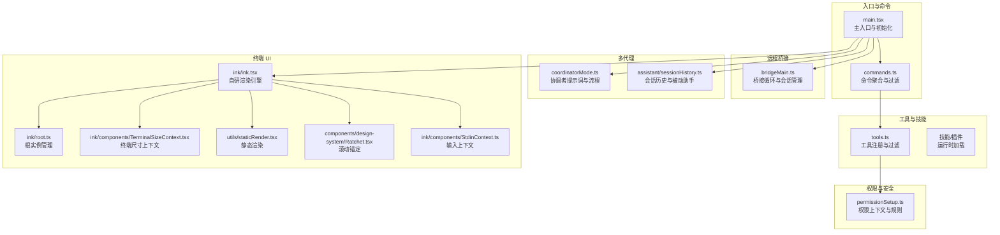
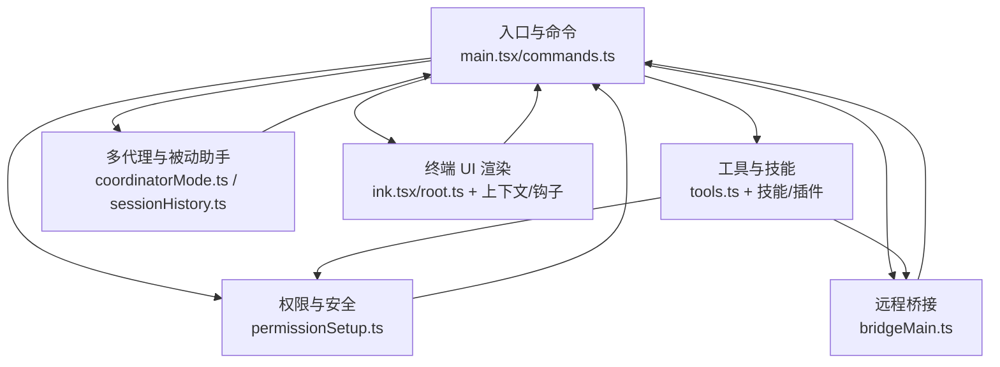
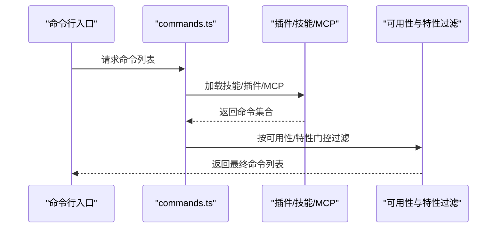
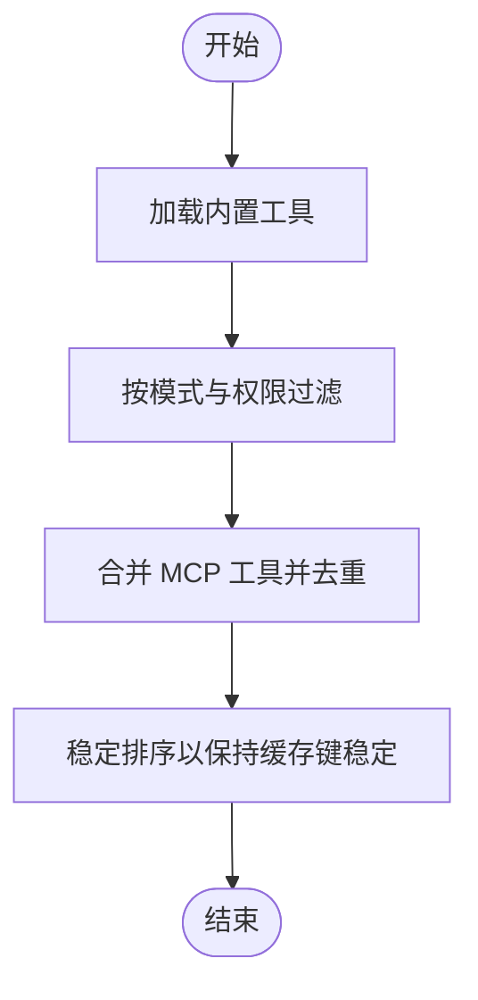
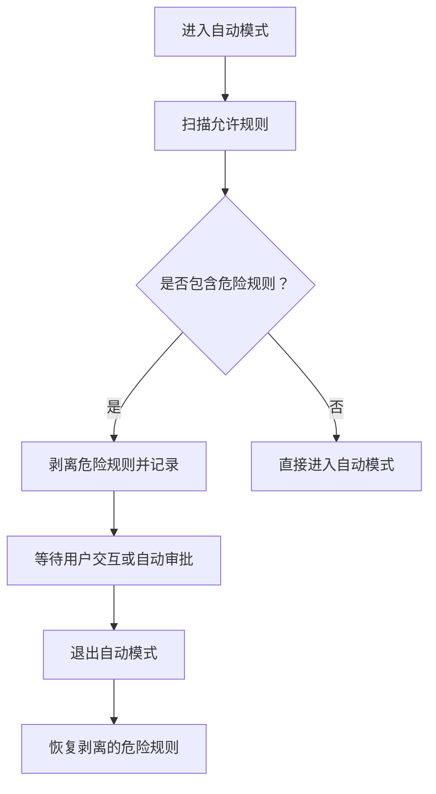
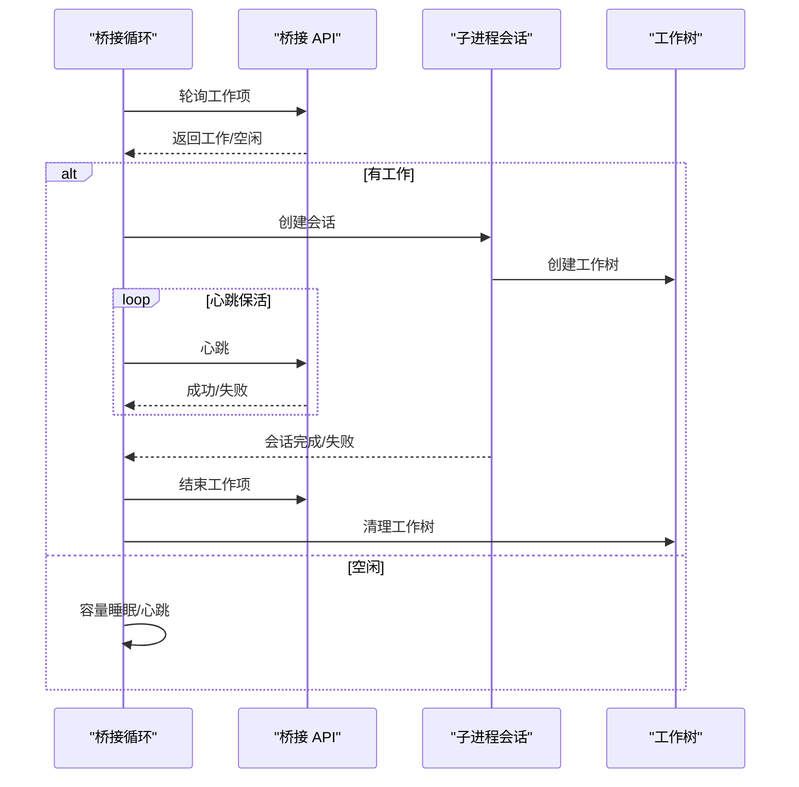
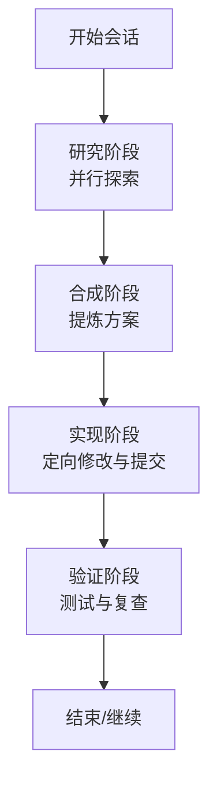
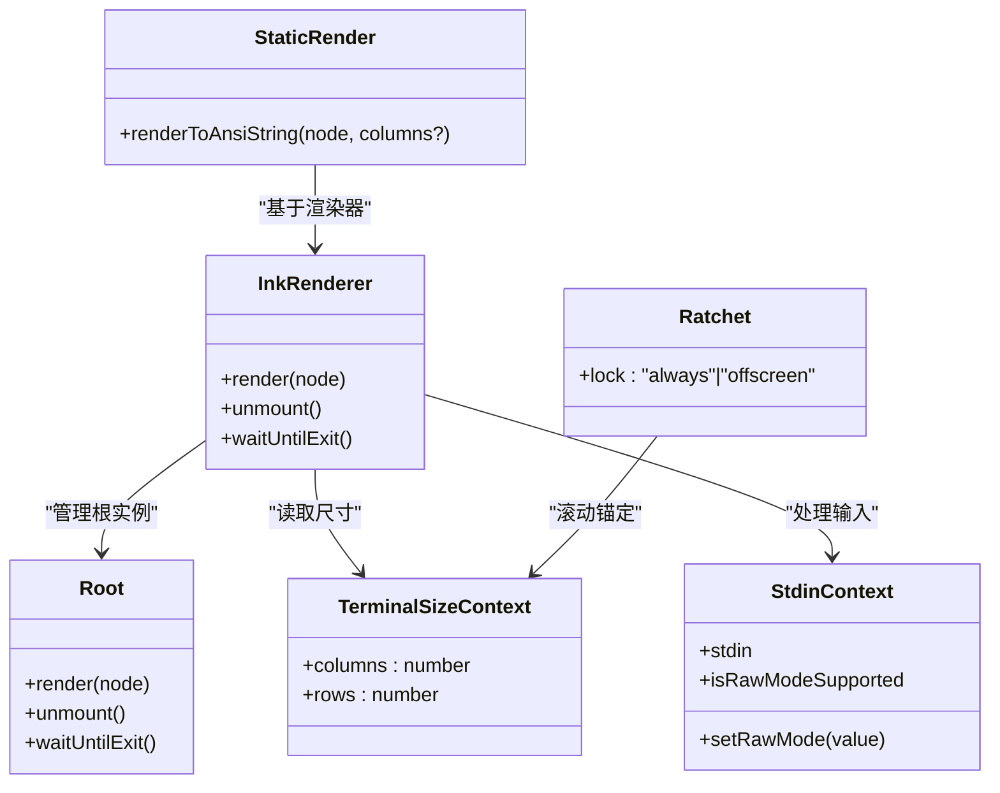
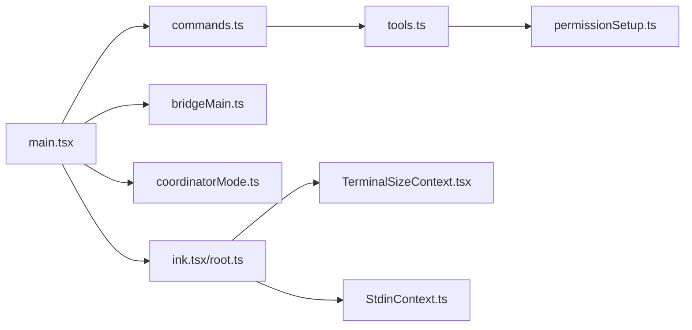

# 项目概述

<cite>
**本文引用的文件**
- [README.md](file://README.md)
- [main.tsx](file://main.tsx)
- [commands.ts](file://commands.ts)
- [bridgeMain.ts](file://bridge/bridgeMain.ts)
- [coordinatorMode.ts](file://coordinator/coordinatorMode.ts)
- [sessionHistory.ts](file://assistant/sessionHistory.ts)
- [tools.ts](file://tools.ts)
- [permissionSetup.ts](file://utils/permissions/permissionSetup.ts)
- [ink.tsx](file://ink/ink.tsx)
- [root.ts](file://ink/root.ts)
- [TerminalSizeContext.tsx](file://ink/components/TerminalSizeContext.tsx)
- [staticRender.tsx](file://utils/staticRender.tsx)
- [Ratchet.tsx](file://components/design-system/Ratchet.tsx)
- [StdinContext.ts](file://ink/components/StdinContext.ts)
- [useTerminalSize.ts](file://hooks/useTerminalSize.ts)
- [prompt.ts](file://tools/TodoWriteTool/prompt.ts)
</cite>

## 目录
1. [简介](#简介)
2. [项目结构](#项目结构)
3. [核心组件](#核心组件)
4. [架构总览](#架构总览)
5. [详细组件分析](#详细组件分析)
6. [依赖关系分析](#依赖关系分析)
7. [性能考量](#性能考量)
8. [故障排查指南](#故障排查指南)
9. [结论](#结论)
10. [附录](#附录)

## 简介
Claude Code 是由 Anthropic 推出的官方 AI 编程 CLI 助手，面向终端用户的智能编程伙伴。该项目以“在终端中提供类桌面级交互体验”为目标，结合 React 与 Ink 实现高性能、可扩展的终端 UI，并通过多代理协作、权限控制、远程桥接等能力，覆盖从日常编码到复杂项目管理的广泛场景。

本项目在技术上强调以下核心价值：
- 终端原生体验：基于 React + Ink 构建，提供流畅的 TUI 交互与即时渲染。
- 多代理协作：支持单代理与协调者模式（Coordinator Mode），实现并行研究、合成与验证的工程化工作流。
- 权限与安全：内置多层次权限系统，支持自动审批、交互式确认与受保护路径策略，兼顾易用性与安全性。
- 远程桥接：通过桥接系统实现本地与云端环境的无缝联动，支持多会话并发与心跳保活。
- 可扩展工具生态：内置 40+ 工具，涵盖文件操作、搜索、网络访问、任务管理、MCP 资源接入等，支持插件与技能扩展。

## 项目结构
项目采用模块化分层组织，围绕“入口与命令解析”“工具与技能体系”“权限与安全”“远程桥接与多代理”“终端 UI 渲染”等维度构建：

- 入口与命令解析：main.tsx 作为主入口，负责初始化、设置入口点、加载命令集与功能门控；commands.ts 汇总所有可用命令，按权限与特性动态启用。
- 工具与技能：tools.ts 提供工具注册与过滤逻辑；技能目录与插件目录在运行时动态加载，形成统一的“技能池”。
- 权限与安全：permissionSetup.ts 负责权限上下文构建、危险规则检测与自动模式切换。
- 远程桥接：bridge/ 目录提供桥接循环、会话管理、心跳保活、容量唤醒等能力。
- 多代理：coordinator/ 提供协调者提示词与工作流；assistant/ 提供会话历史与被动助手模式。
- 终端 UI：ink/ 为自研 React 终端渲染引擎；components/ 与 hooks/ 提供 UI 组件与交互钩子。

图表来源
- [main.tsx](file://main.tsx)
- [commands.ts](file://commands.ts)
- [tools.ts](file://tools.ts)
- [permissionSetup.ts](file://utils/permissions/permissionSetup.ts)
- [bridgeMain.ts](file://bridge/bridgeMain.ts)
- [coordinatorMode.ts](file://coordinator/coordinatorMode.ts)
- [sessionHistory.ts](file://assistant/sessionHistory.ts)
- [ink.tsx](file://ink/ink.tsx)
- [root.ts](file://ink/root.ts)
- [TerminalSizeContext.tsx](file://ink/components/TerminalSizeContext.tsx)
- [staticRender.tsx](file://utils/staticRender.tsx)
- [Ratchet.tsx](file://components/design-system/Ratchet.tsx)
- [StdinContext.ts](file://ink/components/StdinContext.ts)

章节来源
- [main.tsx](file://main.tsx)
- [commands.ts](file://commands.ts)

## 核心组件
- 主入口与初始化：负责启动性能打点、预取用户与上下文、特征门控、命令解析与 Telemetry 初始化。
- 命令系统：集中注册与动态过滤命令，支持内置、插件、技能与 MCP 技能的统一索引与去重。
- 工具系统：提供工具注册、权限过滤、REPL 模式隐藏原始工具、协调者模式下的工具集合等。
- 权限系统：构建工具权限上下文，识别危险规则（如 Bash/PowerShell 全量允许、Agent 子代理放行），在自动模式下进行剥离与恢复。
- 远程桥接：桥接循环、会话生命周期管理、心跳保活、容量唤醒、错误回退与重连。
- 多代理与被动助手：协调者提示词与工作流、会话历史拉取与分页。
- 终端 UI 引擎：自研 Ink 渲染器、根实例管理、终端尺寸与输入上下文、静态渲染与滚动锚定。

章节来源
- [main.tsx](file://main.tsx)
- [commands.ts](file://commands.ts)
- [tools.ts](file://tools.ts)
- [permissionSetup.ts](file://utils/permissions/permissionSetup.ts)
- [bridgeMain.ts](file://bridge/bridgeMain.ts)
- [coordinatorMode.ts](file://coordinator/coordinatorMode.ts)
- [sessionHistory.ts](file://assistant/sessionHistory.ts)
- [ink.tsx](file://ink/ink.tsx)
- [root.ts](file://ink/root.ts)
- [TerminalSizeContext.tsx](file://ink/components/TerminalSizeContext.tsx)
- [staticRender.tsx](file://utils/staticRender.tsx)
- [Ratchet.tsx](file://components/design-system/Ratchet.tsx)
- [StdinContext.ts](file://ink/components/StdinContext.ts)
- [useTerminalSize.ts](file://hooks/useTerminalSize.ts)

## 架构总览
整体架构围绕“入口与命令解析”“工具与技能体系”“权限与安全”“远程桥接与多代理”“终端 UI 渲染”五大支柱展开，形成从命令到工具、从权限到桥接、从 UI 到渲染的完整闭环。

图表来源
- [main.tsx](file://main.tsx)
- [commands.ts](file://commands.ts)
- [tools.ts](file://tools.ts)
- [permissionSetup.ts](file://utils/permissions/permissionSetup.ts)
- [bridgeMain.ts](file://bridge/bridgeMain.ts)
- [coordinatorMode.ts](file://coordinator/coordinatorMode.ts)
- [sessionHistory.ts](file://assistant/sessionHistory.ts)
- [ink.tsx](file://ink/ink.tsx)
- [root.ts](file://ink/root.ts)

## 详细组件分析

### 组件 A：命令系统与动态加载
- 职责：集中注册内置命令、插件命令、技能命令与 MCP 技能，按可用性与特性门控过滤，提供统一的命令索引与去重。
- 关键点：
  - 内置命令列表与动态技能/插件/MCP 技能合并，保证 prompt-cache 稳定性。
  - 远程模式与桥接模式的安全命令白名单，避免本地执行上下文依赖。
  - 命令可用性按订阅/提供商条件过滤，支持实时变更生效。

图表来源
- [commands.ts](file://commands.ts)

章节来源
- [commands.ts](file://commands.ts)

### 组件 B：工具系统与权限过滤
- 职责：注册内置工具，按模式（简单/REPL/协调者）与权限规则过滤，合并 MCP 工具并去重。
- 关键点：
  - 简单模式仅暴露 Bash/读写等基础工具，协调者模式补充 Agent/TaskStop 等。
  - REPL 模式隐藏原始工具，仅在虚拟机内可用。
  - 合并策略保持内置工具前缀连续，避免缓存键失效。

图表来源
- [tools.ts](file://tools.ts)

章节来源
- [tools.ts](file://tools.ts)

### 组件 C：权限系统与自动模式
- 职责：构建工具权限上下文，识别危险规则（如 Bash/PowerShell 全量允许、Agent 放行），在自动模式进入/退出时剥离/恢复规则。
- 关键点：
  - 危险规则检测：对 Bash/PowerShell 的通配符与脚本解释器模式、Agent 子代理放行进行识别。
  - 自动模式切换：进入时剥离危险规则，退出时恢复，确保安全边界不被绕过。
  - 与特性门控协同：自动模式需满足分类器门禁与组织策略。

图表来源
- [permissionSetup.ts](file://utils/permissions/permissionSetup.ts)

章节来源
- [permissionSetup.ts](file://utils/permissions/permissionSetup.ts)

### 组件 D：远程桥接与会话管理
- 职责：桥接循环、会话生命周期管理、心跳保活、容量唤醒、错误回退与重连。
- 关键点：
  - 多会话并发：支持多会话环境与工作树管理。
  - 心跳与令牌刷新：v1 使用 OAuth，v2 通过 reconnectSession 触发服务端重新派发。
  - 容量唤醒：在会话结束后立即唤醒以接收新工作，提升吞吐。

图表来源
- [bridgeMain.ts](file://bridge/bridgeMain.ts)

章节来源
- [bridgeMain.ts](file://bridge/bridgeMain.ts)

### 组件 E：多代理与被动助手
- 职责：协调者提示词与工作流（研究-合成-实现-验证），被动助手模式（KAIROS）的持续观察与主动建议。
- 关键点：
  - 协调者模式：明确阶段分工与并发策略，避免串行瓶颈。
  - 被动助手：基于日志与信号的周期性决策，提供简洁输出与主动通知。

图表来源
- [coordinatorMode.ts](file://coordinator/coordinatorMode.ts)

章节来源
- [coordinatorMode.ts](file://coordinator/coordinatorMode.ts)

### 组件 F：终端 UI 渲染与交互
- 职责：自研 Ink 渲染引擎、根实例管理、终端尺寸与输入上下文、静态渲染与滚动锚定。
- 关键点：
  - 根实例复用：支持多次屏幕切换与复用，降低开销。
  - 尺寸与输入：提供终端尺寸上下文与输入事件处理，适配不同终端行为。
  - 静态渲染：在非 TTY 输出时提取首帧内容，保证一致性。

图表来源
- [ink.tsx](file://ink/ink.tsx)
- [root.ts](file://ink/root.ts)
- [TerminalSizeContext.tsx](file://ink/components/TerminalSizeContext.tsx)
- [StdinContext.ts](file://ink/components/StdinContext.ts)
- [staticRender.tsx](file://utils/staticRender.tsx)
- [Ratchet.tsx](file://components/design-system/Ratchet.tsx)

章节来源
- [ink.tsx](file://ink/ink.tsx)
- [root.ts](file://ink/root.ts)
- [TerminalSizeContext.tsx](file://ink/components/TerminalSizeContext.tsx)
- [staticRender.tsx](file://utils/staticRender.tsx)
- [Ratchet.tsx](file://components/design-system/Ratchet.tsx)
- [StdinContext.ts](file://ink/components/StdinContext.ts)
- [useTerminalSize.ts](file://hooks/useTerminalSize.ts)

## 依赖关系分析
- 入口与命令：main.tsx 依赖 commands.ts 与各类初始化模块；commands.ts 依赖工具与插件/技能/MCP 的动态加载。
- 工具与权限：tools.ts 依赖 permissionSetup.ts 的权限上下文；permissionSetup.ts 依赖特性门控与设置源。
- 桥接与多代理：bridgeMain.ts 依赖产品配置、日志与会话管理；coordinatorMode.ts 依赖工具集合与特性门控。
- 终端 UI：ink/ 与 hooks/、components/ 之间存在强耦合，但通过上下文与钩子实现解耦。

图表来源
- [main.tsx](file://main.tsx)
- [commands.ts](file://commands.ts)
- [tools.ts](file://tools.ts)
- [permissionSetup.ts](file://utils/permissions/permissionSetup.ts)
- [bridgeMain.ts](file://bridge/bridgeMain.ts)
- [coordinatorMode.ts](file://coordinator/coordinatorMode.ts)
- [ink.tsx](file://ink/ink.tsx)
- [root.ts](file://ink/root.ts)
- [TerminalSizeContext.tsx](file://ink/components/TerminalSizeContext.tsx)
- [StdinContext.ts](file://ink/components/StdinContext.ts)

章节来源
- [main.tsx](file://main.tsx)
- [commands.ts](file://commands.ts)
- [tools.ts](file://tools.ts)
- [permissionSetup.ts](file://utils/permissions/permissionSetup.ts)
- [bridgeMain.ts](file://bridge/bridgeMain.ts)
- [coordinatorMode.ts](file://coordinator/coordinatorMode.ts)
- [ink.tsx](file://ink/ink.tsx)
- [root.ts](file://ink/root.ts)
- [TerminalSizeContext.tsx](file://ink/components/TerminalSizeContext.tsx)
- [StdinContext.ts](file://ink/components/StdinContext.ts)

## 性能考量
- 启动性能：入口侧进行预取与并行初始化，延迟非关键模块加载，减少首次渲染阻塞。
- 渲染性能：Ink 渲染器计算布局于 React 提交阶段，避免闪烁；提供帧事件回调用于性能监控。
- 工具与缓存：工具注册与权限过滤采用稳定排序与去重，避免 prompt-cache 键失效；工具模式（REPL/简单）隐藏原始工具，减少模型提示负担。
- 远程桥接：心跳保活与容量唤醒机制在空闲时降低轮询压力，在活跃时维持低延迟响应。

## 故障排查指南
- 权限相关
  - 症状：自动模式无法进入或频繁弹出危险规则提示。
  - 排查：检查 Bash/PowerShell 允许规则是否过于宽泛；确认自动模式门禁状态与组织策略。
  - 处理：移除危险规则或调整为更严格的模式。
- 远程桥接
  - 症状：会话无响应或频繁断线。
  - 排查：检查心跳失败原因（401/403 表示令牌过期，404/410 表示环境失效）；确认容量与回退策略。
  - 处理：触发 reconnectSession 或重启桥接循环。
- 终端 UI
  - 症状：渲染异常或尺寸不正确。
  - 排查：确认终端尺寸上下文与输入上下文初始化顺序；检查静态渲染输出帧标记。
  - 处理：确保在正确的渲染阶段调用静态渲染，并正确设置列数。

章节来源
- [permissionSetup.ts](file://utils/permissions/permissionSetup.ts)
- [bridgeMain.ts](file://bridge/bridgeMain.ts)
- [ink.tsx](file://ink/ink.tsx)
- [root.ts](file://ink/root.ts)
- [staticRender.tsx](file://utils/staticRender.tsx)

## 结论
Claude Code 以 React + Ink 为基础，构建了高性能、可扩展且安全的终端 AI 编程助手。通过命令与工具的统一索引、多层次权限控制、远程桥接与多代理协作，项目在易用性与安全性之间取得平衡，既能满足日常编码需求，也能支撑复杂项目管理与远程协作场景。未来随着特性门控与内部功能逐步开放，项目将持续演进，为开发者提供更强大的终端编程体验。

## 附录
- 使用场景示例（概念性）
  - 基础代码编写：使用 Bash/读写工具快速修改文件，配合工具搜索与 LSP 获取上下文。
  - 复杂项目管理：开启协调者模式，分阶段并行推进研究、实现与验证，自动产出 PR 与测试报告。
  - 远程协作：通过桥接系统在云端容器中执行计划任务，本地终端实时查看进度与结果。
  - 被动助手：启用 KAIROS 模式，持续观察仓库动态并主动推送通知与摘要。