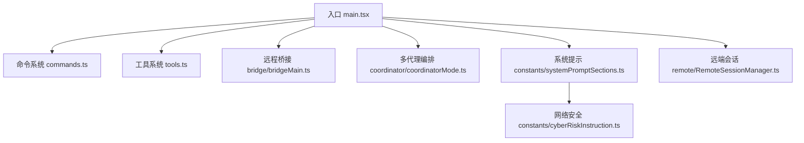
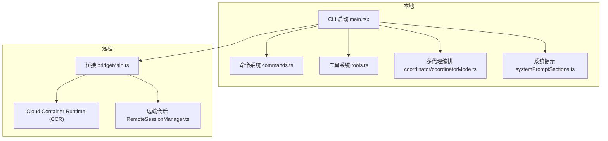
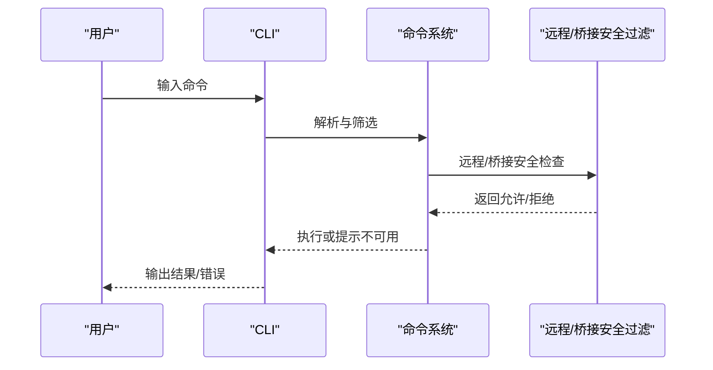
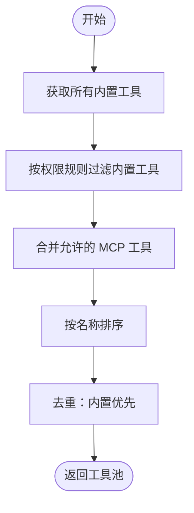
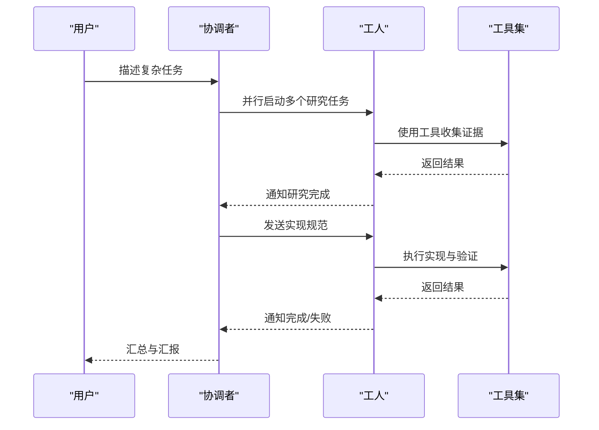
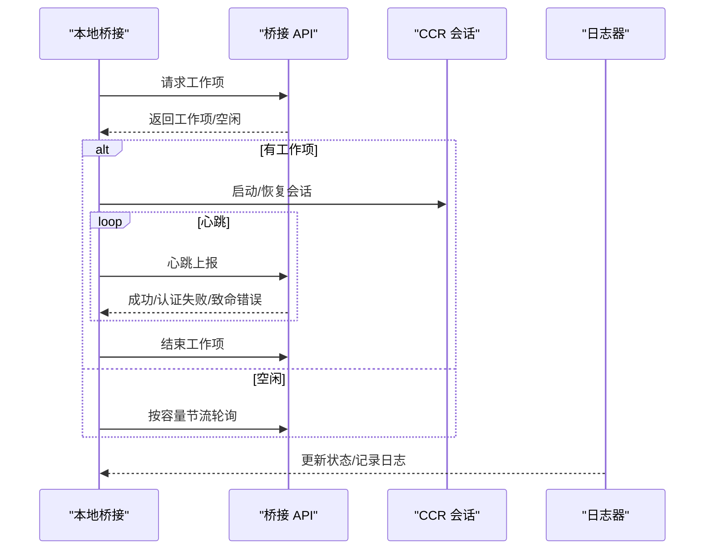
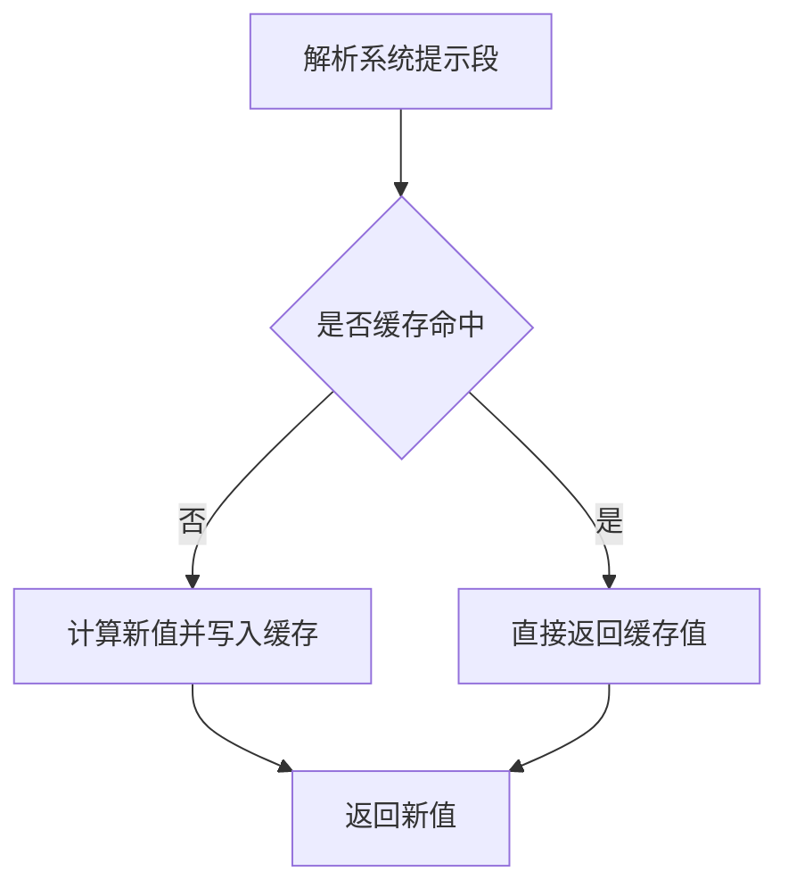
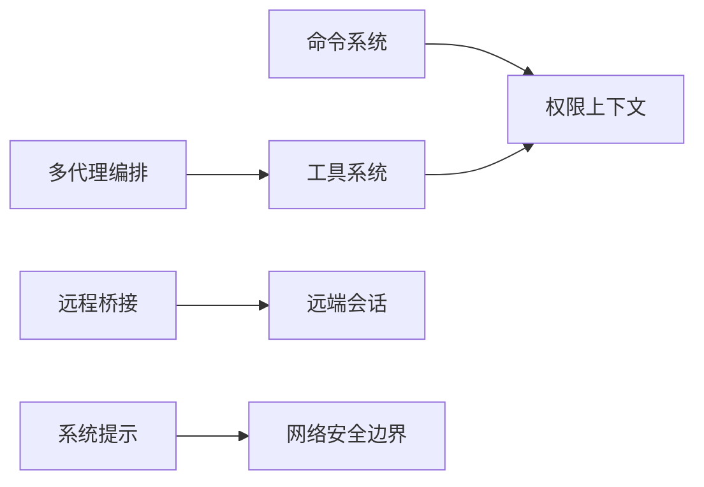

# 项目简介

<cite>
**本文引用的文件列表**
- [README.md](file://README.md)
- [main.tsx](file://main.tsx)
- [commands.ts](file://commands.ts)
- [tools.ts](file://tools.ts)
- [bridge/bridgeMain.ts](file://bridge/bridgeMain.ts)
- [coordinator/coordinatorMode.ts](file://coordinator/coordinatorMode.ts)
- [constants/systemPromptSections.ts](file://constants/systemPromptSections.ts)
- [constants/cyberRiskInstruction.ts](file://constants/cyberRiskInstruction.ts)
- [remote/RemoteSessionManager.ts](file://remote/RemoteSessionManager.ts)
</cite>

## 目录
1. [引言](#引言)
2. [项目结构](#项目结构)
3. [核心组件](#核心组件)
4. [架构总览](#架构总览)
5. [详细组件分析](#详细组件分析)
6. [依赖关系分析](#依赖关系分析)
7. [性能考量](#性能考量)
8. [故障排查指南](#故障排查指南)
9. [结论](#结论)
10. [附录](#附录)

## 引言
Claude Code 是由 Anthropic 推出的官方 AI 编程 CLI 工具，面向“以代码为中心”的人机协作与自动化。它通过多代理协作、权限控制、远程桥接、文件操作工具、Web 搜索、代码编辑等能力，将大型语言模型从“对话式助手”升级为可执行、可验证、可扩展的工程化智能体。该项目在开源社区中因一次源码泄露事件而广受关注，该事件暴露了构建流程中的安全疏漏，但也让外界得以窥见其内部架构与能力边界。

本项目简介旨在帮助不同背景的读者快速理解 Claude Code 的定位、能力与价值：对新手而言，提供清晰的功能概览与使用场景；对开发者而言，提供架构与实现层面的深入解读，并结合安全与合规要点给出实践建议。

## 项目结构
Claude Code 采用模块化与分层设计：
- 入口与启动：入口文件负责初始化、命令解析、遥测与延迟预取，确保启动路径最小化并按需加载。
- 命令体系：commands.ts 统一注册内置命令与动态技能/插件命令，支持远程模式与桥接模式的安全过滤。
- 工具系统：tools.ts 聚合内置工具与 MCP 工具，支持按权限与环境条件裁剪，保证 prompt 缓存稳定性。
- 多代理与编排：coordinator/coordinatorMode.ts 提供协调者模式下的并行工作流与任务管理。
- 远程桥接：bridge/bridgeMain.ts 实现与云端容器运行时（CCR）的桥接，支持会话生命周期管理、心跳与令牌刷新。
- 系统提示与安全：constants/systemPromptSections.ts 与 constants/cyberRiskInstruction.ts 分别负责系统提示的模块化缓存与网络安全边界。
- 远端会话：remote/RemoteSessionManager.ts 协调本地 REPL 与远端 CCR 之间的消息、权限请求与状态同步。

图表来源
- [main.tsx:585-800](file://main.tsx#L585-L800)
- [commands.ts:258-346](file://commands.ts#L258-L346)
- [tools.ts:193-251](file://tools.ts#L193-L251)
- [bridge/bridgeMain.ts:141-200](file://bridge/bridgeMain.ts#L141-L200)
- [coordinator/coordinatorMode.ts:111-160](file://coordinator/coordinatorMode.ts#L111-L160)
- [constants/systemPromptSections.ts:43-58](file://constants/systemPromptSections.ts#L43-L58)
- [constants/cyberRiskInstruction.ts:1-25](file://constants/cyberRiskInstruction.ts#L1-L25)
- [remote/RemoteSessionManager.ts:95-131](file://remote/RemoteSessionManager.ts#L95-L131)

章节来源
- [main.tsx:585-800](file://main.tsx#L585-L800)
- [commands.ts:258-346](file://commands.ts#L258-L346)
- [tools.ts:193-251](file://tools.ts#L193-L251)

## 核心组件
- 命令系统与动态技能
  - 统一注册内置命令、技能目录命令、插件命令与工作流命令，支持按可用性与启用状态过滤。
  - 支持远程模式安全命令白名单与桥接模式命令白名单，避免远程执行本地敏感操作。
- 工具系统
  - 内置工具覆盖 Bash、文件读写、搜索、Web 访问、笔记本编辑、计划任务、MCP 资源访问等。
  - 工具池组装遵循 prompt 缓存稳定性要求，内置工具优先于 MCP 工具，避免缓存键被打乱。
- 多代理编排
  - 协调者模式下，将研究、合成、实现、验证四个阶段并行化，工人之间通过专用通知格式通信。
  - 支持团队/群组模式，具备跨进程/同进程上下文隔离与知识共享机制。
- 远程桥接
  - 通过 JWT 认证与心跳机制维持与云端 CCR 的长连接，支持多会话并发与容量唤醒。
  - 提供会话超时、令牌刷新、错误回退与诊断日志路径配置。
- 系统提示与安全
  - 系统提示模块化缓存，支持静态段与动态段分离，必要时可强制破坏缓存。
  - 明确网络安全边界，限定授权范围内的安全测试与防御性辅助，拒绝破坏性与供应链攻击类请求。

章节来源
- [commands.ts:476-517](file://commands.ts#L476-L517)
- [tools.ts:345-367](file://tools.ts#L345-L367)
- [coordinator/coordinatorMode.ts:111-160](file://coordinator/coordinatorMode.ts#L111-L160)
- [bridge/bridgeMain.ts:141-200](file://bridge/bridgeMain.ts#L141-L200)
- [constants/systemPromptSections.ts:43-58](file://constants/systemPromptSections.ts#L43-L58)
- [constants/cyberRiskInstruction.ts:1-25](file://constants/cyberRiskInstruction.ts#L1-L25)

## 架构总览
Claude Code 的整体架构围绕“本地 CLI + 可选远程桥接 + 多代理编排 + 权限与安全控制”展开。本地 REPL 负责用户交互与工具调度，远程桥接负责与云端 CCR 的会话与权限协调，多代理编排负责复杂任务的拆解与并行执行，系统提示与安全策略保障行为边界与缓存效率。

图表来源
- [main.tsx:585-800](file://main.tsx#L585-L800)
- [commands.ts:258-346](file://commands.ts#L258-L346)
- [tools.ts:193-251](file://tools.ts#L193-L251)
- [coordinator/coordinatorMode.ts:111-160](file://coordinator/coordinatorMode.ts#L111-L160)
- [constants/systemPromptSections.ts:43-58](file://constants/systemPromptSections.ts#L43-L58)
- [bridge/bridgeMain.ts:141-200](file://bridge/bridgeMain.ts#L141-L200)
- [remote/RemoteSessionManager.ts:95-131](file://remote/RemoteSessionManager.ts#L95-L131)

## 详细组件分析

### 命令系统与远程/桥接安全
- 过滤策略
  - 远程模式安全命令集合：仅允许与本地 TUI 状态相关且不依赖本地文件系统/终端的命令。
  - 桥接模式安全命令集合：允许从移动端/网页端触发的文本输出型命令，阻止 JSX 渲染与本地敏感命令。
- 动态命令加载
  - 技能目录、插件与工作流命令异步加载并去重，确保命令列表稳定且可增量更新。
- 可用性与权限
  - 命令按订阅/提供商进行可用性限制，避免未授权访问。

图表来源
- [commands.ts:619-686](file://commands.ts#L619-L686)
- [commands.ts:672-676](file://commands.ts#L672-L676)

章节来源
- [commands.ts:619-686](file://commands.ts#L619-L686)
- [commands.ts:672-676](file://commands.ts#L672-L676)

### 工具系统与工具池组装
- 工具聚合
  - 内置工具覆盖 Bash、文件读写、搜索、Web 访问、笔记本编辑、计划任务、MCP 资源访问等。
  - MCP 工具按权限规则过滤，避免被服务器前缀规则屏蔽。
- 组装策略
  - 内置工具优先，MCP 工具次之，统一按名称排序，保持 prompt 缓存键稳定。
  - 在 REPL 模式下隐藏原始工具，仅通过虚拟机上下文访问，降低误用风险。

图表来源
- [tools.ts:345-367](file://tools.ts#L345-L367)

章节来源
- [tools.ts:345-367](file://tools.ts#L345-L367)

### 多代理编排与任务工作流
- 角色与职责
  - 协调者：负责目标分解、资源分配与结果汇总；工人：执行具体任务（研究/实现/验证）。
- 并行与收敛
  - 研究阶段并行推进，合成阶段聚焦于明确规范，实现与验证阶段严格区分。
- 通知格式
  - 工人结果以特定 XML 格式通知协调者，包含任务 ID、状态、摘要与用量统计。
- 团队/群组
  - 支持进程内/进程间上下文隔离、tmux/iTerm2 集成、团队记忆同步与颜色标识。

图表来源
- [coordinator/coordinatorMode.ts:111-160](file://coordinator/coordinatorMode.ts#L111-L160)
- [coordinator/coordinatorMode.ts:200-210](file://coordinator/coordinatorMode.ts#L200-L210)

章节来源
- [coordinator/coordinatorMode.ts:111-160](file://coordinator/coordinatorMode.ts#L111-L160)
- [coordinator/coordinatorMode.ts:200-210](file://coordinator/coordinatorMode.ts#L200-L210)

### 远程桥接与会话管理
- 连接与心跳
  - 通过 JWT 认证与心跳维持长连接，支持多会话并发与容量唤醒。
- 令牌与超时
  - 在 CCR v2 环境下，令牌到期通过服务端重新派发；超时与中断有明确处理逻辑。
- 日志与诊断
  - 支持调试日志路径配置，便于定位问题。

图表来源
- [bridge/bridgeMain.ts:141-200](file://bridge/bridgeMain.ts#L141-L200)
- [bridge/bridgeMain.ts:202-270](file://bridge/bridgeMain.ts#L202-L270)
- [bridge/bridgeMain.ts:600-750](file://bridge/bridgeMain.ts#L600-L750)

章节来源
- [bridge/bridgeMain.ts:141-200](file://bridge/bridgeMain.ts#L141-L200)
- [bridge/bridgeMain.ts:202-270](file://bridge/bridgeMain.ts#L202-L270)
- [bridge/bridgeMain.ts:600-750](file://bridge/bridgeMain.ts#L600-L750)

### 系统提示与网络安全边界
- 模块化缓存
  - 将系统提示分为静态段与动态段，静态段可跨组织缓存，动态段按会话变化破坏缓存。
- 安全边界
  - 明确授权范围内的安全测试与防御性辅助，拒绝破坏性与供应链攻击类请求，强调变更需经安全团队评估。

图表来源
- [constants/systemPromptSections.ts:43-58](file://constants/systemPromptSections.ts#L43-L58)

章节来源
- [constants/systemPromptSections.ts:43-58](file://constants/systemPromptSections.ts#L43-L58)
- [constants/cyberRiskInstruction.ts:1-25](file://constants/cyberRiskInstruction.ts#L1-L25)

## 依赖关系分析
- 组件耦合
  - 命令系统与工具系统通过权限上下文与可用性规则解耦，支持按环境条件裁剪。
  - 多代理编排与工具系统通过工具池组装接口耦合，确保 prompt 缓存稳定。
  - 远程桥接与远端会话通过 WebSocket 与 HTTP 协议耦合，权限请求与响应形成闭环。
- 外部依赖
  - 通过 MCP 机制扩展工具集，避免内置工具爆炸式增长。
  - 通过 GrowthBook 特性门控与缓存，平衡功能 rollout 与性能。

图表来源
- [commands.ts:476-517](file://commands.ts#L476-L517)
- [tools.ts:345-367](file://tools.ts#L345-L367)
- [coordinator/coordinatorMode.ts:111-160](file://coordinator/coordinatorMode.ts#L111-L160)
- [bridge/bridgeMain.ts:141-200](file://bridge/bridgeMain.ts#L141-L200)
- [remote/RemoteSessionManager.ts:95-131](file://remote/RemoteSessionManager.ts#L95-L131)
- [constants/systemPromptSections.ts:43-58](file://constants/systemPromptSections.ts#L43-L58)
- [constants/cyberRiskInstruction.ts:1-25](file://constants/cyberRiskInstruction.ts#L1-L25)

章节来源
- [commands.ts:476-517](file://commands.ts#L476-L517)
- [tools.ts:345-367](file://tools.ts#L345-L367)
- [coordinator/coordinatorMode.ts:111-160](file://coordinator/coordinatorMode.ts#L111-L160)
- [bridge/bridgeMain.ts:141-200](file://bridge/bridgeMain.ts#L141-L200)
- [remote/RemoteSessionManager.ts:95-131](file://remote/RemoteSessionManager.ts#L95-L131)
- [constants/systemPromptSections.ts:43-58](file://constants/systemPromptSections.ts#L43-L58)
- [constants/cyberRiskInstruction.ts:1-25](file://constants/cyberRiskInstruction.ts#L1-L25)

## 性能考量
- 启动路径优化
  - 入口文件采用延迟预取与并行子进程启动策略，减少首次渲染阻塞。
- 工具与提示缓存
  - 工具池按名称排序并去重，避免 prompt 缓存键抖动；系统提示分段缓存，仅在必要时破坏缓存。
- 远程桥接节流
  - 在容量饱和时采用心跳模式与容量唤醒，避免轮询风暴；根据配置调整轮询间隔与心跳周期。

章节来源
- [main.tsx:388-431](file://main.tsx#L388-L431)
- [tools.ts:362-366](file://tools.ts#L362-L366)
- [constants/systemPromptSections.ts:43-58](file://constants/systemPromptSections.ts#L43-L58)
- [bridge/bridgeMain.ts:640-750](file://bridge/bridgeMain.ts#L640-L750)

## 故障排查指南
- 远程桥接常见问题
  - 认证失败：检查 JWT 是否过期，确认服务端重新派发流程是否生效。
  - 连接中断：查看心跳失败与断连时间，确认网络波动与服务端策略。
  - 容量饱和：观察 at-capacity 节流与心跳模式，等待容量唤醒或主动停止工作项。
- 权限与安全
  - 工具被拒绝：检查权限上下文与 deny 规则，确认 MCP 服务器前缀规则是否屏蔽。
  - 安全边界触发：确认请求是否在授权范围内，避免破坏性与供应链攻击类场景。
- 系统提示缓存
  - 缓存未更新：触发清理或强制破坏缓存的段落，确保动态段重新计算。

章节来源
- [bridge/bridgeMain.ts:202-270](file://bridge/bridgeMain.ts#L202-L270)
- [bridge/bridgeMain.ts:640-750](file://bridge/bridgeMain.ts#L640-L750)
- [constants/cyberRiskInstruction.ts:1-25](file://constants/cyberRiskInstruction.ts#L1-L25)
- [constants/systemPromptSections.ts:65-68](file://constants/systemPromptSections.ts#L65-L68)

## 结论
Claude Code 以“本地 CLI + 远程桥接 + 多代理编排 + 权限与安全控制”为核心，构建了面向工程化的 AI 编程基础设施。其命令与工具系统的模块化设计、系统提示的缓存策略、以及远程桥接的心跳与容量管理，共同支撑起高并发、可扩展、可审计的开发体验。尽管开源泄露事件暴露了构建流程中的安全短板，但其内部架构与能力边界仍值得深入学习与借鉴。

## 附录
- 开源背景与安全事件
  - 项目因 npm 包中包含 sourcemap 导致源码泄露，引发对构建产物与忽略规则的关注。
- 版本演进与未来规划
  - 通过迁移脚本与特性门控，持续演进模型与功能；部分高级能力（如 Always-On Assistant、ULTRAPLAN、Buddy 等）仍处于内部或受限发布阶段。

章节来源
- [README.md:1-463](file://README.md#L1-L463)