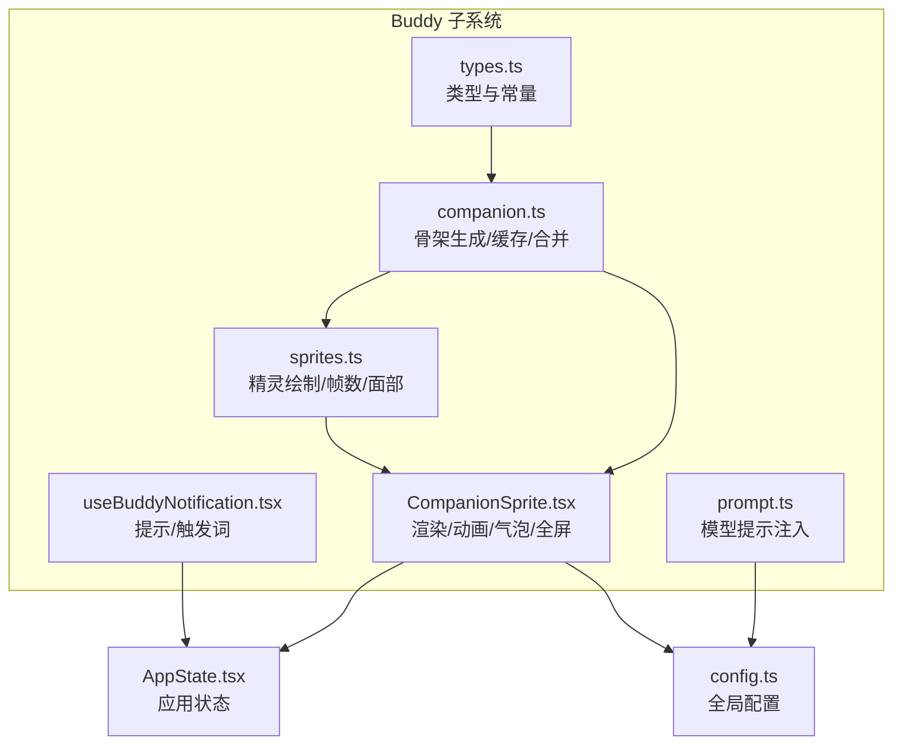
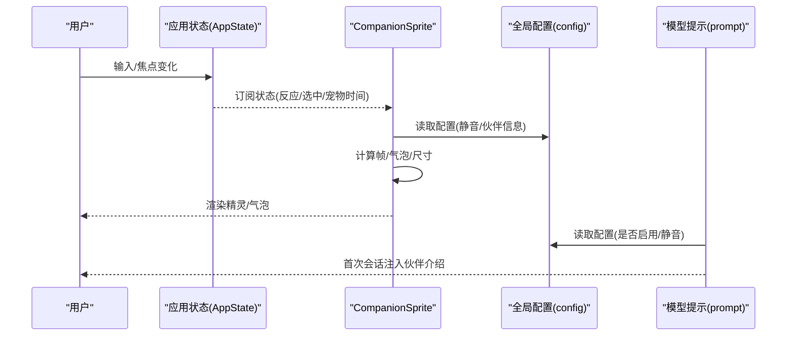
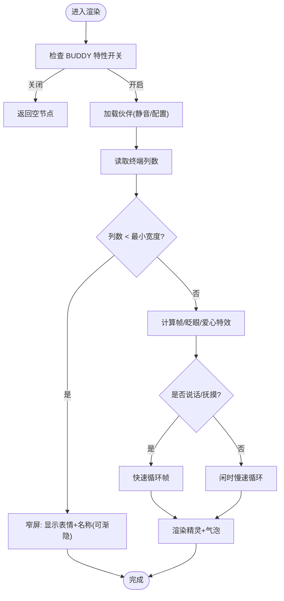
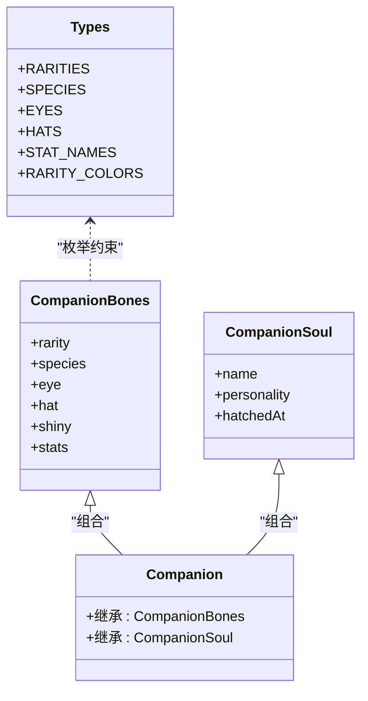
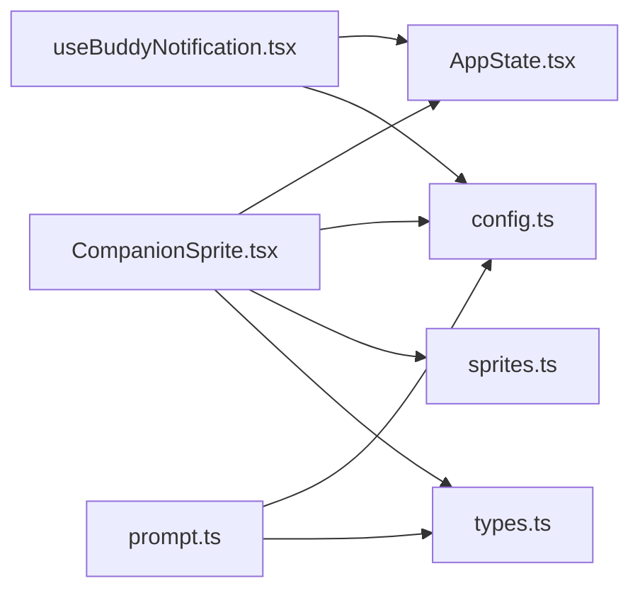

# Buddy 伙伴系统

<cite>
**本文引用的文件**
- [CompanionSprite.tsx](file://buddy/CompanionSprite.tsx)
- [companion.ts](file://buddy/companion.ts)
- [types.ts](file://buddy/types.ts)
- [useBuddyNotification.tsx](file://buddy/useBuddyNotification.tsx)
- [sprites.ts](file://buddy/sprites.ts)
- [prompt.ts](file://buddy/prompt.ts)
- [sessionHistory.ts](file://assistant/sessionHistory.ts)
- [config.ts](file://utils/config.ts)
- [AppState.tsx](file://state/AppState.tsx)
</cite>

## 目录
1. [简介](#简介)
2. [项目结构](#项目结构)
3. [核心组件](#核心组件)
4. [架构总览](#架构总览)
5. [详细组件分析](#详细组件分析)
6. [依赖关系分析](#依赖关系分析)
7. [性能考量](#性能考量)
8. [故障排查指南](#故障排查指南)
9. [结论](#结论)
10. [附录](#附录)

## 简介
Buddy 伙伴系统是终端内嵌的“随行伙伴”，以低开销的 ASCII 动画精灵形式呈现，伴随用户输入并适时以气泡对话的方式进行轻量互动。系统围绕“可复现的角色生成”“跨会话持久化”“终端尺寸自适应”“主题色彩映射”等设计目标构建，既保证一致性又兼顾可用性与可扩展性。

## 项目结构
Buddy 相关代码集中在 buddy 目录，主要文件职责如下：
- types.ts：角色类型、稀有度、外观枚举与颜色映射
- companion.ts：角色骨架（bones）生成、缓存与合并逻辑
- sprites.ts：角色精灵绘制、帧数与面部特写
- CompanionSprite.tsx：渲染器与动画控制、气泡显示、全屏覆盖层
- useBuddyNotification.tsx：启动提示、触发词检测
- prompt.ts：向模型注入伙伴介绍附件，避免重复发送
- sessionHistory.ts：会话历史检索（用于与伙伴系统集成时的历史联动）
- config.ts：全局配置读取（含 companion、companionMuted 等）
- AppState.tsx：应用状态订阅（伙伴反应、选中态等）

图表来源
- [types.ts:1-149](file://buddy/types.ts#L1-L149)
- [companion.ts:1-134](file://buddy/companion.ts#L1-L134)
- [sprites.ts:1-515](file://buddy/sprites.ts#L1-L515)
- [CompanionSprite.tsx:1-371](file://buddy/CompanionSprite.tsx#L1-L371)
- [useBuddyNotification.tsx:1-98](file://buddy/useBuddyNotification.tsx#L1-L98)
- [prompt.ts:1-36](file://buddy/prompt.ts#L1-L36)
- [config.ts:1-200](file://utils/config.ts#L1-L200)
- [AppState.tsx:1-200](file://state/AppState.tsx#L1-L200)

章节来源
- [types.ts:1-149](file://buddy/types.ts#L1-L149)
- [companion.ts:1-134](file://buddy/companion.ts#L1-L134)
- [sprites.ts:1-515](file://buddy/sprites.ts#L1-L515)
- [CompanionSprite.tsx:1-371](file://buddy/CompanionSprite.tsx#L1-L371)
- [useBuddyNotification.tsx:1-98](file://buddy/useBuddyNotification.tsx#L1-L98)
- [prompt.ts:1-36](file://buddy/prompt.ts#L1-L36)
- [config.ts:1-200](file://utils/config.ts#L1-L200)
- [AppState.tsx:1-200](file://state/AppState.tsx#L1-L200)

## 核心组件
- 角色骨架与外观（companion.ts + types.ts）
  - 基于用户 ID 的确定性随机生成（Mulberry32 + 字符串哈希），确保跨设备一致
  - 骨架字段包括稀有度、物种、眼睛、帽子、闪光、属性点
  - 存储仅保存“灵魂”（name、personality、hatchedAt），骨架在每次读取时重新生成
- 精灵绘制（sprites.ts）
  - 每个物种 5 行 × 12 列的 ASCII 精灵，多帧用于闲适抖动
  - 支持帽子行替换与空帽行裁剪，保持紧凑布局
  - 提供“面部特写”字符串，用于窄终端显示
- 渲染与动画（CompanionSprite.tsx）
  - 周期性帧切换（500ms），闲时慢速循环，说话/抚摸时快速循环
  - 气泡对话与渐隐（约 10 秒）、全屏浮动气泡覆盖层
  - 终端宽度自适应：窄屏仅显示单行表情与名称；宽屏显示完整精灵与气泡
- 提示与触发（useBuddyNotification.tsx）
  - 启动时在特定窗口期内展示彩虹“/buddy”提示
  - 提供“/buddy”触发词位置检测，便于命令解析
- 模型集成（prompt.ts）
  - 首次引入伙伴时向模型发送“伙伴介绍”附件，避免重复
  - 通过全局配置判断是否启用与静音
- 状态与配置（AppState.tsx + config.ts）
  - 通过应用状态订阅获取伙伴反应、选中态等
  - 全局配置提供 companion、companionMuted、账户信息等

章节来源
- [companion.ts:1-134](file://buddy/companion.ts#L1-L134)
- [types.ts:1-149](file://buddy/types.ts#L1-L149)
- [sprites.ts:1-515](file://buddy/sprites.ts#L1-L515)
- [CompanionSprite.tsx:1-371](file://buddy/CompanionSprite.tsx#L1-L371)
- [useBuddyNotification.tsx:1-98](file://buddy/useBuddyNotification.tsx#L1-L98)
- [prompt.ts:1-36](file://buddy/prompt.ts#L1-L36)
- [AppState.tsx:1-200](file://state/AppState.tsx#L1-L200)
- [config.ts:1-200](file://utils/config.ts#L1-L200)

## 架构总览
下图展示了 Buddy 的关键交互路径：从状态订阅到渲染器，再到配置与模型提示注入。

图表来源
- [AppState.tsx:142-172](file://state/AppState.tsx#L142-L172)
- [CompanionSprite.tsx:175-290](file://buddy/CompanionSprite.tsx#L175-L290)
- [config.ts:183-200](file://utils/config.ts#L183-L200)
- [prompt.ts:15-36](file://buddy/prompt.ts#L15-L36)

## 详细组件分析

### CompanionSprite 组件
- 设计理念
  - 低耦合：渲染逻辑独立于业务流，通过状态订阅驱动
  - 自适应：根据终端列数决定显示策略（窄屏表情+名称、宽屏完整精灵+气泡）
  - 可见性：全屏模式下气泡作为覆盖层浮动，避免滚动区域裁剪
- 外观与交互
  - 动画：500ms 帧周期，闲时慢速，说话/抚摸快速循环
  - 气泡：最长显示约 10 秒，最后 3 秒渐隐；全屏模式单独覆盖层
  - 抚摸：短时爱心特效（2.5 秒），期间帧循环加速
  - 稀有度：通过主题色映射（常见/稀有/史诗/传奇）
- 数据流
  - 从应用状态订阅反应、宠物时间戳、焦点状态
  - 从全局配置读取静音标志与伙伴信息
  - 通过精灵工具计算帧号、眨眼、帽子与爱心特效

图表来源
- [CompanionSprite.tsx:175-290](file://buddy/CompanionSprite.tsx#L175-L290)
- [sprites.ts:454-473](file://buddy/sprites.ts#L454-L473)
- [types.ts:142-149](file://buddy/types.ts#L142-L149)

章节来源
- [CompanionSprite.tsx:1-371](file://buddy/CompanionSprite.tsx#L1-L371)
- [sprites.ts:1-515](file://buddy/sprites.ts#L1-L515)
- [types.ts:1-149](file://buddy/types.ts#L1-L149)

### 角色骨架与外观（companion.ts + types.ts）
- 确定性生成
  - 使用用户 ID 与固定盐值，经哈希与乘法器生成种子，再用均匀分布的伪随机函数生成外观
  - 结果缓存在内存，避免重复计算
- 外观要素
  - 稀有度权重控制出现概率
  - 属性点一高一低，其余散落，稀有度提升基础值
  - 帽子仅在非常见稀有度时出现
- 存储策略
  - 配置中仅存储“灵魂”字段；骨架在每次读取时再生，防止配置篡改与重命名破坏

图表来源
- [types.ts:1-149](file://buddy/types.ts#L1-L149)
- [companion.ts:86-133](file://buddy/companion.ts#L86-L133)

章节来源
- [companion.ts:1-134](file://buddy/companion.ts#L1-L134)
- [types.ts:1-149](file://buddy/types.ts#L1-L149)

### 精灵绘制与表情（sprites.ts）
- 精灵矩阵
  - 每个物种 3 帧，每帧 5 行 × 12 列
  - 帽子行位于第 0 行，仅当该行为空时才替换
  - 对齐所有帧的空帽行，避免高度抖动
- 面部特写
  - 为窄屏显示提供简洁表情字符串，减少空间占用
- 帧数与循环
  - 通过 species 查询帧数，按时间模运算选择帧

章节来源
- [sprites.ts:1-515](file://buddy/sprites.ts#L1-L515)

### 提示系统与通知（useBuddyNotification.tsx）
- 启动提示
  - 在特定时间窗口内（2026 年 4 月 1-7 日）且无已孵化伙伴时，显示彩虹“/buddy”
  - 优先级 immediate，15 秒后自动移除
- 触发词检测
  - 在文本中查找“/buddy”触发词，返回起止位置数组，便于命令解析

章节来源
- [useBuddyNotification.tsx:1-98](file://buddy/useBuddyNotification.tsx#L1-L98)

### 与模型的集成（prompt.ts）
- 首次引入
  - 若未发送过伙伴介绍附件，则向模型发送包含伙伴姓名与物种的附件
- 去重策略
  - 遍历消息历史，若已存在同名伙伴介绍则跳过
- 静音与特性
  - 未启用 BUDDY 或被静音则不注入

章节来源
- [prompt.ts:1-36](file://buddy/prompt.ts#L1-L36)

### 与会话历史记录的集成（sessionHistory.ts）
- 历史检索
  - 提供最新事件与更早事件的分页拉取，支持锚定到最新或基于游标拉取
- 与 Buddy 的结合点
  - 可在需要时读取会话事件，配合伙伴反应进行上下文增强或历史联动展示

章节来源
- [sessionHistory.ts:1-88](file://assistant/sessionHistory.ts#L1-L88)

## 依赖关系分析
- 组件内聚
  - CompanionSprite 与 sprites.ts 高内聚，渲染逻辑集中
  - companion.ts 与 types.ts 高内聚，骨架与类型强约束
- 组件耦合
  - CompanionSprite 依赖 AppState 与 config，但通过最小接口访问
  - prompt.ts 仅依赖 config 与全局状态，避免对渲染层耦合
- 外部依赖
  - Ink 组件库用于终端渲染（Box、Text）
  - 主题系统用于颜色映射

图表来源
- [CompanionSprite.tsx:1-371](file://buddy/CompanionSprite.tsx#L1-L371)
- [AppState.tsx:1-200](file://state/AppState.tsx#L1-L200)
- [config.ts:1-200](file://utils/config.ts#L1-L200)
- [sprites.ts:1-515](file://buddy/sprites.ts#L1-L515)
- [types.ts:1-149](file://buddy/types.ts#L1-L149)
- [prompt.ts:1-36](file://buddy/prompt.ts#L1-L36)
- [useBuddyNotification.tsx:1-98](file://buddy/useBuddyNotification.tsx#L1-L98)

章节来源
- [CompanionSprite.tsx:1-371](file://buddy/CompanionSprite.tsx#L1-L371)
- [AppState.tsx:1-200](file://state/AppState.tsx#L1-L200)
- [config.ts:1-200](file://utils/config.ts#L1-L200)
- [sprites.ts:1-515](file://buddy/sprites.ts#L1-L515)
- [types.ts:1-149](file://buddy/types.ts#L1-L149)
- [prompt.ts:1-36](file://buddy/prompt.ts#L1-L36)
- [useBuddyNotification.tsx:1-98](file://buddy/useBuddyNotification.tsx#L1-L98)

## 性能考量
- 帧计算
  - 每 500ms 一次定时器，帧索引按时间模帧数，避免复杂状态机
- 缓存策略
  - 角色骨架结果按用户 ID+盐值缓存，避免重复生成
- 渲染优化
  - 窄屏仅渲染表情与名称，减少计算与输出
  - 气泡渐隐与定时清理，避免长期驻留
- I/O 与网络
  - 伙伴系统本地渲染，不依赖网络；历史读取由外部模块负责

## 故障排查指南
- 伙伴不显示
  - 检查 BUDDY 特性开关与全局静音标志
  - 确认终端列数是否低于最小宽度
- 伙伴不动或不说话
  - 检查应用状态中的反应字段与宠物时间戳
  - 确认帧计时器是否正常运行
- 重复发送伙伴介绍
  - 检查消息历史中是否已有同名伙伴介绍附件
- 触发词未识别
  - 确认文本中存在“/buddy”且未被过滤
- 历史读取异常
  - 检查会话 ID、鉴权头与网络超时设置

章节来源
- [CompanionSprite.tsx:175-290](file://buddy/CompanionSprite.tsx#L175-L290)
- [useBuddyNotification.tsx:79-97](file://buddy/useBuddyNotification.tsx#L79-L97)
- [prompt.ts:15-36](file://buddy/prompt.ts#L15-L36)
- [sessionHistory.ts:30-87](file://assistant/sessionHistory.ts#L30-L87)

## 结论
Buddy 伙伴系统以“确定性生成 + 轻量渲染”的方式，在终端环境中提供了稳定、可预测且富有表现力的随行体验。其设计强调可复现性、可配置性与可扩展性，既满足日常交互需求，也为后续功能拓展预留了清晰的接口与边界。

## 附录

### 配置选项与个性化设置
- 全局配置键
  - companion：已孵化伙伴的“灵魂”数据（name、personality、hatchedAt）
  - companionMuted：静音标志
  - userID / oauthAccount.accountUuid：用于角色生成的用户标识
- 主题定制
  - 稀有度到主题色映射，影响气泡与名称颜色
- 个性化外观
  - 眼睛、帽子、稀有度、属性点由骨架生成决定，不可直接编辑

章节来源
- [config.ts:183-200](file://utils/config.ts#L183-L200)
- [types.ts:142-149](file://buddy/types.ts#L142-L149)
- [companion.ts:119-133](file://buddy/companion.ts#L119-L133)

### 扩展接口与自定义方法
- 新增物种/外观
  - 在 types.ts 中扩展枚举，并在 sprites.ts 中添加对应精灵帧与帽子行
- 自定义动画
  - 在 companion.ts 中调整帧序列或稀有度权重
- 自定义提示
  - 在 useBuddyNotification.tsx 中调整提示文案、时间窗与优先级
- 自定义模型提示
  - 在 prompt.ts 中调整首次介绍的条件与内容

章节来源
- [types.ts:1-149](file://buddy/types.ts#L1-L149)
- [sprites.ts:1-515](file://buddy/sprites.ts#L1-L515)
- [companion.ts:1-134](file://buddy/companion.ts#L1-L134)
- [useBuddyNotification.tsx:1-98](file://buddy/useBuddyNotification.tsx#L1-L98)
- [prompt.ts:1-36](file://buddy/prompt.ts#L1-L36)