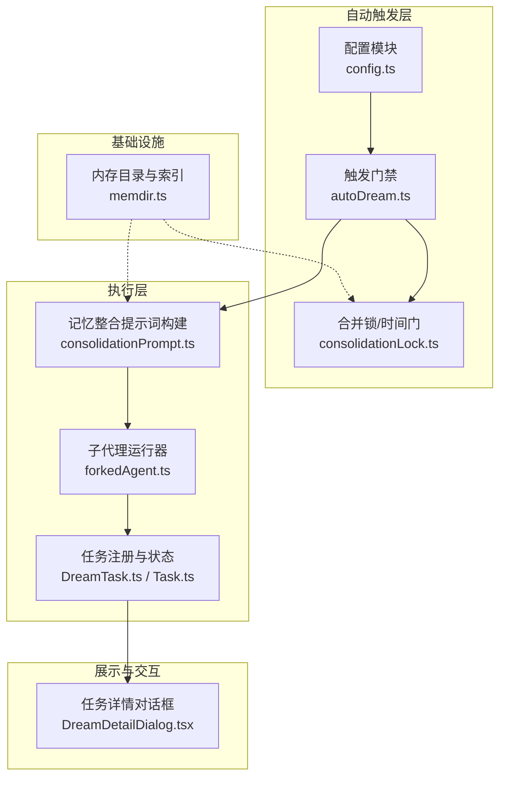
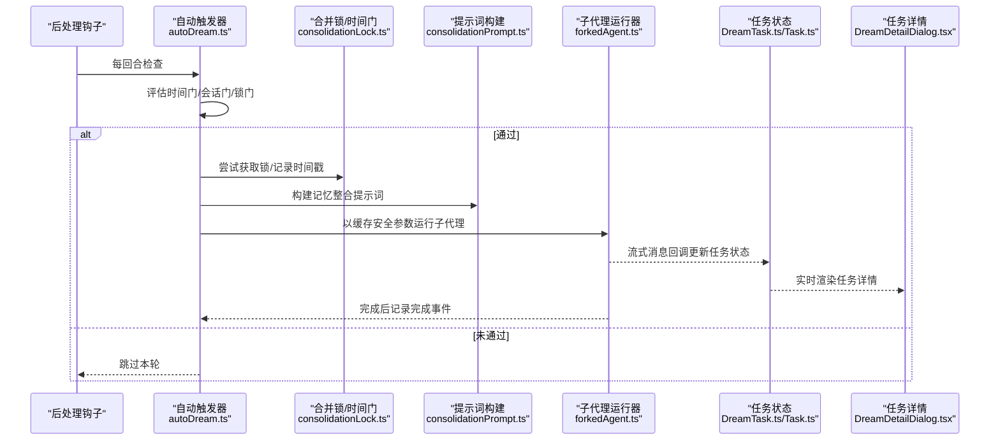
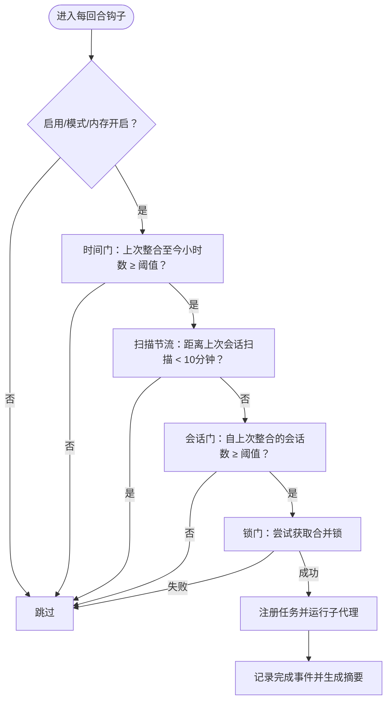
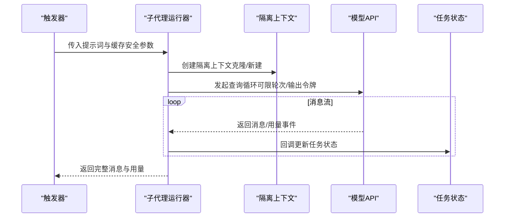
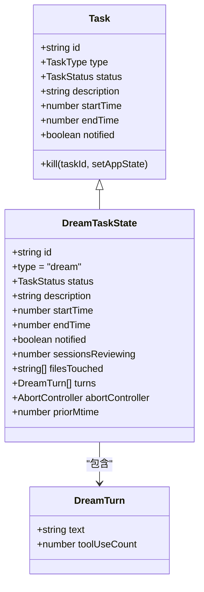
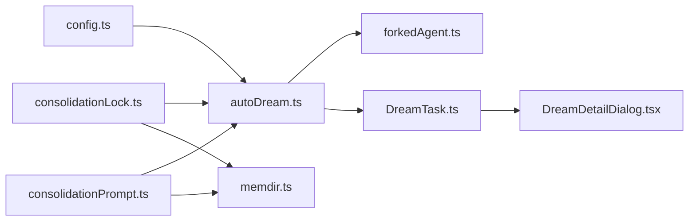

# Dream 任务系统

<cite>
**本文引用的文件**
- [DreamTask.ts](file://tasks/DreamTask/DreamTask.ts)
- [autoDream.ts](file://services/autoDream/autoDream.ts)
- [config.ts](file://services/autoDream/config.ts)
- [consolidationPrompt.ts](file://services/autoDream/consolidationPrompt.ts)
- [consolidationLock.ts](file://services/autoDream/consolidationLock.ts)
- [DreamDetailDialog.tsx](file://components/tasks/DreamDetailDialog.tsx)
- [Task.ts](file://Task.ts)
- [forkedAgent.ts](file://utils/forkedAgent.ts)
- [memdir.ts](file://memdir/memdir.ts)
</cite>

## 目录
1. [简介](#简介)
2. [项目结构](#项目结构)
3. [核心组件](#核心组件)
4. [架构总览](#架构总览)
5. [详细组件分析](#详细组件分析)
6. [依赖关系分析](#依赖关系分析)
7. [性能考量](#性能考量)
8. [故障排除指南](#故障排除指南)
9. [结论](#结论)
10. [附录](#附录)

## 简介
本文件系统性阐述 Dream 任务系统的设计理念、执行机制与记忆整合能力，覆盖自动 Dream 的触发条件、执行策略、结果处理与状态管理；解释任务压缩（Compact）机制、内存优化与长期存储策略；并提供配置参数、性能调优与资源控制选项，以及在不同场景下的使用模式与最佳实践。同时说明 Dream 任务与会话管理、内存系统和工具执行的集成关系，并给出监控指标、调试方法与故障排除建议。

## 项目结构
Dream 任务系统由“后台自动触发器”“子代理执行器”“任务状态管理”“UI 展示”“锁与时间门”等模块协同组成，围绕自动记忆整合（auto-dream）展开，形成从“感知—决策—执行—反馈”的闭环。

图示来源
- [autoDream.ts:122-273](file://services/autoDream/autoDream.ts#L122-L273)
- [config.ts:13-21](file://services/autoDream/config.ts#L13-L21)
- [consolidationLock.ts:29-124](file://services/autoDream/consolidationLock.ts#L29-L124)
- [consolidationPrompt.ts:10-65](file://services/autoDream/consolidationPrompt.ts#L10-L65)
- [forkedAgent.ts:489-626](file://utils/forkedAgent.ts#L489-L626)
- [DreamTask.ts:52-157](file://tasks/DreamTask/DreamTask.ts#L52-L157)
- [Task.ts:6-126](file://Task.ts#L6-L126)
- [DreamDetailDialog.tsx:22-244](file://components/tasks/DreamDetailDialog.tsx#L22-L244)
- [memdir.ts:34-119](file://memdir/memdir.ts#L34-L119)

章节来源
- [autoDream.ts:122-273](file://services/autoDream/autoDream.ts#L122-L273)
- [config.ts:13-21](file://services/autoDream/config.ts#L13-L21)
- [consolidationLock.ts:29-124](file://services/autoDream/consolidationLock.ts#L29-L124)
- [consolidationPrompt.ts:10-65](file://services/autoDream/consolidationPrompt.ts#L10-L65)
- [forkedAgent.ts:489-626](file://utils/forkedAgent.ts#L489-L626)
- [DreamTask.ts:52-157](file://tasks/DreamTask/DreamTask.ts#L52-L157)
- [Task.ts:6-126](file://Task.ts#L6-L126)
- [DreamDetailDialog.tsx:22-244](file://components/tasks/DreamDetailDialog.tsx#L22-L244)
- [memdir.ts:34-119](file://memdir/memdir.ts#L34-L119)

## 核心组件
- 自动触发器：按时间门、会话数门与锁门三阶段判定是否触发，避免并发冲突与过度频繁。
- 子代理执行器：以缓存安全参数复用主回路上下文，隔离可变状态，稳定提示词缓存命中。
- 任务状态管理：统一的任务生命周期（pending/running/completed/failed/killed），支持 UI 可见与可中断。
- 提示词构建：面向“记忆整合”的四阶段流程（定位/收集/整合/修剪/索引），指导模型行为。
- 锁与时间门：基于内存目录内锁文件的 mtime 记录上次整合时间，防止并发与崩溃残留。
- UI 展示：任务详情对话框实时显示运行时长、会话回顾数量、文件改动与最近若干轮输出。

章节来源
- [autoDream.ts:95-199](file://services/autoDream/autoDream.ts#L95-L199)
- [forkedAgent.ts:489-626](file://utils/forkedAgent.ts#L489-L626)
- [Task.ts:6-126](file://Task.ts#L6-L126)
- [consolidationPrompt.ts:15-64](file://services/autoDream/consolidationPrompt.ts#L15-L64)
- [consolidationLock.ts:29-108](file://services/autoDream/consolidationLock.ts#L29-L108)
- [DreamDetailDialog.tsx:22-244](file://components/tasks/DreamDetailDialog.tsx#L22-L244)

## 架构总览
自动 Dream 的整体流程如下：

图示来源
- [autoDream.ts:125-272](file://services/autoDream/autoDream.ts#L125-L272)
- [consolidationLock.ts:46-84](file://services/autoDream/consolidationLock.ts#L46-L84)
- [consolidationPrompt.ts:10-65](file://services/autoDream/consolidationPrompt.ts#L10-L65)
- [forkedAgent.ts:489-626](file://utils/forkedAgent.ts#L489-L626)
- [DreamTask.ts:76-130](file://tasks/DreamTask/DreamTask.ts#L76-L130)
- [DreamDetailDialog.tsx:22-244](file://components/tasks/DreamDetailDialog.tsx#L22-L244)

## 详细组件分析

### 组件一：自动触发器（autoDream）
- 触发门禁顺序（成本从低到高）：
  - 时间门：上次整合至今的小时数需达到阈值。
  - 会话门：自上次整合以来，满足时间窗口内的会话数量需达到阈值（当前会话除外）。
  - 锁门：无其他进程正在整合中（基于内存目录内的锁文件）。
- 扫描节流：当时间门通过但会话门未通过时，限制扫描频率，避免每回合都尝试。
- 强制模式：仅用于测试，绕过启用/时间/会话门，但仍保留锁与前置条件。
- 执行路径：成功后注册任务、构建提示词、运行子代理、记录完成事件并生成摘要消息。

图示来源
- [autoDream.ts:95-199](file://services/autoDream/autoDream.ts#L95-L199)
- [autoDream.ts:125-272](file://services/autoDream/autoDream.ts#L125-L272)

章节来源
- [autoDream.ts:95-199](file://services/autoDream/autoDream.ts#L95-L199)
- [autoDream.ts:125-272](file://services/autoDream/autoDream.ts#L125-L272)

### 组件二：子代理运行器（forkedAgent）
- 缓存安全：共享父回路的系统提示、用户上下文、系统上下文、工具上下文与前缀消息，确保提示词缓存命中。
- 隔离状态：为子代理创建独立的可变状态（文件读取缓存、内容替换状态、拒绝计数等），避免污染父回路。
- 流式回调：逐条消息回调，驱动任务状态更新与 UI 渲染。
- 使用统计：聚合整次执行的输入/输出/缓存读写令牌用量，记录分析事件。

图示来源
- [forkedAgent.ts:489-626](file://utils/forkedAgent.ts#L489-L626)
- [forkedAgent.ts:345-462](file://utils/forkedAgent.ts#L345-L462)

章节来源
- [forkedAgent.ts:489-626](file://utils/forkedAgent.ts#L489-L626)
- [forkedAgent.ts:345-462](file://utils/forkedAgent.ts#L345-L462)

### 组件三：任务状态管理（DreamTask/Task）
- 任务类型：dream，ID 前缀为 d。
- 生命周期：pending → running → completed/failed/killed。
- 进度追踪：最多保留最近若干轮输出，滚动截断，避免内存膨胀。
- 中断与回滚：支持用户中断，回滚锁时间戳，保证下一次触发能再次尝试。
- UI 可见：通过任务注册暴露给 UI，可在底部任务栏与 Shift+Down 对话框中查看。

图示来源
- [Task.ts:6-126](file://Task.ts#L6-L126)
- [DreamTask.ts:25-157](file://tasks/DreamTask/DreamTask.ts#L25-L157)

章节来源
- [Task.ts:6-126](file://Task.ts#L6-L126)
- [DreamTask.ts:25-157](file://tasks/DreamTask/DreamTask.ts#L25-L157)

### 组件四：提示词构建（consolidationPrompt）
- 面向“记忆整合”的四阶段流程：定位（ls/入口文件/现有主题）、收集（日志/漂移事实/检索）、整合（写/更新主题文件）、修剪与索引（维护入口文件）。
- 提示词包含内存目录与会话转录目录信息，指导模型在大文件中进行窄范围检索。
- 额外上下文：在自动触发时注入“自上次整合以来的会话列表”和“只读 Bash 工具约束”。

章节来源
- [consolidationPrompt.ts:10-65](file://services/autoDream/consolidationPrompt.ts#L10-L65)

### 组件五：锁与时间门（consolidationLock）
- 锁文件位于内存目录内，mtime 即上次整合时间；持有者 PID 写入文件体。
- 并发控制：若锁存在且持有者进程存活且未过期，则阻塞；否则回收。
- 回滚机制：失败或被中断时回滚 mtime，便于下次触发重新评估时间门。
- 会话扫描：基于项目目录下会话候选文件的 mtime 过滤自上次整合以来的新会话。

章节来源
- [consolidationLock.ts:29-124](file://services/autoDream/consolidationLock.ts#L29-L124)

### 组件六：UI 展示（DreamDetailDialog）
- 实时显示：运行时长、回顾的会话数量、改动的文件数量、最近若干轮输出。
- 交互：空格关闭、方向键返回、x 键停止（仅运行中）。
- 状态可视化：运行中/已完成/失败三种状态的颜色区分。

章节来源
- [DreamDetailDialog.tsx:22-244](file://components/tasks/DreamDetailDialog.tsx#L22-L244)

## 依赖关系分析
- 触发器依赖配置模块（启用开关与调度参数）、锁模块（时间门与并发控制）、提示词模块（构建整合提示词）、任务模块（注册与状态更新）、UI 模块（详情对话框）。
- 子代理运行器依赖缓存安全参数与隔离上下文，确保与父回路共享提示词缓存的同时保持状态隔离。
- 提示词模块依赖内存目录与入口文件信息，确保模型在正确的目录结构下工作。
- 锁模块依赖内存目录路径与会话扫描工具，确保时间门与会话门的正确计算。

图示来源
- [autoDream.ts:28-50](file://services/autoDream/autoDream.ts#L28-L50)
- [consolidationPrompt.ts:4-8](file://services/autoDream/consolidationPrompt.ts#L4-L8)
- [consolidationLock.ts:9-14](file://services/autoDream/consolidationLock.ts#L9-L14)
- [DreamTask.ts:6-9](file://tasks/DreamTask/DreamTask.ts#L6-L9)
- [DreamDetailDialog.tsx:8-12](file://components/tasks/DreamDetailDialog.tsx#L8-L12)
- [memdir.ts:34-39](file://memdir/memdir.ts#L34-L39)

章节来源
- [autoDream.ts:28-50](file://services/autoDream/autoDream.ts#L28-L50)
- [consolidationPrompt.ts:4-8](file://services/autoDream/consolidationPrompt.ts#L4-L8)
- [consolidationLock.ts:9-14](file://services/autoDream/consolidationLock.ts#L9-L14)
- [DreamTask.ts:6-9](file://tasks/DreamTask/DreamTask.ts#L6-L9)
- [DreamDetailDialog.tsx:8-12](file://components/tasks/DreamDetailDialog.tsx#L8-L12)
- [memdir.ts:34-39](file://memdir/memdir.ts#L34-L39)

## 性能考量
- 缓存安全与命中率：子代理运行器通过共享父回路的缓存安全参数，最大化提示词缓存命中，降低输入令牌消耗与响应延迟。
- 内存优化：任务状态仅保留最近若干轮输出，滚动截断，避免长时间运行导致的内存膨胀。
- 扫描节流：时间门通过后，限制会话扫描频率，减少不必要的磁盘 stat 操作。
- 使用统计：记录输入/输出/缓存读写令牌用量，便于后续性能分析与调优。
- 索引修剪：严格控制入口文件行数与字节数，避免超大索引影响加载性能。

章节来源
- [forkedAgent.ts:489-626](file://utils/forkedAgent.ts#L489-L626)
- [DreamTask.ts:11-12](file://tasks/DreamTask/DreamTask.ts#L11-L12)
- [autoDream.ts:56-151](file://services/autoDream/autoDream.ts#L56-L151)
- [memdir.ts:57-103](file://memdir/memdir.ts#L57-L103)

## 故障排除指南
- 触发不生效
  - 检查启用开关与模式：确认自动记忆与自动 Dream 启用，且不在远程模式或 KAIROS 模式下。
  - 查看时间门与会话门：确认已达到最小小时数与最小会话数阈值。
  - 锁竞争：若锁被其他进程持有且未过期，等待或手动清理锁文件。
- 执行失败
  - 用户中断：任务状态为 killed，锁已回滚，下次触发可重试。
  - 子代理异常：查看分析事件中的输入/输出/缓存用量，定位问题。
- UI 不可见
  - 确认任务已注册并处于运行状态，Shift+Down 对话框中应可见。
- 性能退化
  - 入口文件过大：检查行数与字节上限，必要时精简索引条目。
  - 频繁触发：调整时间门与会话门阈值，或启用扫描节流。

章节来源
- [autoDream.ts:95-199](file://services/autoDream/autoDream.ts#L95-L199)
- [autoDream.ts:258-271](file://services/autoDream/autoDream.ts#L258-L271)
- [consolidationLock.ts:60-84](file://services/autoDream/consolidationLock.ts#L60-L84)
- [DreamTask.ts:136-156](file://tasks/DreamTask/DreamTask.ts#L136-L156)
- [DreamDetailDialog.tsx:22-244](file://components/tasks/DreamDetailDialog.tsx#L22-L244)
- [memdir.ts:57-103](file://memdir/memdir.ts#L57-L103)

## 结论
Dream 任务系统通过“触发门禁—子代理执行—任务状态—UI 展示”的闭环设计，在保障缓存命中与状态隔离的前提下，实现了自动记忆整合的高效与稳定。其锁与时间门机制有效避免并发冲突，提示词构建明确引导模型行为，UI 展示提供可观测性与可控性。结合性能调优与故障排除策略，可在不同场景下实现可靠的长期记忆维护与知识沉淀。

## 附录

### 配置参数与调优选项
- 启用开关
  - 用户设置优先：settings.json 中的 autoDreamEnabled。
  - 特征门控：未显式设置时，回落至 tengu_onyx_plover 的 enabled 字段。
- 调度参数
  - minHours：时间门阈值（小时）。
  - minSessions：会话门阈值（会话数）。
- 执行参数
  - 缓存安全参数：共享父回路的系统提示、用户上下文、系统上下文、工具上下文与前缀消息。
  - 最大轮次/输出令牌：可选限制，避免缓存共享场景下的预算差异。
  - 流式回调：onMessage，用于实时更新任务状态与 UI。
- 索引修剪
  - 入口文件最大行数与字节数，超限时截断并警告。

章节来源
- [config.ts:13-21](file://services/autoDream/config.ts#L13-L21)
- [autoDream.ts:73-93](file://services/autoDream/autoDream.ts#L73-L93)
- [forkedAgent.ts:83-113](file://utils/forkedAgent.ts#L83-L113)
- [memdir.ts:57-103](file://memdir/memdir.ts#L57-L103)