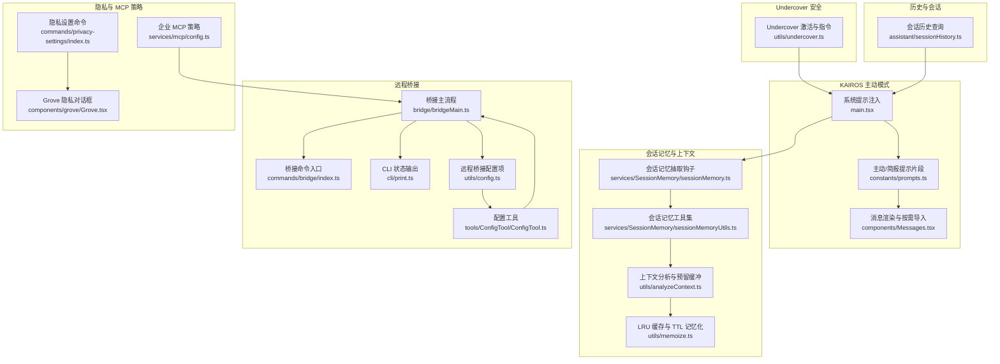
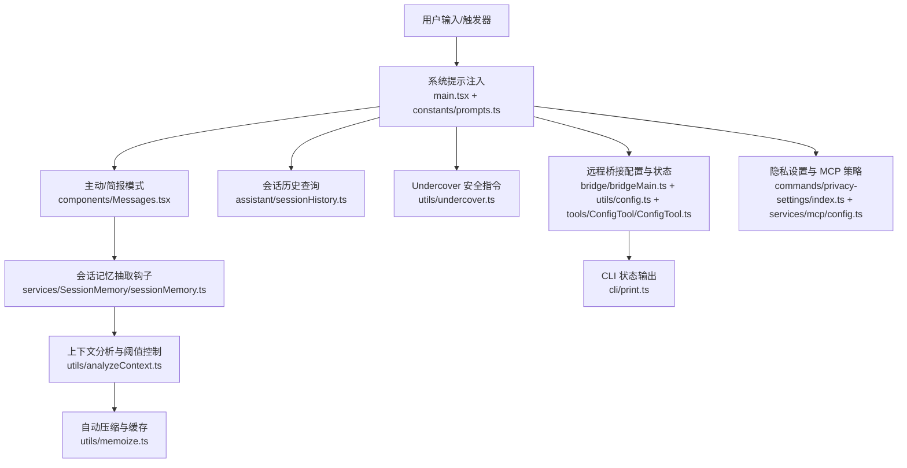
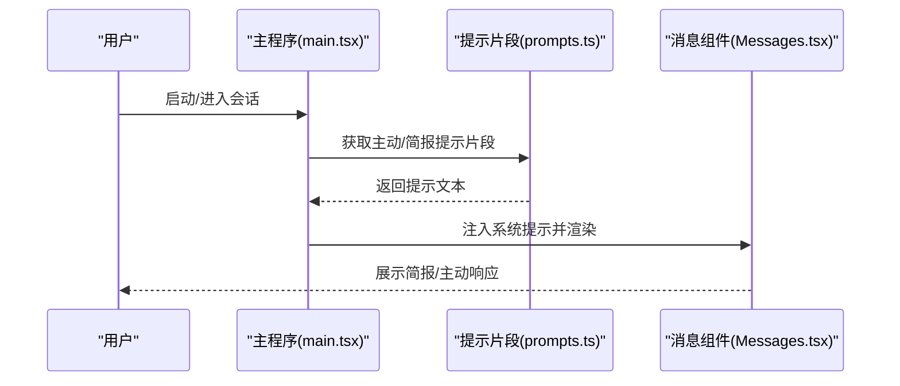
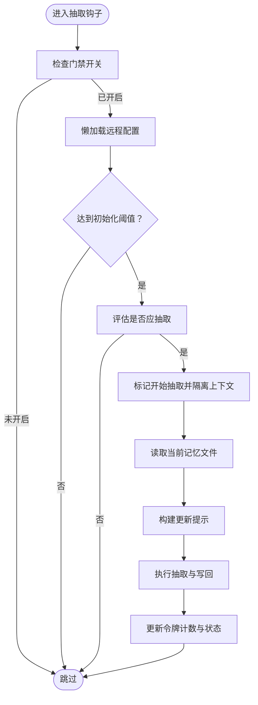
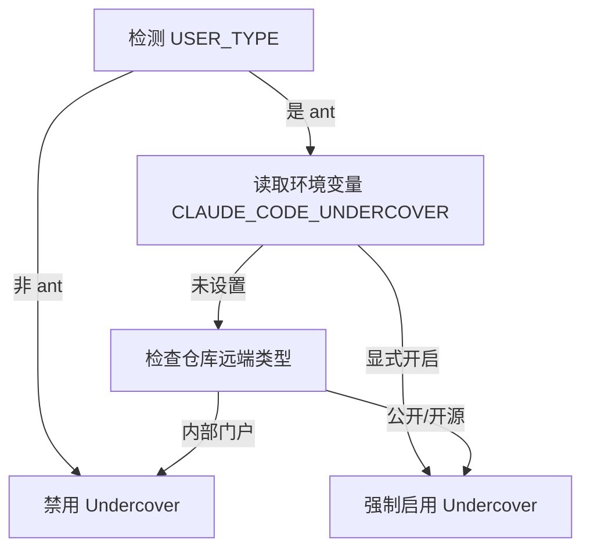
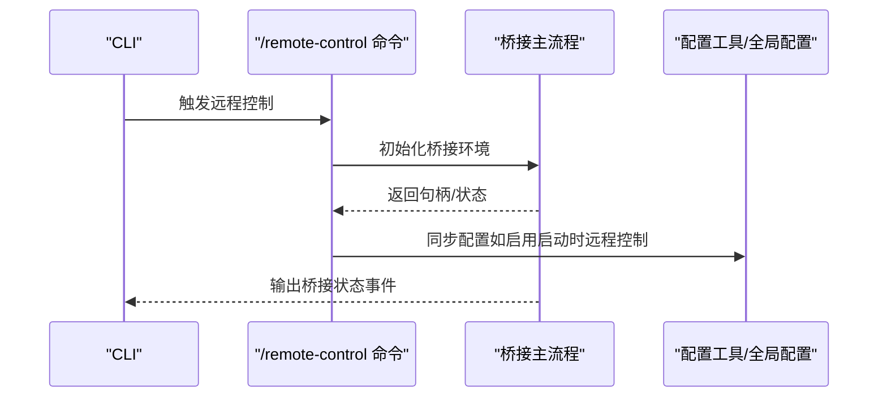
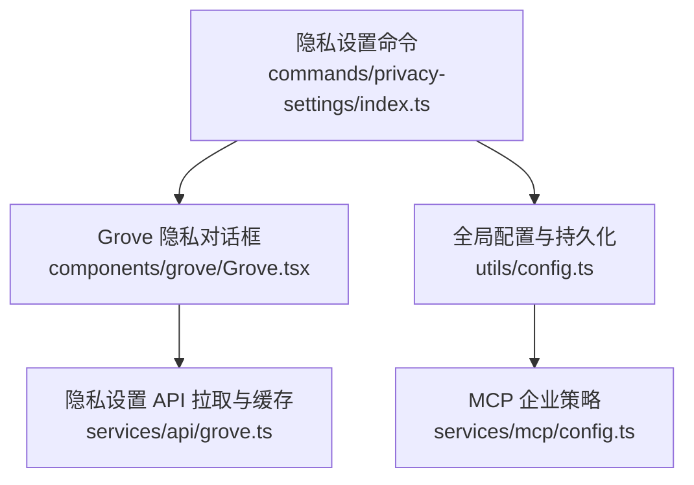
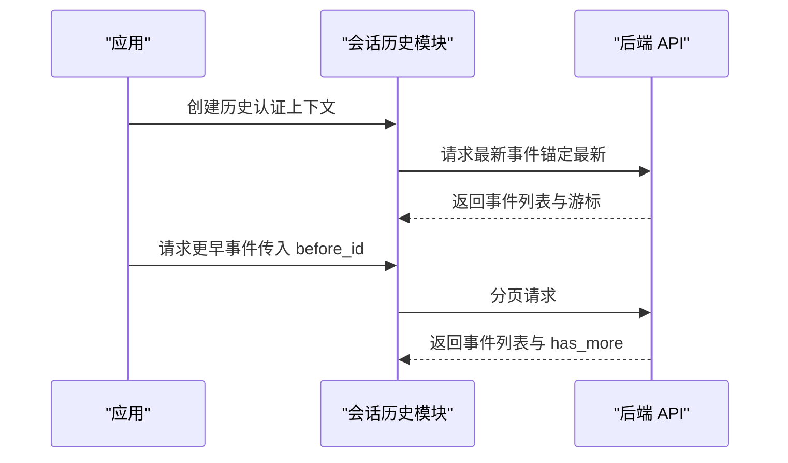
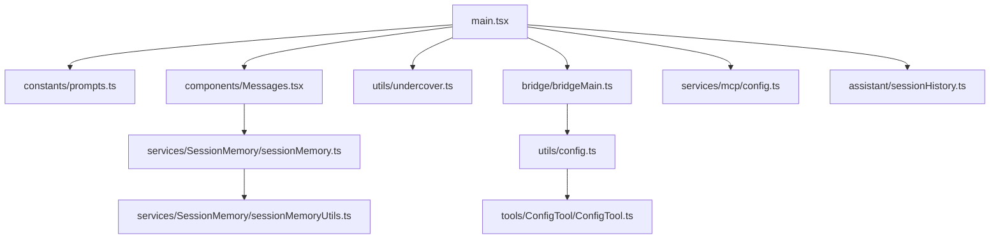

# KAIROS 持续助手

<cite>
**本文引用的文件**
- [README.md](file://README.md)
- [utils/undercover.ts](file://utils/undercover.ts)
- [assistant/sessionHistory.ts](file://assistant/sessionHistory.ts)
- [main.tsx](file://main.tsx)
- [components/Messages.tsx](file://components/Messages.tsx)
- [constants/prompts.ts](file://constants/prompts.ts)
- [services/SessionMemory/sessionMemory.ts](file://services/SessionMemory/sessionMemory.ts)
- [services/SessionMemory/sessionMemoryUtils.ts](file://services/SessionMemory/sessionMemoryUtils.ts)
- [bridge/bridgeMain.ts](file://bridge/bridgeMain.ts)
- [commands/bridge/index.ts](file://commands/bridge/index.ts)
- [commands/privacy-settings/index.ts](file://commands/privacy-settings/index.ts)
- [components/grove/Grove.tsx](file://components/grove/Grove.tsx)
- [services/mcp/config.ts](file://services/mcp/config.ts)
- [utils/config.ts](file://utils/config.ts)
- [tools/ConfigTool/ConfigTool.ts](file://tools/ConfigTool/ConfigTool.ts)
- [cli/print.ts](file://cli/print.ts)
- [utils/analyzeContext.ts](file://utils/analyzeContext.ts)
- [utils/memoize.ts](file://utils/memoize.ts)
- [services/api/grove.ts](file://services/api/grove.ts)
</cite>

## 目录
1. [简介](#简介)
2. [项目结构](#项目结构)
3. [核心组件](#核心组件)
4. [架构总览](#架构总览)
5. [详细组件分析](#详细组件分析)
6. [依赖关系分析](#依赖关系分析)
7. [性能考量](#性能考量)
8. [故障排查指南](#故障排查指南)
9. [结论](#结论)
10. [附录](#附录)

## 简介
本文件系统性梳理 KAIROS 持续助手在该代码库中的实现与设计要点，重点覆盖以下方面：
- 核心概念与设计理念：持续会话、记忆管理、上下文延续、主动行为与节制（阻塞预算）。
- Undercover 模式的安全机制与企业级应用边界：如何在公开/开源仓库中避免泄露内部信息。
- 会话保持、记忆管理与上下文延续：基于每日日志、会话记忆抽取与自动压缩。
- 隐私保护与数据安全策略：权限控制、路径穿越防护、MCP 服务器白名单/黑名单、远程桥接的安全配置。
- 配置选项与部署方式：特征开关、远程桥接、企业 MCP 策略、隐私设置入口。
- 与其他系统的集成接口与 API：历史事件查询、远程桥接、MCP 资源读取、Grove 配置。
- 适应性与扩展性：多代理编排、工具权限分级、上下文折叠与自动压缩。
- 性能优化建议与资源管理策略：缓存、并发、阻塞预算、上下文阈值。

## 项目结构
围绕 KAIROS 的关键目录与文件：
- assistant：会话历史查询能力，支撑持续助手对历史事件的检索与上下文注入。
- utils/undercover.ts：Undercover 安全模式，确保在公开/开源仓库中不泄露内部信息。
- services/SessionMemory：会话记忆抽取、初始化阈值、更新间隔与并发控制。
- bridge：远程桥接主流程与命令入口，支持企业级远程控制与可信设备。
- components/Messages.tsx、constants/prompts.ts、main.tsx：主动模式与 Brief 输出模式的系统提示注入与条件加载。
- services/mcp/config.ts：企业 MCP 服务器策略（白/黑名单、范围、写入保护）。
- commands/privacy-settings、components/grove/Grove.tsx：隐私设置入口与数据隐私对话框。
- utils/config.ts、tools/ConfigTool/ConfigTool.ts：远程桥接启动策略与配置项持久化。
- cli/print.ts：桥接状态输出与调试日志。
- utils/analyzeContext.ts、utils/memoize.ts：上下文分析与缓存策略。
- services/api/grove.ts：Grove 配置拉取与缓存。

**图表来源**
- [main.tsx:2200-2209](file://main.tsx#L2200-L2209)
- [constants/prompts.ts:843-864](file://constants/prompts.ts#L843-L864)
- [components/Messages.tsx:78-85](file://components/Messages.tsx#L78-L85)
- [services/SessionMemory/sessionMemory.ts:272-313](file://services/SessionMemory/sessionMemory.ts#L272-L313)
- [services/SessionMemory/sessionMemoryUtils.ts:85-177](file://services/SessionMemory/sessionMemoryUtils.ts#L85-L177)
- [utils/analyzeContext.ts:1105-1132](file://utils/analyzeContext.ts#L1105-L1132)
- [utils/memoize.ts:1-49](file://utils/memoize.ts#L1-L49)
- [utils/undercover.ts:1-90](file://utils/undercover.ts#L1-L90)
- [bridge/bridgeMain.ts:2447-2467](file://bridge/bridgeMain.ts#L2447-L2467)
- [commands/bridge/index.ts:1-26](file://commands/bridge/index.ts#L1-L26)
- [cli/print.ts:3951-3985](file://cli/print.ts#L3951-L3985)
- [utils/config.ts:1088-1125](file://utils/config.ts#L1088-L1125)
- [tools/ConfigTool/ConfigTool.ts:132-180](file://tools/ConfigTool/ConfigTool.ts#L132-L180)
- [commands/privacy-settings/index.ts:1-14](file://commands/privacy-settings/index.ts#L1-L14)
- [components/grove/Grove.tsx:421-462](file://components/grove/Grove.tsx#L421-L462)
- [services/mcp/config.ts:336-378](file://services/mcp/config.ts#L336-L378)
- [assistant/sessionHistory.ts:1-88](file://assistant/sessionHistory.ts#L1-L88)

**章节来源**
- [README.md:124-150](file://README.md#L124-L150)
- [main.tsx:2200-2209](file://main.tsx#L2200-L2209)
- [components/Messages.tsx:78-85](file://components/Messages.tsx#L78-L85)
- [constants/prompts.ts:843-864](file://constants/prompts.ts#L843-L864)
- [utils/undercover.ts:1-90](file://utils/undercover.ts#L1-L90)
- [services/SessionMemory/sessionMemory.ts:272-313](file://services/SessionMemory/sessionMemory.ts#L272-L313)
- [services/SessionMemory/sessionMemoryUtils.ts:85-177](file://services/SessionMemory/sessionMemoryUtils.ts#L85-L177)
- [bridge/bridgeMain.ts:2447-2467](file://bridge/bridgeMain.ts#L2447-L2467)
- [commands/bridge/index.ts:1-26](file://commands/bridge/index.ts#L1-L26)
- [utils/config.ts:1088-1125](file://utils/config.ts#L1088-L1125)
- [tools/ConfigTool/ConfigTool.ts:132-180](file://tools/ConfigTool/ConfigTool.ts#L132-L180)
- [cli/print.ts:3951-3985](file://cli/print.ts#L3951-L3985)
- [commands/privacy-settings/index.ts:1-14](file://commands/privacy-settings/index.ts#L1-L14)
- [components/grove/Grove.tsx:421-462](file://components/grove/Grove.tsx#L421-L462)
- [services/mcp/config.ts:336-378](file://services/mcp/config.ts#L336-L378)
- [assistant/sessionHistory.ts:1-88](file://assistant/sessionHistory.ts#L1-L88)

## 核心组件
- 主动模式与简报输出
  - 通过系统提示注入与按需模块导入，实现“总是在线”的主动助手，并在需要时采用简报模式以减少干扰。
- 会话记忆与上下文延续
  - 基于会话内存抽取钩子与阈值控制，结合自动压缩与上下文分析，维持长期对话的连贯性。
- Undercover 安全模式
  - 在公开/开源仓库中强制安全指令与去归属化，防止内部信息外泄。
- 远程桥接与企业策略
  - 支持远程控制、可信设备、企业 MCP 策略与配置持久化，满足企业级部署与合规要求。
- 隐私设置与数据保护
  - 提供隐私设置入口与对话框，结合 MCP 策略与权限控制，保障数据安全。

**章节来源**
- [README.md:124-150](file://README.md#L124-L150)
- [main.tsx:2200-2209](file://main.tsx#L2200-L2209)
- [components/Messages.tsx:78-85](file://components/Messages.tsx#L78-L85)
- [constants/prompts.ts:843-864](file://constants/prompts.ts#L843-L864)
- [utils/undercover.ts:1-90](file://utils/undercover.ts#L1-L90)
- [services/SessionMemory/sessionMemory.ts:272-313](file://services/SessionMemory/sessionMemory.ts#L272-L313)
- [services/SessionMemory/sessionMemoryUtils.ts:85-177](file://services/SessionMemory/sessionMemoryUtils.ts#L85-L177)
- [bridge/bridgeMain.ts:2447-2467](file://bridge/bridgeMain.ts#L2447-L2467)
- [commands/bridge/index.ts:1-26](file://commands/bridge/index.ts#L1-L26)
- [utils/config.ts:1088-1125](file://utils/config.ts#L1088-L1125)
- [tools/ConfigTool/ConfigTool.ts:132-180](file://tools/ConfigTool/ConfigTool.ts#L132-L180)
- [commands/privacy-settings/index.ts:1-14](file://commands/privacy-settings/index.ts#L1-L14)
- [components/grove/Grove.tsx:421-462](file://components/grove/Grove.tsx#L421-L462)
- [services/mcp/config.ts:336-378](file://services/mcp/config.ts#L336-L378)

## 架构总览
KAIROS 的整体架构围绕“系统提示注入—主动行为—会话记忆—上下文管理—安全与合规”展开，同时通过远程桥接与企业 MCP 策略实现跨环境的一致性与安全性。

**图表来源**
- [main.tsx:2200-2209](file://main.tsx#L2200-L2209)
- [constants/prompts.ts:843-864](file://constants/prompts.ts#L843-L864)
- [components/Messages.tsx:78-85](file://components/Messages.tsx#L78-L85)
- [services/SessionMemory/sessionMemory.ts:272-313](file://services/SessionMemory/sessionMemory.ts#L272-L313)
- [utils/analyzeContext.ts:1105-1132](file://utils/analyzeContext.ts#L1105-L1132)
- [utils/memoize.ts:1-49](file://utils/memoize.ts#L1-L49)
- [assistant/sessionHistory.ts:1-88](file://assistant/sessionHistory.ts#L1-L88)
- [utils/undercover.ts:1-90](file://utils/undercover.ts#L1-L90)
- [bridge/bridgeMain.ts:2447-2467](file://bridge/bridgeMain.ts#L2447-L2467)
- [utils/config.ts:1088-1125](file://utils/config.ts#L1088-L1125)
- [tools/ConfigTool/ConfigTool.ts:132-180](file://tools/ConfigTool/ConfigTool.ts#L132-L180)
- [cli/print.ts:3951-3985](file://cli/print.ts#L3951-L3985)
- [commands/privacy-settings/index.ts:1-14](file://commands/privacy-settings/index.ts#L1-L14)
- [services/mcp/config.ts:336-378](file://services/mcp/config.ts#L336-L378)

## 详细组件分析

### 主动模式与简报输出
- 系统提示注入：在启用 KAIROS 或 PROACTIVE 时，动态追加主动模式提示；当 Brief 工具可用时，进一步注入简报可见性提示。
- 条件导入：通过特征门控按需加载主动模块与简报工具，避免外部构建中冗余代码。
- 简报模式：强调“少即是多”，仅在关键节点输出摘要或状态，避免淹没用户终端。

**图表来源**
- [main.tsx:2200-2209](file://main.tsx#L2200-L2209)
- [constants/prompts.ts:843-864](file://constants/prompts.ts#L843-L864)
- [components/Messages.tsx:78-85](file://components/Messages.tsx#L78-L85)

**章节来源**
- [main.tsx:2200-2209](file://main.tsx#L2200-L2209)
- [constants/prompts.ts:843-864](file://constants/prompts.ts#L843-L864)
- [components/Messages.tsx:78-85](file://components/Messages.tsx#L78-L85)

### 会话记忆抽取与上下文延续
- 抽取钩子：在 REPL 主线程上运行，检查门禁开关、远程配置与阈值，决定是否执行记忆抽取。
- 初始化与阈值：基于消息令牌数与最小初始化阈值判断是否初始化会话记忆。
- 更新策略：记录上次提取令牌数，控制最小令牌间隔与工具调用间隔，避免频繁更新。
- 并发与等待：对正在进行的抽取进行超时与过期处理，避免阻塞主线程。

**图表来源**
- [services/SessionMemory/sessionMemory.ts:272-313](file://services/SessionMemory/sessionMemory.ts#L272-L313)
- [services/SessionMemory/sessionMemoryUtils.ts:85-177](file://services/SessionMemory/sessionMemoryUtils.ts#L85-L177)

**章节来源**
- [services/SessionMemory/sessionMemory.ts:272-313](file://services/SessionMemory/sessionMemory.ts#L272-L313)
- [services/SessionMemory/sessionMemoryUtils.ts:85-177](file://services/SessionMemory/sessionMemoryUtils.ts#L85-L177)

### Undercover 安全机制与企业应用
- 自动检测：根据仓库远端类型与环境变量决定是否启用 Undercover；默认保守策略“非内部门户即启用”。
- 安全指令：在系统提示中注入严格限制，禁止泄露内部模型代号、版本号、项目名、工具链等。
- 去归属化：提交信息与 PR 内容不得包含任何归属信息，以避免暴露 AI 身份与内部命名。

**图表来源**
- [utils/undercover.ts:1-90](file://utils/undercover.ts#L1-L90)

**章节来源**
- [utils/undercover.ts:1-90](file://utils/undercover.ts#L1-L90)
- [README.md:206-244](file://README.md#L206-L244)

### 远程桥接与企业策略
- 环境注册：桥接主流程负责注册环境并获取凭据，失败时输出清晰错误信息。
- 命令入口：/remote-control 命令在启用 BRIDGE_MODE 且已开启桥接时可用。
- 配置持久化：远程桥接启动策略可由全局配置与配置工具共同决定，并同步到应用状态。
- CLI 状态输出：桥接状态变化通过标准输出上报，便于自动化监控。

**图表来源**
- [bridge/bridgeMain.ts:2447-2467](file://bridge/bridgeMain.ts#L2447-L2467)
- [commands/bridge/index.ts:1-26](file://commands/bridge/index.ts#L1-L26)
- [utils/config.ts:1088-1125](file://utils/config.ts#L1088-L1125)
- [tools/ConfigTool/ConfigTool.ts:132-180](file://tools/ConfigTool/ConfigTool.ts#L132-L180)
- [cli/print.ts:3951-3985](file://cli/print.ts#L3951-L3985)

**章节来源**
- [bridge/bridgeMain.ts:2447-2467](file://bridge/bridgeMain.ts#L2447-L2467)
- [commands/bridge/index.ts:1-26](file://commands/bridge/index.ts#L1-L26)
- [utils/config.ts:1088-1125](file://utils/config.ts#L1088-L1125)
- [tools/ConfigTool/ConfigTool.ts:132-180](file://tools/ConfigTool/ConfigTool.ts#L132-L180)
- [cli/print.ts:3951-3985](file://cli/print.ts#L3951-L3985)

### 隐私设置与数据安全策略
- 隐私设置命令：消费者订阅者可通过本地 JSX 命令查看与更新隐私设置。
- Grove 隐私对话框：提供数据隐私控制入口与帮助链接，便于用户管理。
- MCP 企业策略：支持仅允许受管 MCP 服务器、名称/命令/URL 三类拒绝规则，以及写入保护与权限保留。
- 权限与路径安全：统一的权限模式、风险分类与路径穿越防护，确保工具调用安全。

**图表来源**
- [commands/privacy-settings/index.ts:1-14](file://commands/privacy-settings/index.ts#L1-L14)
- [components/grove/Grove.tsx:421-462](file://components/grove/Grove.tsx#L421-L462)
- [services/api/grove.ts:190-225](file://services/api/grove.ts#L190-L225)
- [utils/config.ts:1088-1125](file://utils/config.ts#L1088-L1125)
- [services/mcp/config.ts:336-378](file://services/mcp/config.ts#L336-L378)

**章节来源**
- [commands/privacy-settings/index.ts:1-14](file://commands/privacy-settings/index.ts#L1-L14)
- [components/grove/Grove.tsx:421-462](file://components/grove/Grove.tsx#L421-L462)
- [services/api/grove.ts:190-225](file://services/api/grove.ts#L190-L225)
- [utils/config.ts:1088-1125](file://utils/config.ts#L1088-L1125)
- [services/mcp/config.ts:336-378](file://services/mcp/config.ts#L336-L378)

### 会话历史与上下文延续
- 历史查询：提供最新事件与更早事件分页查询，支持锚定最新事件与游标翻页。
- 上下文分析：结合自动压缩与预留缓冲，避免在主动模式与上下文折叠之间产生冲突。
- 缓存与 TTL：通过记忆化函数实现缓存与后台刷新，降低重复计算成本。

**图表来源**
- [assistant/sessionHistory.ts:1-88](file://assistant/sessionHistory.ts#L1-L88)
- [utils/analyzeContext.ts:1105-1132](file://utils/analyzeContext.ts#L1105-L1132)
- [utils/memoize.ts:1-49](file://utils/memoize.ts#L1-L49)

**章节来源**
- [assistant/sessionHistory.ts:1-88](file://assistant/sessionHistory.ts#L1-L88)
- [utils/analyzeContext.ts:1105-1132](file://utils/analyzeContext.ts#L1105-L1132)
- [utils/memoize.ts:1-49](file://utils/memoize.ts#L1-L49)

## 依赖关系分析
- 组件耦合与内聚
  - 主动模式与简报输出通过系统提示注入实现高内聚，按需导入降低外部构建体积。
  - 会话记忆抽取与上下文分析解耦，前者专注“何时抽取”，后者专注“如何管理”。
  - Undercover 与远程桥接分别面向安全与连接，通过配置与命令入口解耦。
- 外部依赖与集成点
  - 历史查询依赖 OAuth 凭证与组织 UUID，确保访问控制。
  - 桥接依赖 JWT 认证与环境注册，失败路径明确。
  - MCP 策略依赖受管配置文件与权限保留，防止误写。
- 循环依赖与规避
  - 主动模式阈值检查中通过延迟 require 避免初始化循环。
  - 记忆化缓存独立模块，避免与业务逻辑耦合。

**图表来源**
- [main.tsx:2200-2209](file://main.tsx#L2200-L2209)
- [constants/prompts.ts:843-864](file://constants/prompts.ts#L843-L864)
- [components/Messages.tsx:78-85](file://components/Messages.tsx#L78-L85)
- [services/SessionMemory/sessionMemory.ts:272-313](file://services/SessionMemory/sessionMemory.ts#L272-L313)
- [services/SessionMemory/sessionMemoryUtils.ts:85-177](file://services/SessionMemory/sessionMemoryUtils.ts#L85-L177)
- [utils/undercover.ts:1-90](file://utils/undercover.ts#L1-L90)
- [bridge/bridgeMain.ts:2447-2467](file://bridge/bridgeMain.ts#L2447-L2467)
- [utils/config.ts:1088-1125](file://utils/config.ts#L1088-L1125)
- [tools/ConfigTool/ConfigTool.ts:132-180](file://tools/ConfigTool/ConfigTool.ts#L132-L180)
- [services/mcp/config.ts:336-378](file://services/mcp/config.ts#L336-L378)
- [assistant/sessionHistory.ts:1-88](file://assistant/sessionHistory.ts#L1-L88)

**章节来源**
- [main.tsx:2200-2209](file://main.tsx#L2200-L2209)
- [components/Messages.tsx:78-85](file://components/Messages.tsx#L78-L85)
- [services/SessionMemory/sessionMemory.ts:272-313](file://services/SessionMemory/sessionMemory.ts#L272-L313)
- [utils/undercover.ts:1-90](file://utils/undercover.ts#L1-L90)
- [bridge/bridgeMain.ts:2447-2467](file://bridge/bridgeMain.ts#L2447-L2467)
- [utils/config.ts:1088-1125](file://utils/config.ts#L1088-L1125)
- [tools/ConfigTool/ConfigTool.ts:132-180](file://tools/ConfigTool/ConfigTool.ts#L132-L180)
- [services/mcp/config.ts:336-378](file://services/mcp/config.ts#L336-L378)
- [assistant/sessionHistory.ts:1-88](file://assistant/sessionHistory.ts#L1-L88)

## 性能考量
- 缓存与并发
  - 使用记忆化与 TTL 缓存减少重复计算，后台刷新避免阻塞主线程。
- 上下文管理
  - 自动压缩与预留缓冲平衡“节省空间”与“透明性”，避免在主动模式与上下文折叠之间冲突。
- 阻塞预算
  - 主动行为设置 15 秒阻塞预算，避免影响用户工作流。
- 配置懒加载
  - 会话记忆配置与门禁检查采用懒加载与缓存，降低启动与运行时开销。

**章节来源**
- [utils/memoize.ts:1-49](file://utils/memoize.ts#L1-L49)
- [utils/analyzeContext.ts:1105-1132](file://utils/analyzeContext.ts#L1105-L1132)
- [services/SessionMemory/sessionMemory.ts:272-313](file://services/SessionMemory/sessionMemory.ts#L272-L313)
- [README.md:132-134](file://README.md#L132-L134)

## 故障排查指南
- 远程桥接失败
  - 环境注册失败会输出清晰错误码；检查账户权限与网络状态。
  - 使用桥接调试命令模拟关闭、轮询失败、心跳异常等，验证恢复路径。
- 会话记忆未更新
  - 检查门禁开关、远程配置与阈值；确认抽取钩子在主 REPL 线程运行。
  - 关注“抽取过期/超时”日志，避免长时间阻塞。
- Undercover 行为异常
  - 确认环境变量与仓库远端类型；必要时强制开启以排除误判。
- 隐私设置无效
  - 检查消费者订阅状态与隐私设置命令可用性；确认配置持久化成功。

**章节来源**
- [bridge/bridgeMain.ts:2447-2467](file://bridge/bridgeMain.ts#L2447-L2467)
- [cli/print.ts:3951-3985](file://cli/print.ts#L3951-L3985)
- [services/SessionMemory/sessionMemory.ts:272-313](file://services/SessionMemory/sessionMemory.ts#L272-L313)
- [utils/undercover.ts:1-90](file://utils/undercover.ts#L1-L90)
- [commands/privacy-settings/index.ts:1-14](file://commands/privacy-settings/index.ts#L1-L14)

## 结论
KAIROS 持续助手在该代码库中体现了“主动但克制、记忆可延续、安全可审计”的设计哲学。通过系统提示注入、会话记忆抽取、上下文分析与缓存、Undercover 安全模式、远程桥接与企业 MCP 策略，以及隐私设置入口，实现了从个人开发者到企业用户的广泛适用。建议在生产环境中结合阻塞预算、自动压缩与缓存策略，持续监控桥接状态与会话记忆阈值，以获得稳定高效的体验。

## 附录
- 配置选项与部署要点
  - 特征开关：PROACTIVE/KAIROS、KAIROS_BRIEF、BRIDGE_MODE、DAEMON、COORDINATOR_MODE 等。
  - 远程桥接：remoteControlAtStartup 可通过配置工具设置为“默认/启用/禁用”，并同步到应用状态。
  - 企业 MCP：仅允许受管服务器、名称/命令/URL 拒绝规则、写入保护与权限保留。
  - 隐私设置：消费者订阅者可通过本地命令查看与更新隐私设置，配合 Grove 对话框使用。
- 接口与 API
  - 会话历史事件查询：支持锚定最新与游标翻页，返回事件列表与分页标识。
  - 远程桥接：注册环境、心跳、断开与重连，失败路径明确。
  - MCP 资源读取：基于已连接客户端与资源 URI 读取内容，支持大小限制与能力校验。

**章节来源**
- [README.md:389-414](file://README.md#L389-L414)
- [utils/config.ts:1088-1125](file://utils/config.ts#L1088-L1125)
- [tools/ConfigTool/ConfigTool.ts:132-180](file://tools/ConfigTool/ConfigTool.ts#L132-L180)
- [services/mcp/config.ts:336-378](file://services/mcp/config.ts#L336-L378)
- [assistant/sessionHistory.ts:1-88](file://assistant/sessionHistory.ts#L1-L88)
- [bridge/bridgeMain.ts:2447-2467](file://bridge/bridgeMain.ts#L2447-L2467)