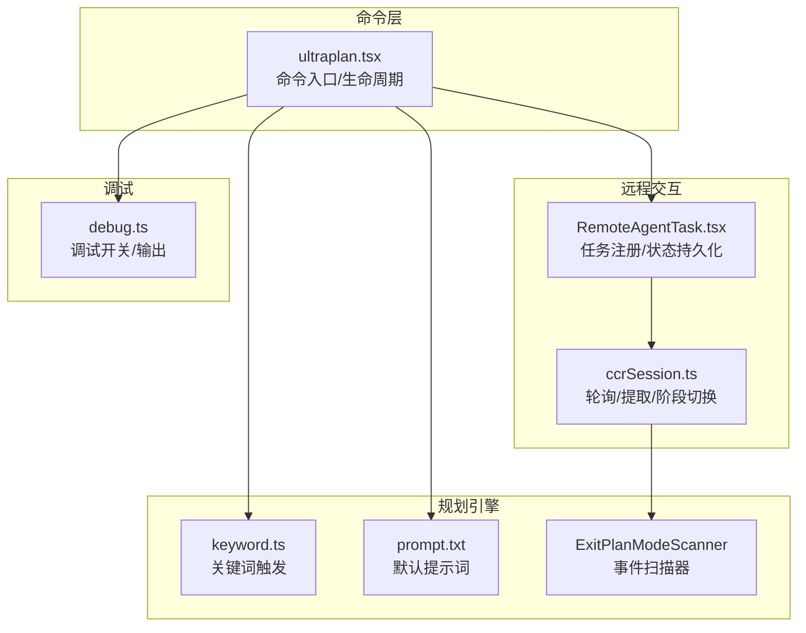
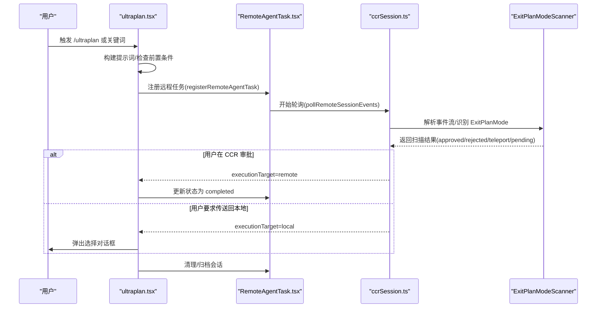
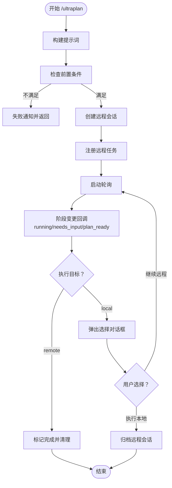
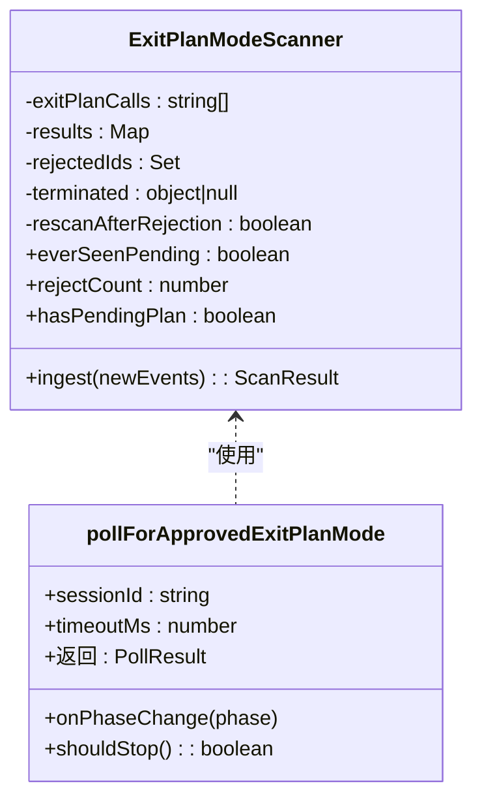
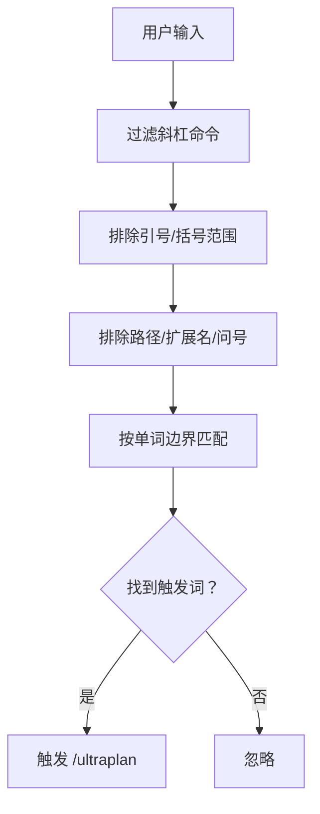
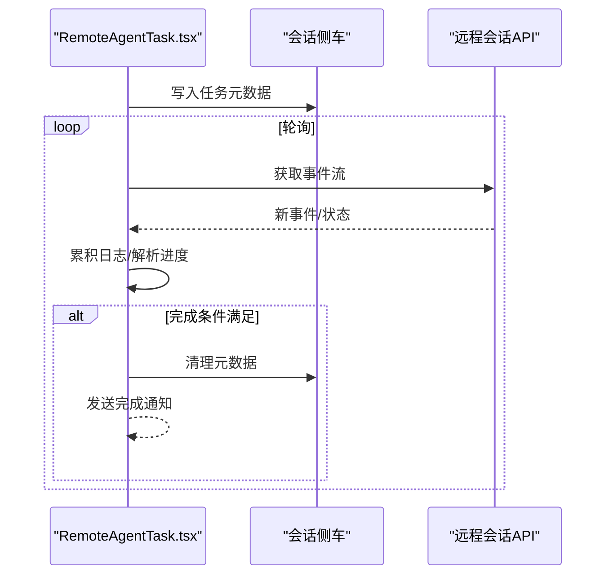
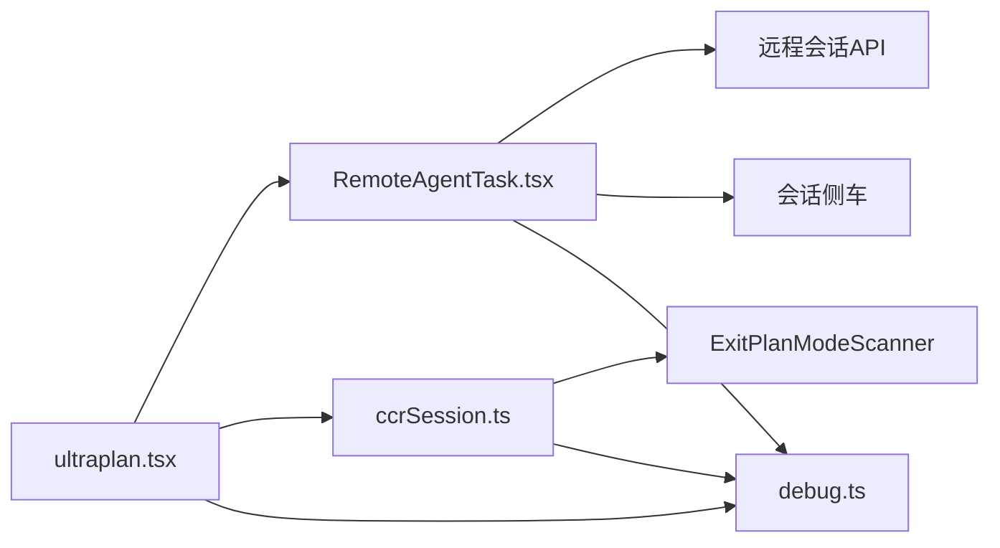

# ULTRAPLAN 远程规划

<cite>
**本文档引用的文件**
- [ultraplan.tsx](file://commands/ultraplan.tsx)
- [ccrSession.ts](file://utils/ultraplan/ccrSession.ts)
- [keyword.ts](file://utils/ultraplan/keyword.ts)
- [prompt.txt](file://utils/ultraplan/prompt.txt)
- [RemoteAgentTask.tsx](file://tasks/RemoteAgentTask/RemoteAgentTask.tsx)
- [debug.ts](file://utils/debug.ts)
</cite>

## 目录
1. [简介](#简介)
2. [项目结构](#项目结构)
3. [核心组件](#核心组件)
4. [架构总览](#架构总览)
5. [详细组件分析](#详细组件分析)
6. [依赖关系分析](#依赖关系分析)
7. [性能考虑](#性能考虑)
8. [故障排查指南](#故障排查指南)
9. [结论](#结论)
10. [附录](#附录)

## 简介
ULTRAPLAN 是一个在 Claude Code on the web（简称 CCR）中运行的高级远程规划系统。它通过多轮对话与模型协作，生成复杂软件工程问题的详细计划，并支持用户在浏览器中审批或要求本地执行。系统采用“远程规划 + 本地选择”的模式：当计划在 CCR 中生成后，用户可选择在 CCR 内部执行，或将其带回本地终端执行；同时系统提供状态同步、超时控制、错误处理与调试能力。

## 项目结构
ULTRAPLAN 的实现主要分布在以下模块：
- 命令入口与生命周期管理：commands/ultraplan.tsx
- CCR 会话轮询与计划提取：utils/ultraplan/ccrSession.ts
- 关键词触发与提示词构建：utils/ultraplan/keyword.ts、utils/ultraplan/prompt.txt
- 远程任务框架与状态持久化：tasks/RemoteAgentTask/RemoteAgentTask.tsx
- 调试与日志：utils/debug.ts

图表来源
- [ultraplan.tsx:59-170](file://commands/ultraplan.tsx#L59-L170)
- [ccrSession.ts:80-181](file://utils/ultraplan/ccrSession.ts#L80-L181)
- [keyword.ts:46-95](file://utils/ultraplan/keyword.ts#L46-L95)
- [prompt.txt:1-4](file://utils/ultraplan/prompt.txt#L1-L4)
- [RemoteAgentTask.tsx:386-466](file://tasks/RemoteAgentTask/RemoteAgentTask.tsx#L386-L466)
- [debug.ts:42-102](file://utils/debug.ts#L42-L102)

章节来源
- [ultraplan.tsx:59-170](file://commands/ultraplan.tsx#L59-L170)
- [ccrSession.ts:80-181](file://utils/ultraplan/ccrSession.ts#L80-L181)
- [keyword.ts:46-95](file://utils/ultraplan/keyword.ts#L46-L95)
- [prompt.txt:1-4](file://utils/ultraplan/prompt.txt#L1-L4)
- [RemoteAgentTask.tsx:386-466](file://tasks/RemoteAgentTask/RemoteAgentTask.tsx#L386-L466)
- [debug.ts:42-102](file://utils/debug.ts#L42-L102)

## 核心组件
- 命令入口与生命周期
  - 构建初始提示词、检查前置条件、启动远程会话、注册远程任务、启动轮询并更新状态。
- CCR 会话轮询与计划提取
  - 基于事件流的扫描器，识别 ExitPlanMode 工具调用与结果，提取批准/拒绝/传送计划文本，维护阶段状态。
- 关键词触发与提示词
  - 智能关键词匹配，避免误触路径/标识符/注释等上下文；默认提示词引导专家级系统性思考。
- 远程任务框架
  - 任务注册、状态持久化、日志累积、进度解析、超时与完成判定。
- 调试与日志
  - 运行时调试开关、过滤器、文件输出与缓冲写入。

章节来源
- [ultraplan.tsx:59-170](file://commands/ultraplan.tsx#L59-L170)
- [ccrSession.ts:80-181](file://utils/ultraplan/ccrSession.ts#L80-L181)
- [keyword.ts:46-95](file://utils/ultraplan/keyword.ts#L46-L95)
- [prompt.txt:1-4](file://utils/ultraplan/prompt.txt#L1-L4)
- [RemoteAgentTask.tsx:386-466](file://tasks/RemoteAgentTask/RemoteAgentTask.tsx#L386-L466)
- [debug.ts:42-102](file://utils/debug.ts#L42-L102)

## 架构总览
ULTRAPLAN 的整体流程如下：
- 用户输入触发命令，构建提示词并检查前置条件。
- 启动远程会话（permissionMode=plan），注册远程任务并开始轮询。
- 轮询解析事件流，识别 ExitPlanMode 的批准/拒绝/传送信号。
- 用户在浏览器中审批或要求传送回本地，系统据此决定执行目标。
- 完成后清理资源并通知用户。

图表来源
- [ultraplan.tsx:314-382](file://commands/ultraplan.tsx#L314-L382)
- [RemoteAgentTask.tsx:538-799](file://tasks/RemoteAgentTask/RemoteAgentTask.tsx#L538-L799)
- [ccrSession.ts:198-306](file://utils/ultraplan/ccrSession.ts#L198-L306)

章节来源
- [ultraplan.tsx:314-382](file://commands/ultraplan.tsx#L314-L382)
- [RemoteAgentTask.tsx:538-799](file://tasks/RemoteAgentTask/RemoteAgentTask.tsx#L538-L799)
- [ccrSession.ts:198-306](file://utils/ultraplan/ccrSession.ts#L198-L306)

## 详细组件分析

### 组件 A：命令入口与生命周期（ultraplan.tsx）
- 提示词构建：支持种子计划与自由描述，结合默认提示词模板。
- 前置条件检查：登录、环境、仓库/GitHub 配置等。
- 会话创建与注册：使用 teleportToRemote 创建 CCR 会话，permissionMode=plan，注册远程任务。
- 轮询与状态更新：基于 pollForApprovedExitPlanMode 的阶段变化回调，更新任务状态与 UI。
- 停止与清理：停止任务、归档会话、清理 URL 与待定选择。

图表来源
- [ultraplan.tsx:59-170](file://commands/ultraplan.tsx#L59-L170)
- [ultraplan.tsx:196-223](file://commands/ultraplan.tsx#L196-L223)
- [ultraplan.tsx:234-293](file://commands/ultraplan.tsx#L234-L293)
- [ultraplan.tsx:294-410](file://commands/ultraplan.tsx#L294-L410)

章节来源
- [ultraplan.tsx:59-170](file://commands/ultraplan.tsx#L59-L170)
- [ultraplan.tsx:196-223](file://commands/ultraplan.tsx#L196-L223)
- [ultraplan.tsx:234-293](file://commands/ultraplan.tsx#L234-L293)
- [ultraplan.tsx:294-410](file://commands/ultraplan.tsx#L294-L410)

### 组件 B：CCR 会话轮询与计划提取（ccrSession.ts）
- 事件扫描器（ExitPlanModeScanner）：跟踪 ExitPlanMode 工具调用、结果与拒绝记录，维护拒绝计数与待定状态。
- 轮询逻辑：分页获取事件，处理瞬时网络错误，计算阶段（running/needs_input/plan_ready），抛出超时/终止/提取失败等错误。
- 计划提取：从批准结果中提取“已批准计划”；从拒绝结果中提取“传送回本地”的计划文本。

图表来源
- [ccrSession.ts:80-181](file://utils/ultraplan/ccrSession.ts#L80-L181)
- [ccrSession.ts:198-306](file://utils/ultraplan/ccrSession.ts#L198-L306)

章节来源
- [ccrSession.ts:80-181](file://utils/ultraplan/ccrSession.ts#L80-L181)
- [ccrSession.ts:198-306](file://utils/ultraplan/ccrSession.ts#L198-L306)

### 组件 C：关键词触发与提示词（keyword.ts、prompt.txt）
- 关键词触发：排除括号/引号/路径/文件扩展名/问号等误触场景，支持斜杠命令过滤。
- 提示词构建：默认提示词强调系统性思考与边缘情况，支持开发期覆盖（ANT 构建下读取外部文件）。

图表来源
- [keyword.ts:46-95](file://utils/ultraplan/keyword.ts#L46-L95)
- [ultraplan.tsx:50-57](file://commands/ultraplan.tsx#L50-L57)

章节来源
- [keyword.ts:46-95](file://utils/ultraplan/keyword.ts#L46-L95)
- [prompt.txt:1-4](file://utils/ultraplan/prompt.txt#L1-L4)
- [ultraplan.tsx:50-57](file://commands/ultraplan.tsx#L50-L57)

### 组件 D：远程任务框架与状态持久化（RemoteAgentTask.tsx）
- 任务注册：生成 taskId、初始化输出文件、注册任务并持久化元数据到会话侧车。
- 日志累积：将新事件增量写入任务输出文件，支持远程审查的进度解析与超时控制。
- 完成判定：根据 result(success)/session idle/remote-review 标签/超时等条件完成任务。
- 失败通知：提供通用与特定（ultraplan）失败通知封装。

图表来源
- [RemoteAgentTask.tsx:386-466](file://tasks/RemoteAgentTask/RemoteAgentTask.tsx#L386-L466)
- [RemoteAgentTask.tsx:538-799](file://tasks/RemoteAgentTask/RemoteAgentTask.tsx#L538-L799)

章节来源
- [RemoteAgentTask.tsx:386-466](file://tasks/RemoteAgentTask/RemoteAgentTask.tsx#L386-L466)
- [RemoteAgentTask.tsx:538-799](file://tasks/RemoteAgentTask/RemoteAgentTask.tsx#L538-L799)

### 组件 E：调试与日志（debug.ts）
- 调试开关：支持命令行参数、环境变量与运行时启用，区分 ANT 与非 ANT 的日志策略。
- 输出策略：支持标准输出/标准错误分流、文件输出与缓冲写入，带过滤器与符号链接更新。

章节来源
- [debug.ts:42-102](file://utils/debug.ts#L42-L102)
- [debug.ts:155-196](file://utils/debug.ts#L155-L196)

## 依赖关系分析
- 命令入口依赖远程任务框架与 CCR 轮询模块，负责编排生命周期。
- CCR 轮询依赖事件扫描器与远程 API，负责状态与计划提取。
- 远程任务框架依赖会话 API 与侧车存储，负责任务持久化与状态更新。
- 调试模块被各层调用，提供统一的日志与输出能力。

图表来源
- [ultraplan.tsx:314-382](file://commands/ultraplan.tsx#L314-L382)
- [RemoteAgentTask.tsx:538-799](file://tasks/RemoteAgentTask/RemoteAgentTask.tsx#L538-L799)
- [ccrSession.ts:198-306](file://utils/ultraplan/ccrSession.ts#L198-L306)
- [debug.ts:42-102](file://utils/debug.ts#L42-L102)

章节来源
- [ultraplan.tsx:314-382](file://commands/ultraplan.tsx#L314-L382)
- [RemoteAgentTask.tsx:538-799](file://tasks/RemoteAgentTask/RemoteAgentTask.tsx#L538-L799)
- [ccrSession.ts:198-306](file://utils/ultraplan/ccrSession.ts#L198-L306)
- [debug.ts:42-102](file://utils/debug.ts#L42-L102)

## 性能考虑
- 轮询间隔与稳定性：远程轮询间隔为 1 秒，空闲稳定判断需连续多次空闲才认定完成，避免瞬态空闲导致误判。
- 事件增量处理：仅对新增事件进行增量写入与解析，减少全量扫描开销。
- 超时与重试：轮询设置 30 分钟超时，网络瞬时错误最多重试有限次数，避免长时间阻塞。
- 资源释放：任务完成后清理输出文件与侧车元数据，归档远程会话以避免资源泄漏。

章节来源
- [RemoteAgentTask.tsx:538-799](file://tasks/RemoteAgentTask/RemoteAgentTask.tsx#L538-L799)
- [ccrSession.ts:21-24](file://utils/ultraplan/ccrSession.ts#L21-L24)
- [ccrSession.ts:198-306](file://utils/ultraplan/ccrSession.ts#L198-L306)

## 故障排查指南
- 常见错误类型
  - 会话未启动/ID 不匹配：超时但未达到 ExitPlanMode。
  - 远程终止：会话在审批前异常结束（如容器启动失败）。
  - 网络错误：瞬时网络波动导致轮询失败。
  - 提取失败：批准结果缺少标记或内容格式异常。
- 排查步骤
  - 检查前置条件（登录、环境、Git/GitHub）。
  - 查看会话 URL 并在浏览器中确认是否出现 ExitPlanMode 审批界面。
  - 启用调试模式（--debug 或 /debug），观察轮询阶段与事件流。
  - 若出现“传送回本地”但计划缺失，检查拒绝结果中的标记位置。
- 相关实现参考
  - 错误类型与原因码定义、阶段变更日志、失败通知封装。

章节来源
- [ccrSession.ts:26-44](file://utils/ultraplan/ccrSession.ts#L26-L44)
- [ccrSession.ts:299-306](file://utils/ultraplan/ccrSession.ts#L299-L306)
- [ultraplan.tsx:146-164](file://commands/ultraplan.tsx#L146-L164)
- [RemoteAgentTask.tsx:225-239](file://tasks/RemoteAgentTask/RemoteAgentTask.tsx#L225-L239)

## 结论
ULTRAPLAN 将“远程生成 + 本地选择”的模式与强大的事件流解析相结合，提供了高可靠性的远程规划体验。通过清晰的阶段状态、完善的错误处理与调试能力，系统能够在复杂任务场景下稳定运行，并支持与审查系统的协作与数据共享。

## 附录

### A. 关键词触发规则摘要
- 排除范围：引号/括号/标签/方括号/圆括号/单引号（需非撇号语境）。
- 上下文排除：路径分隔符、连字符、文件扩展名句点后跟单词。
- 特殊处理：斜杠命令不触发；问号结尾不触发；首尾空白过滤。

章节来源
- [keyword.ts:13-45](file://utils/ultraplan/keyword.ts#L13-L45)

### B. 默认提示词要点
- 强调系统性思考与边缘情况。
- 鼓励先分析再写作。

章节来源
- [prompt.txt:1-4](file://utils/ultraplan/prompt.txt#L1-L4)

### C. 配置参数与调优建议
- 调试相关
  - 启用调试：--debug 或 /debug；支持过滤器与文件输出。
  - 运行时调整：enableDebugLogging 可在会话中动态开启。
- 轮询与超时
  - 轮询间隔：1 秒；空闲稳定阈值：连续多次空闲。
  - 超时时间：30 分钟；网络瞬时错误最大重试次数：有限次。
- 开发覆盖
  - ANT 构建下可通过环境变量覆盖提示词文件。

章节来源
- [debug.ts:42-102](file://utils/debug.ts#L42-L102)
- [RemoteAgentTask.tsx:538-799](file://tasks/RemoteAgentTask/RemoteAgentTask.tsx#L538-L799)
- [ccrSession.ts:21-24](file://utils/ultraplan/ccrSession.ts#L21-L24)
- [ultraplan.tsx:50-57](file://commands/ultraplan.tsx#L50-L57)