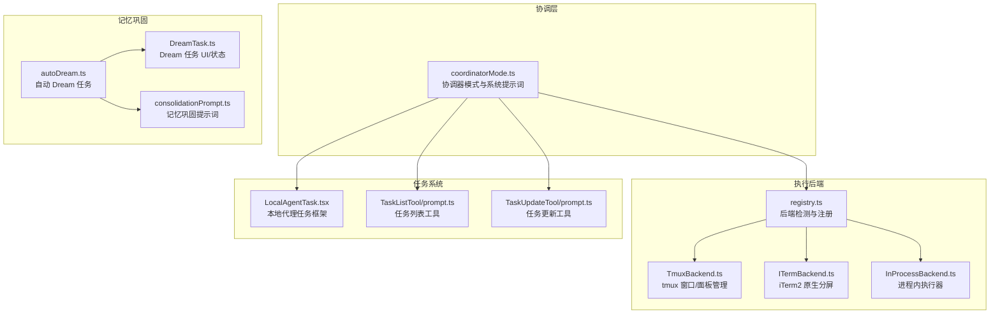
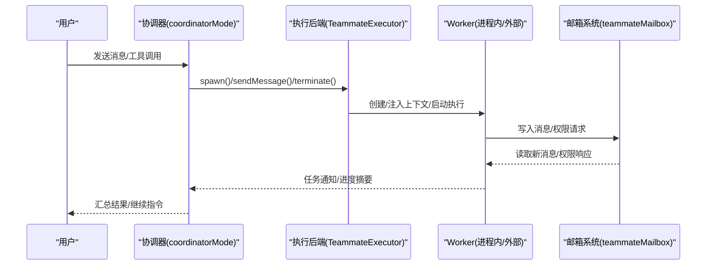
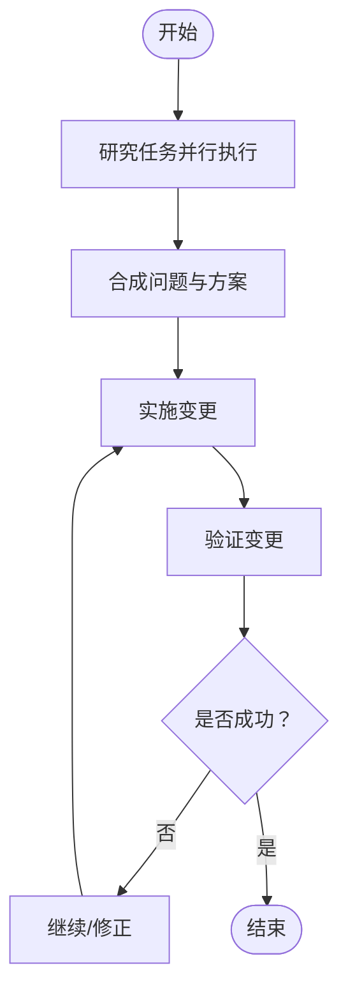
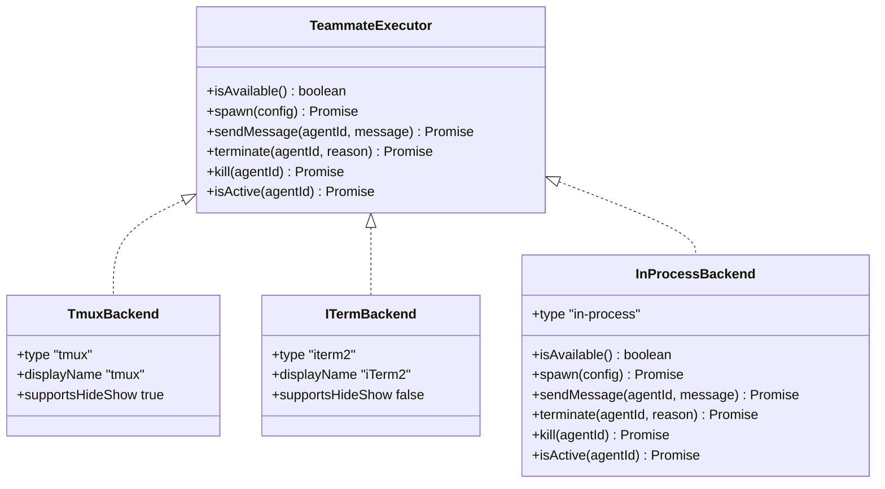
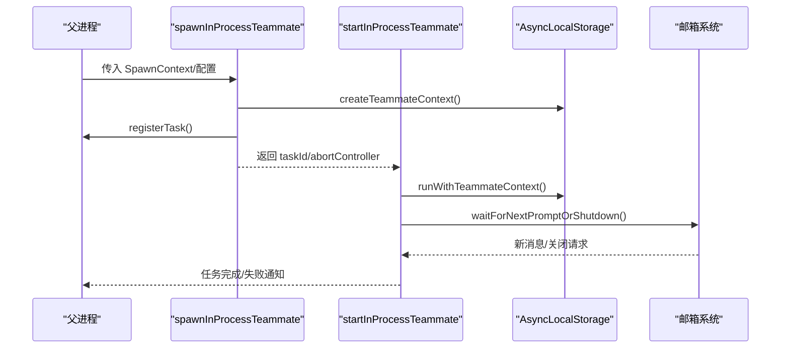
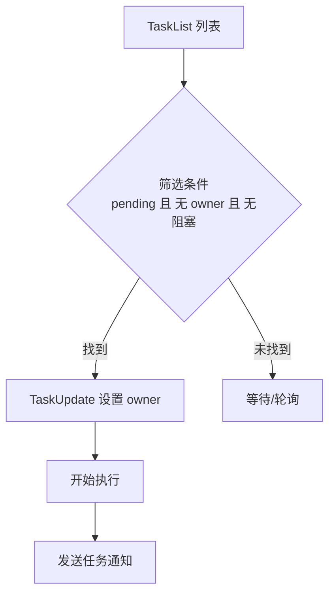
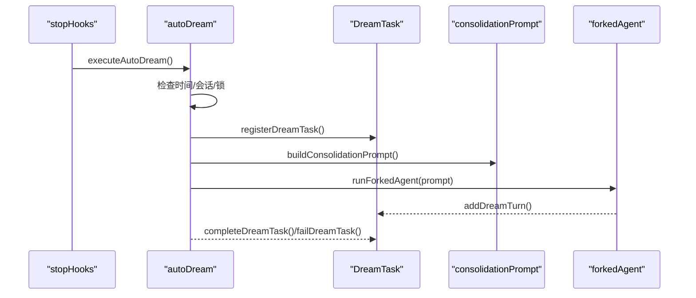
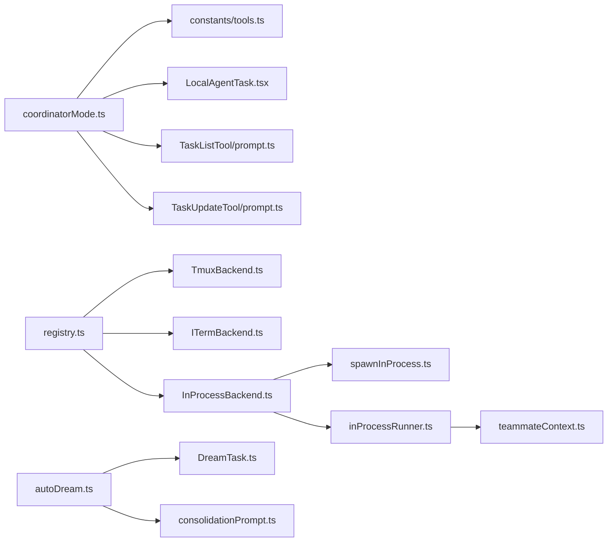

# 多代理协作

<cite>
**本文引用的文件**
- [coordinatorMode.ts](file://coordinator/coordinatorMode.ts)
- [DreamTask.ts](file://tasks/DreamTask/DreamTask.ts)
- [autoDream.ts](file://services/autoDream/autoDream.ts)
- [registry.ts](file://utils/swarm/backends/registry.ts)
- [TmuxBackend.ts](file://utils/swarm/backends/TmuxBackend.ts)
- [ITermBackend.ts](file://utils/swarm/backends/ITermBackend.ts)
- [InProcessBackend.ts](file://utils/swarm/backends/InProcessBackend.ts)
- [spawnInProcess.ts](file://utils/swarm/spawnInProcess.ts)
- [inProcessRunner.ts](file://utils/swarm/inProcessRunner.ts)
- [teammateContext.ts](file://utils/teammateContext.ts)
- [LocalAgentTask.tsx](file://tasks/LocalAgentTask/LocalAgentTask.tsx)
- [TaskListTool/prompt.ts](file://tools/TaskListTool/prompt.ts)
- [TaskUpdateTool/prompt.ts](file://tools/TaskUpdateTool/prompt.ts)
- [AgentTool/AgentTool.tsx](file://tools/AgentTool/AgentTool.tsx)
- [AgentTool/prompt.ts](file://tools/AgentTool/prompt.ts)
- [tools.ts](file://constants/tools.ts)
- [REPL.tsx](file://screens/REPL.tsx)
- [sessionRestore.ts](file://utils/sessionRestore.ts)
- [consolidationPrompt.ts](file://services/autoDream/consolidationPrompt.ts)
- [MemoryFileSelector.tsx](file://components/memory/MemoryFileSelector.tsx)
</cite>

## 目录
1. [引言](#引言)
2. [项目结构](#项目结构)
3. [核心组件](#核心组件)
4. [架构总览](#架构总览)
5. [详细组件分析](#详细组件分析)
6. [依赖关系分析](#依赖关系分析)
7. [性能考量](#性能考量)
8. [故障排除指南](#故障排除指南)
9. [结论](#结论)
10. [附录](#附录)

## 引言
本文件面向多代理协作系统，系统性阐述其架构设计、协调机制与通信协议，覆盖以下关键主题：
- 协调器模式：角色定位、工具集、工作流与并发策略
- 任务系统：任务分配、进度监控、状态流转与依赖管理
- Dream 记忆整合与后台运行：自动记忆巩固与资源约束
- 执行后端：InProcess、Tmux、iTerm2 的选择策略与实现差异
- 配置选项、权限管理与安全控制
- 负载均衡、容错与资源优化
- 复杂任务场景的应用模式与扩展方法
- 性能监控、调试与故障排除

## 项目结构
多代理协作由“协调器模式 + 多执行后端 + 任务系统 + 记忆巩固”四部分构成：
- 协调器模式：定义系统提示词、可用工具、工作流与并发策略
- 执行后端：统一抽象 TeammateExecutor，支持 InProcess、Tmux、iTerm2
- 任务系统：任务列表、任务获取、任务更新、任务停止等工具
- 记忆巩固：自动 Dream 任务，后台运行并整合记忆

**图表来源**
- [coordinatorMode.ts:111-370](file://coordinator/coordinatorMode.ts#L111-L370)
- [registry.ts:136-254](file://utils/swarm/backends/registry.ts#L136-L254)
- [TmuxBackend.ts:104-546](file://utils/swarm/backends/TmuxBackend.ts#L104-L546)
- [ITermBackend.ts:79-371](file://utils/swarm/backends/ITermBackend.ts#L79-L371)
- [InProcessBackend.ts:38-340](file://utils/swarm/backends/InProcessBackend.ts#L38-L340)
- [LocalAgentTask.tsx:270-456](file://tasks/LocalAgentTask/LocalAgentTask.tsx#L270-L456)
- [TaskListTool/prompt.ts:5-30](file://tools/TaskListTool/prompt.ts#L5-L30)
- [TaskUpdateTool/prompt.ts:26-77](file://tools/TaskUpdateTool/prompt.ts#L26-L77)
- [autoDream.ts:122-325](file://services/autoDream/autoDream.ts#L122-L325)
- [DreamTask.ts:52-158](file://tasks/DreamTask/DreamTask.ts#L52-L158)
- [consolidationPrompt.ts:10-35](file://services/autoDream/consolidationPrompt.ts#L10-L35)

**章节来源**
- [coordinatorMode.ts:111-370](file://coordinator/coordinatorMode.ts#L111-L370)
- [registry.ts:136-254](file://utils/swarm/backends/registry.ts#L136-L254)

## 核心组件
- 协调器模式与系统提示词：定义 Worker 工具集、任务工作流、并发策略与失败处理流程
- 执行后端注册与选择：按环境优先级选择 tmux、iTerm2 或进程内执行
- 进程内执行器：共享主进程资源、使用 AsyncLocalStorage 隔离上下文
- 任务系统：任务列表、任务获取、任务更新、任务停止与通知
- 自动 Dream：后台记忆巩固，按时间与会话阈值触发

**章节来源**
- [coordinatorMode.ts:29-109](file://coordinator/coordinatorMode.ts#L29-L109)
- [registry.ts:136-254](file://utils/swarm/backends/registry.ts#L136-L254)
- [InProcessBackend.ts:38-340](file://utils/swarm/backends/InProcessBackend.ts#L38-L340)
- [LocalAgentTask.tsx:270-456](file://tasks/LocalAgentTask/LocalAgentTask.tsx#L270-L456)
- [autoDream.ts:122-325](file://services/autoDream/autoDream.ts#L122-L325)

## 架构总览
多代理协作通过“协调器模式”统一调度，底层以 TeammateExecutor 抽象连接不同执行后端。协调器向 Worker 下发任务，Worker 通过邮箱系统与协调器交互；任务状态通过任务框架持久化；记忆巩固以后台任务形式运行。

**图表来源**
- [coordinatorMode.ts:111-370](file://coordinator/coordinatorMode.ts#L111-L370)
- [InProcessBackend.ts:72-143](file://utils/swarm/backends/InProcessBackend.ts#L72-L143)
- [inProcessRunner.ts:689-800](file://utils/swarm/inProcessRunner.ts#L689-L800)
- [registry.ts:425-436](file://utils/swarm/backends/registry.ts#L425-L436)

## 详细组件分析

### 协调器模式与工作流
- 角色与职责：协调器负责任务分解、并行调度、结果合成与与用户沟通
- 工具集：AgentTool、SendMessage、TaskStop、MCP 工具访问等
- 工作流阶段：研究 → 合成 → 实施 → 验证；并发策略：只读任务自由并行，写密集任务串行或分片
- 失败处理：通过 TaskStop 终止错误路径，通过 SendMessage 继续修正后的任务

**图表来源**
- [coordinatorMode.ts:198-335](file://coordinator/coordinatorMode.ts#L198-L335)

**章节来源**
- [coordinatorMode.ts:111-370](file://coordinator/coordinatorMode.ts#L111-L370)

### 执行后端与选择策略
- 后端抽象：TeammateExecutor 提供统一接口，屏蔽 tmux/iTerm2/进程内差异
- 选择策略：
  - 在 tmux 中：优先 tmux
  - 在 iTerm2 中：优先原生分屏（需要 it2 CLI），否则回退 tmux
  - 其他情况：tmux 外部会话
  - 非交互模式：强制进程内
- InProcessBackend：共享主进程资源，使用 AsyncLocalStorage 隔离上下文，支持计划模式审批与权限桥接

**图表来源**
- [registry.ts:136-254](file://utils/swarm/backends/registry.ts#L136-L254)
- [TmuxBackend.ts:104-123](file://utils/swarm/backends/TmuxBackend.ts#L104-L123)
- [ITermBackend.ts:79-108](file://utils/swarm/backends/ITermBackend.ts#L79-L108)
- [InProcessBackend.ts:38-60](file://utils/swarm/backends/InProcessBackend.ts#L38-L60)

**章节来源**
- [registry.ts:136-254](file://utils/swarm/backends/registry.ts#L136-L254)
- [InProcessBackend.ts:38-340](file://utils/swarm/backends/InProcessBackend.ts#L38-L340)

### 进程内执行器与上下文隔离
- 上下文隔离：通过 AsyncLocalStorage 保存 TeammateContext，避免全局状态冲突
- 生命周期：spawnInProcessTeammate 注册任务状态，startInProcessTeammate 驱动执行循环
- 权限与计划模式：支持计划模式审批、权限桥接与分类器自动批准
- 任务等待与中断：轮询邮箱与内存队列，支持优雅关闭与立即终止

**图表来源**
- [spawnInProcess.ts:104-216](file://utils/swarm/spawnInProcess.ts#L104-L216)
- [inProcessRunner.ts:689-800](file://utils/swarm/inProcessRunner.ts#L689-L800)
- [teammateContext.ts:59-64](file://utils/teammateContext.ts#L59-L64)

**章节来源**
- [spawnInProcess.ts:104-216](file://utils/swarm/spawnInProcess.ts#L104-L216)
- [inProcessRunner.ts:689-800](file://utils/swarm/inProcessRunner.ts#L689-L800)
- [teammateContext.ts:59-64](file://utils/teammateContext.ts#L59-L64)

### 任务系统：分配与进度监控
- 任务分配：Worker 可通过 TaskList 查看待办任务，按“无所有者且无阻塞”原则挑选，或通过 TaskUpdate 指定 owner
- 进度监控：LocalAgentTask 维护工具使用计数、token 计数与最近活动，支持摘要与 SDK 进度事件
- 通知格式：通过 XML 标签封装任务状态、结果与用量，供协调器消费

**图表来源**
- [TaskListTool/prompt.ts:15-26](file://tools/TaskListTool/prompt.ts#L15-L26)
- [TaskUpdateTool/prompt.ts:26-77](file://tools/TaskUpdateTool/prompt.ts#L26-L77)
- [LocalAgentTask.tsx:252-262](file://tasks/LocalAgentTask/LocalAgentTask.tsx#L252-L262)

**章节来源**
- [TaskListTool/prompt.ts:5-30](file://tools/TaskListTool/prompt.ts#L5-L30)
- [TaskUpdateTool/prompt.ts:26-77](file://tools/TaskUpdateTool/prompt.ts#L26-L77)
- [LocalAgentTask.tsx:252-262](file://tasks/LocalAgentTask/LocalAgentTask.tsx#L252-L262)

### Dream 记忆巩固与后台运行
- 触发条件：时间阈值（小时）、会话数量阈值、互斥锁（防止并发）
- 执行流程：注册 Dream 任务、构建巩固提示词、fork 子代理执行、增量记录进度、完成/失败通知
- UI 展示：DreamTask 状态与转储，自动记忆开关与上次运行时间

**图表来源**
- [autoDream.ts:122-325](file://services/autoDream/autoDream.ts#L122-L325)
- [DreamTask.ts:52-158](file://tasks/DreamTask/DreamTask.ts#L52-L158)
- [consolidationPrompt.ts:10-35](file://services/autoDream/consolidationPrompt.ts#L10-L35)

**章节来源**
- [autoDream.ts:122-325](file://services/autoDream/autoDream.ts#L122-L325)
- [DreamTask.ts:52-158](file://tasks/DreamTask/DreamTask.ts#L52-L158)
- [MemoryFileSelector.tsx:154-199](file://components/memory/MemoryFileSelector.tsx#L154-L199)

## 依赖关系分析
- 协调器模式依赖工具常量与系统提示词，限制允许工具集合
- 执行后端依赖环境检测与平台能力（tmux、iTerm2、it2 CLI）
- 进程内执行器依赖 AsyncLocalStorage 与邮箱系统
- 任务系统依赖任务框架与工具提示词
- Dream 任务依赖会话存储与记忆目录

**图表来源**
- [tools.ts:107-112](file://constants/tools.ts#L107-L112)
- [registry.ts:136-254](file://utils/swarm/backends/registry.ts#L136-L254)
- [InProcessBackend.ts:38-60](file://utils/swarm/backends/InProcessBackend.ts#L38-L60)
- [spawnInProcess.ts:104-216](file://utils/swarm/spawnInProcess.ts#L104-L216)
- [inProcessRunner.ts:689-800](file://utils/swarm/inProcessRunner.ts#L689-L800)
- [teammateContext.ts:59-64](file://utils/teammateContext.ts#L59-L64)
- [TaskListTool/prompt.ts:5-30](file://tools/TaskListTool/prompt.ts#L5-L30)
- [TaskUpdateTool/prompt.ts:26-77](file://tools/TaskUpdateTool/prompt.ts#L26-L77)
- [autoDream.ts:122-325](file://services/autoDream/autoDream.ts#L122-L325)
- [DreamTask.ts:52-158](file://tasks/DreamTask/DreamTask.ts#L52-L158)
- [consolidationPrompt.ts:10-35](file://services/autoDream/consolidationPrompt.ts#L10-L35)

**章节来源**
- [tools.ts:107-112](file://constants/tools.ts#L107-L112)
- [registry.ts:136-254](file://utils/swarm/backends/registry.ts#L136-L254)

## 性能考量
- 并发与吞吐：只读任务并行、写密集任务串行；合理拆分任务边界，减少锁竞争
- 资源复用：进程内执行器共享主进程 API 客户端与 MCP 连接
- I/O 优化：邮箱系统批量读取与标记已读，避免频繁磁盘扫描
- 缓存与估算：令牌计数采用估算，降低开销；自动压缩对话以控制上下文长度
- 后台任务节流：Dream 任务扫描间隔与锁机制，避免重复执行

[本节为通用指导，不直接分析具体文件]

## 故障排除指南
- 后端不可用
  - 症状：无法创建面板或分屏
  - 排查：检查 tmux 是否安装、iTerm2 是否具备 it2 CLI、非交互模式是否强制进程内
  - 参考：后端检测与错误提示
- 进程内执行异常
  - 症状：子代理被中断或无法接收消息
  - 排查：确认 AbortController 状态、AsyncLocalStorage 上下文、邮箱读取与标记
  - 参考：进程内执行器生命周期与等待循环
- 任务状态不一致
  - 症状：任务列表显示与实际不符
  - 排查：使用 TaskGet 获取最新状态，确保 TaskUpdate 正确设置 owner 与 blockedBy
  - 参考：任务分配与更新提示词
- 记忆巩固未触发
  - 症状：未按预期运行
  - 排查：检查时间阈值、会话数量阈值、锁文件状态与自动记忆开关
  - 参考：自动 Dream 触发逻辑与 UI 状态

**章节来源**
- [registry.ts:256-285](file://utils/swarm/backends/registry.ts#L256-L285)
- [inProcessRunner.ts:689-800](file://utils/swarm/inProcessRunner.ts#L689-L800)
- [TaskUpdateTool/prompt.ts:26-77](file://tools/TaskUpdateTool/prompt.ts#L26-L77)
- [autoDream.ts:122-325](file://services/autoDream/autoDream.ts#L122-L325)

## 结论
多代理协作系统通过“协调器模式 + 统一执行后端 + 任务系统 + 记忆巩固”的组合，实现了可扩展、可观测、可恢复的多代理工作流。系统在并发策略、权限管理、上下文隔离与后台任务方面提供了稳健的设计与实现，适用于复杂工程任务的分解与执行。

[本节为总结性内容，不直接分析具体文件]

## 附录

### 配置选项与环境变量
- 协调器模式开关：通过环境变量启用/禁用协调器模式，并与会话模式匹配
- 团队成员执行模式：自动/强制 tmux/进程内，受非交互模式影响
- iTerm2 与 tmux：优先级与回退策略，以及 it2 CLI 安装提示

**章节来源**
- [REPL.tsx:1742-1769](file://screens/REPL.tsx#L1742-L1769)
- [sessionRestore.ts:251-271](file://utils/sessionRestore.ts#L251-L271)
- [registry.ts:335-398](file://utils/swarm/backends/registry.ts#L335-L398)

### 工具与权限
- 协调器允许工具集：限制仅输出与代理管理工具
- 进程内权限桥接：通过 ToolUseConfirm 对话框或邮箱系统进行权限决策
- Bash 分类器自动批准：在满足条件时跳过用户交互

**章节来源**
- [tools.ts:107-112](file://constants/tools.ts#L107-L112)
- [inProcessRunner.ts:128-451](file://utils/swarm/inProcessRunner.ts#L128-L451)