# 进程内同伴系统

<cite>
**本文档引用的文件**
- [spawnInProcess.ts](file://utils/swarm/spawnInProcess.ts)
- [inProcessRunner.ts](file://utils/swarm/inProcessRunner.ts)
- [InProcessBackend.ts](file://utils/swarm/backends/InProcessBackend.ts)
- [InProcessTeammateTask.tsx](file://tasks/InProcessTeammateTask/InProcessTeammateTask.tsx)
- [types.ts](file://tasks/InProcessTeammateTask/types.ts)
- [teammateContext.ts](file://utils/teammateContext.ts)
- [teammateMailbox.ts](file://utils/teammateMailbox.ts)
- [types.ts](file://utils/swarm/backends/types.ts)
- [registry.ts](file://utils/swarm/backends/registry.ts)
- [paneBackendExecutor.ts](file://utils/swarm/backends/PaneBackendExecutor.ts)
- [sendMessageTool.ts](file://tools/SendMessageTool/SendMessageTool.ts)
- [peerAddress.ts](file://utils/peerAddress.ts)
- [prompt.ts](file://tools/SendMessageTool/prompt.ts)
- [flushGate.ts](file://bridge/flushGate.ts)
- [replBridge.ts](file://bridge/replBridge.ts)
- [messages.ts](file://utils/messages.ts)
</cite>

## 目录
1. [简介](#简介)
2. [项目结构](#项目结构)
3. [核心组件](#核心组件)
4. [架构概览](#架构概览)
5. [详细组件分析](#详细组件分析)
6. [依赖关系分析](#依赖关系分析)
7. [性能考虑](#性能考虑)
8. [故障排除指南](#故障排除指南)
9. [结论](#结论)

## 简介

进程内同伴系统是 Claude Code AI 平台中的一个关键组件，它允许在同一个 Node.js 进程中运行多个智能体（AI 代理），这些智能体可以作为团队成员协作完成复杂任务。与传统的基于终端面板的进程外同伴不同，进程内同伴通过 AsyncLocalStorage 实现上下文隔离，共享相同的内存空间和资源。

该系统的核心设计目标包括：
- **资源效率**：避免进程间通信开销，减少内存占用
- **实时协作**：支持多智能体之间的即时通信和协调
- **统一接口**：提供与进程外同伴相同的抽象接口
- **灵活管理**：支持动态启停、权限控制和状态管理

## 项目结构

进程内同伴系统主要分布在以下目录结构中：

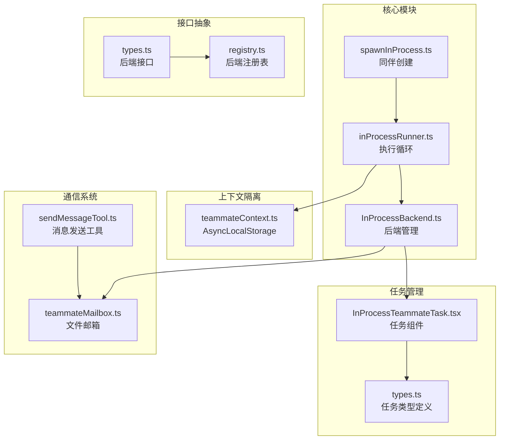

**图表来源**
- [spawnInProcess.ts:1-329](file://utils/swarm/spawnInProcess.ts#L1-L329)
- [inProcessRunner.ts:1-1553](file://utils/swarm/inProcessRunner.ts#L1-L1553)
- [InProcessBackend.ts:1-340](file://utils/swarm/backends/InProcessBackend.ts#L1-L340)

**章节来源**
- [spawnInProcess.ts:1-329](file://utils/swarm/spawnInProcess.ts#L1-L329)
- [inProcessRunner.ts:1-1553](file://utils/swarm/inProcessRunner.ts#L1-L1553)
- [InProcessBackend.ts:1-340](file://utils/swarm/backends/InProcessBackend.ts#L1-L340)

## 核心组件

### 1. 同伴创建系统

进程内同伴的创建过程涉及多个层次的抽象和管理：

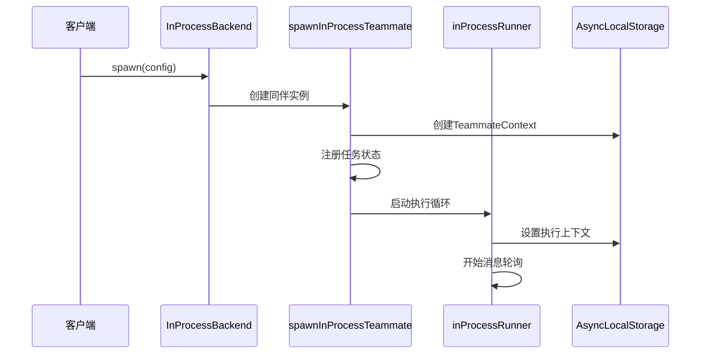

**图表来源**
- [InProcessBackend.ts:72-143](file://utils/swarm/backends/InProcessBackend.ts#L72-L143)
- [spawnInProcess.ts:104-216](file://utils/swarm/spawnInProcess.ts#L104-L216)
- [inProcessRunner.ts:883-906](file://utils/swarm/inProcessRunner.ts#L883-L906)

### 2. 执行循环系统

进程内同伴的执行采用持续轮询模式，能够响应多种类型的输入：

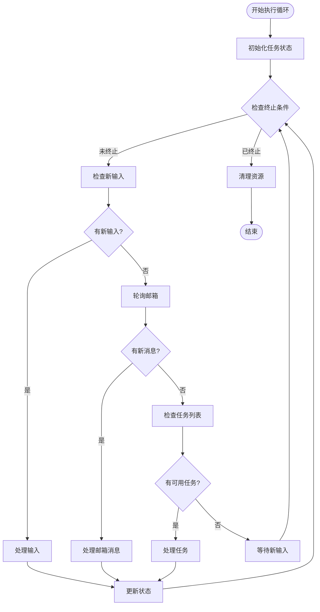

**图表来源**
- [inProcessRunner.ts:689-868](file://utils/swarm/inProcessRunner.ts#L689-L868)
- [inProcessRunner.ts:1048-1417](file://utils/swarm/inProcessRunner.ts#L1048-L1417)

### 3. 上下文隔离机制

系统使用 AsyncLocalStorage 实现多同伴的并发执行隔离：

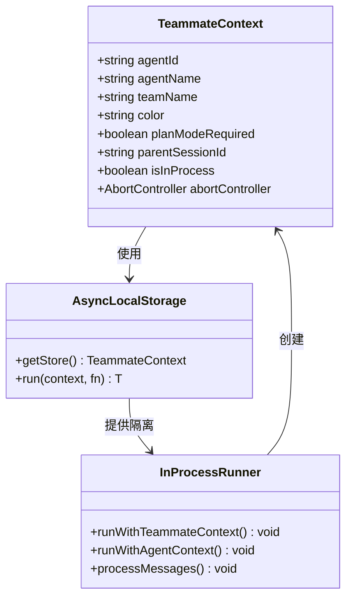

**图表来源**
- [teammateContext.ts:22-39](file://utils/teammateContext.ts#L22-L39)
- [teammateContext.ts:59-64](file://utils/teammateContext.ts#L59-L64)
- [inProcessRunner.ts:1160-1177](file://utils/swarm/inProcessRunner.ts#L1160-L1177)

**章节来源**
- [teammateContext.ts:1-97](file://utils/teammateContext.ts#L1-L97)
- [inProcessRunner.ts:1-1553](file://utils/swarm/inProcessRunner.ts#L1-L1553)

## 架构概览

进程内同伴系统采用分层架构设计，确保了模块间的清晰职责分离：

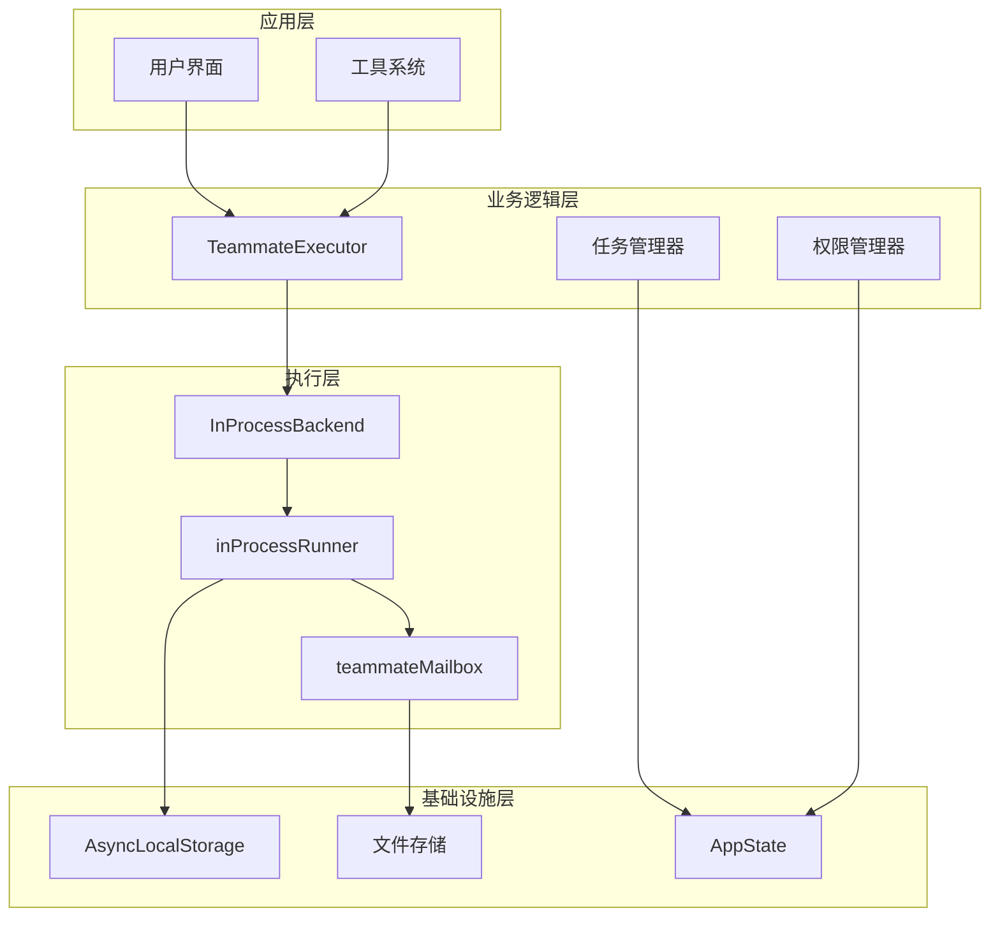

**图表来源**
- [InProcessBackend.ts:38-331](file://utils/swarm/backends/InProcessBackend.ts#L38-L331)
- [types.ts:279-300](file://utils/swarm/backends/types.ts#L279-L300)
- [registry.ts:425-436](file://utils/swarm/backends/registry.ts#L425-L436)

### 系统特性

1. **资源共享**：所有进程内同伴共享相同的 API 客户端和 MCP 连接
2. **隔离执行**：通过 AsyncLocalStorage 确保并发执行的安全性
3. **统一接口**：提供与进程外同伴相同的抽象接口
4. **消息路由**：支持跨会话通信（UDS 和远程控制）

## 详细组件分析

### 组件A：同伴创建与生命周期管理

#### 数据结构设计

进程内同伴的状态管理采用了精心设计的数据结构：

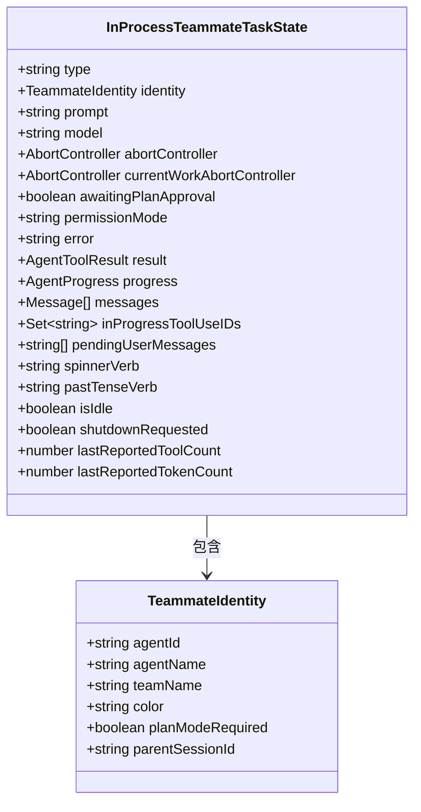

**图表来源**
- [types.ts:22-76](file://tasks/InProcessTeammateTask/types.ts#L22-L76)
- [types.ts:13-20](file://tasks/InProcessTeammateTask/types.ts#L13-L20)

#### 生命周期控制

同伴的生命周期管理包括创建、运行、暂停、恢复和销毁等阶段：

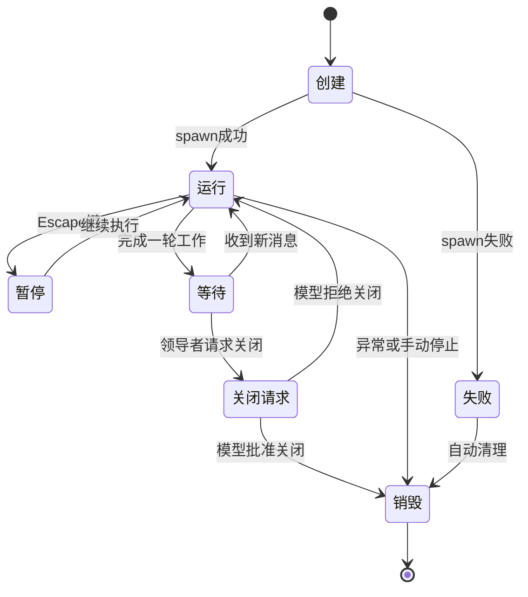

**图表来源**
- [spawnInProcess.ts:157-180](file://utils/swarm/spawnInProcess.ts#L157-L180)
- [inProcessRunner.ts:1354-1417](file://utils/swarm/inProcessRunner.ts#L1354-L1417)

**章节来源**
- [spawnInProcess.ts:1-329](file://utils/swarm/spawnInProcess.ts#L1-L329)
- [types.ts:1-122](file://tasks/InProcessTeammateTask/types.ts#L1-L122)

### 组件B：通信协议与消息传递

#### 文件邮箱系统

进程内同伴使用文件邮箱系统实现可靠的消息传递：

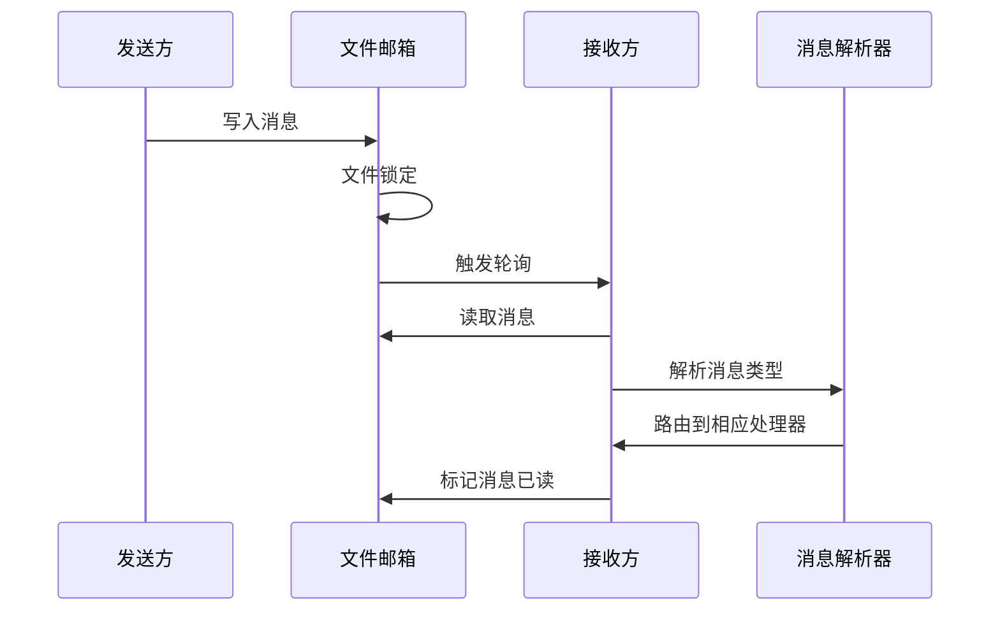

**图表来源**
- [teammateMailbox.ts:134-192](file://utils/teammateMailbox.ts#L134-L192)
- [teammateMailbox.ts:84-108](file://utils/teammateMailbox.ts#L84-L108)

#### 跨会话通信

系统支持多种通信方式，包括本地会话和远程控制：

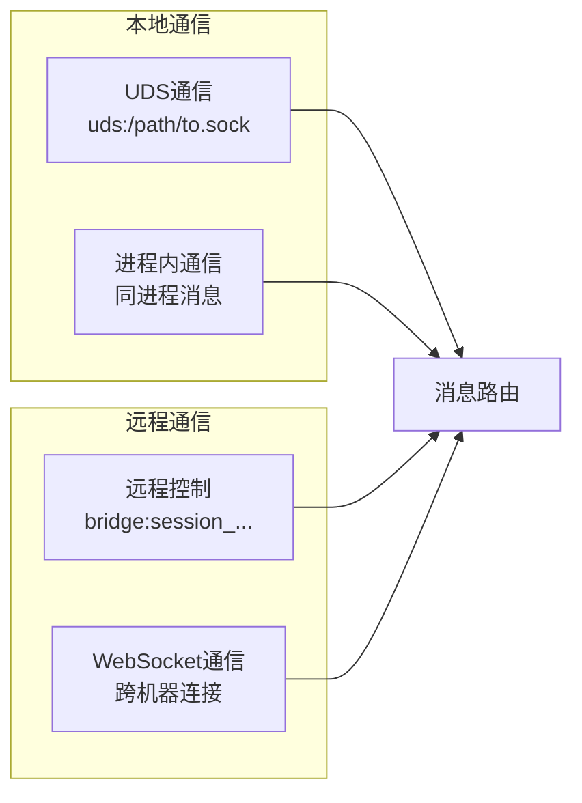

**图表来源**
- [peerAddress.ts:7-21](file://utils/peerAddress.ts#L7-L21)
- [sendMessageTool.ts:69-86](file://tools/SendMessageTool/SendMessageTool.ts#L69-L86)

**章节来源**
- [teammateMailbox.ts:1-1184](file://utils/teammateMailbox.ts#L1-L1184)
- [sendMessageTool.ts:1-769](file://tools/SendMessageTool/SendMessageTool.ts#L1-L769)
- [peerAddress.ts:1-21](file://utils/peerAddress.ts#L1-L21)

### 组件C：权限管理与安全控制

#### 权限决策流程

进程内同伴的权限管理采用多层次的决策机制：

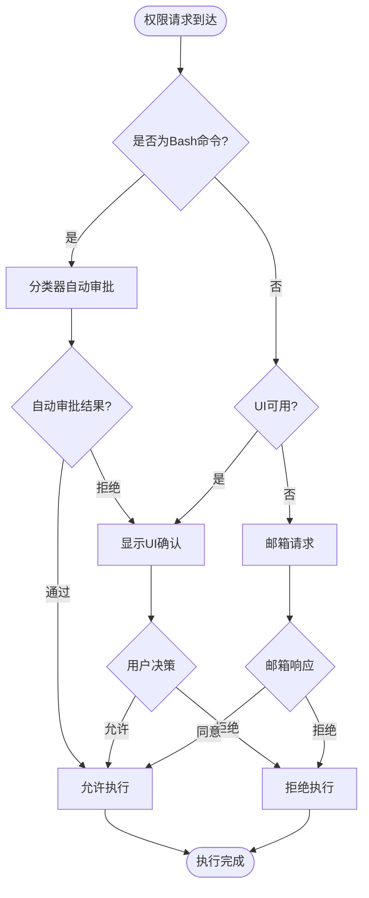

**图表来源**
- [inProcessRunner.ts:128-451](file://utils/swarm/inProcessRunner.ts#L128-L451)

#### 权限更新机制

系统支持动态权限更新，确保安全性和灵活性：

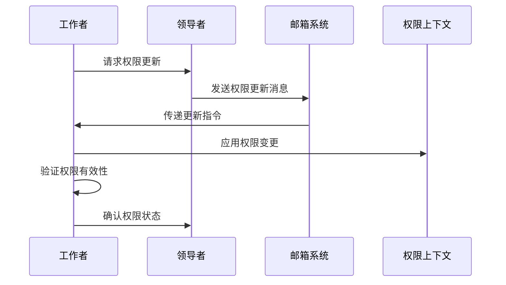

**图表来源**
- [inProcessRunner.ts:264-281](file://utils/swarm/inProcessRunner.ts#L264-L281)
- [teammateMailbox.ts:980-1013](file://utils/teammateMailbox.ts#L980-L1013)

**章节来源**
- [inProcessRunner.ts:128-451](file://utils/swarm/inProcessRunner.ts#L128-L451)
- [teammateMailbox.ts:980-1013](file://utils/teammateMailbox.ts#L980-L1013)

## 依赖关系分析

### 组件耦合度分析

进程内同伴系统展现了良好的模块化设计，各组件之间的耦合度控制得当：

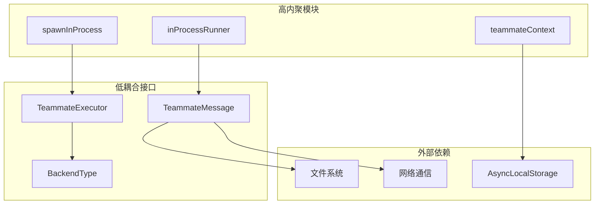

**图表来源**
- [types.ts:279-300](file://utils/swarm/backends/types.ts#L279-L300)
- [teammateContext.ts:41-42](file://utils/teammateContext.ts#L41-L42)

### 循环依赖检测

系统通过接口抽象避免了循环依赖问题：

| 组件 | 依赖方向 | 依赖组件 | 说明 |
|------|----------|----------|------|
| spawnInProcess | ↓ | inProcessRunner | 单向依赖，避免循环 |
| inProcessRunner | ↑ | spawnInProcess | 通过接口解耦 |
| InProcessBackend | ← | InProcessBackend | 自依赖，但通过工厂函数隔离 |
| teammateMailbox | → | 文件系统 | 单向数据流 |

**章节来源**
- [types.ts:1-312](file://utils/swarm/backends/types.ts#L1-L312)
- [InProcessBackend.ts:1-340](file://utils/swarm/backends/InProcessBackend.ts#L1-L340)

## 性能考虑

### 内存管理优化

进程内同伴系统采用了多项内存优化策略：

1. **消息容量限制**：UI 显示的消息数组限制为 50 条，避免内存膨胀
2. **历史压缩**：超过阈值时自动压缩对话历史
3. **增量更新**：只更新必要的状态字段
4. **资源回收**：及时释放不再使用的资源

### 并发执行优化

系统通过 AsyncLocalStorage 实现高效的并发执行：

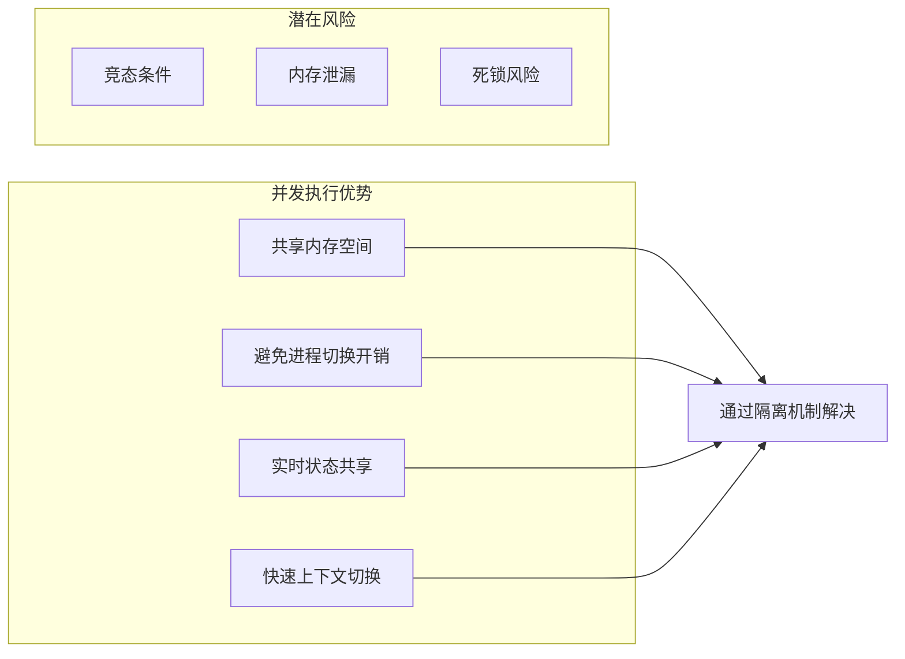

**图表来源**
- [types.ts:96-121](file://tasks/InProcessTeammateTask/types.ts#L96-L121)
- [teammateContext.ts:41-42](file://utils/teammateContext.ts#L41-L42)

### 性能监控指标

系统提供了丰富的性能监控能力：

- **令牌计数**：跟踪对话历史的令牌使用量
- **工具使用统计**：记录工具调用频率和成功率
- **执行时间测量**：监控每轮对话的处理时间
- **内存使用监控**：跟踪同伴的内存占用情况

## 故障排除指南

### 常见问题诊断

#### 1. 同伴无法启动

**症状**：spawn 调用返回失败，错误信息提示缺少上下文

**排查步骤**：
1. 检查是否正确设置了 ToolUseContext
2. 验证 AppState 的可访问性
3. 确认 AbortController 的创建状态

**解决方案**：
```typescript
// 确保在调用 spawn 前设置上下文
backend.setContext(toolUseContext);
const result = await backend.spawn(config);
```

#### 2. 消息传递失败

**症状**：同伴无法接收来自领导者的消息

**排查步骤**：
1. 检查邮箱文件是否存在且可写
2. 验证文件锁定机制是否正常工作
3. 确认消息格式符合预期

**解决方案**：
```typescript
// 检查邮箱状态
const inboxPath = getInboxPath(agentName, teamName);
const exists = await existsAsync(inboxPath);
if (!exists) {
  await ensureInboxDir(teamName);
}
```

#### 3. 权限请求超时

**症状**：同伴发起的权限请求长时间无响应

**排查步骤**：
1. 检查 UI 队列是否被正确设置
2. 验证邮箱轮询间隔设置
3. 确认权限回调函数的注册状态

**解决方案**：
```typescript
// 设置权限轮询间隔
const permissionPollInterval = 500; // ms
// 确保权限回调正确注册
registerPermissionCallback({requestId, callback});
```

### 调试工具使用

#### 1. 日志分析

系统提供了详细的日志记录机制：

```typescript
// 启用调试日志
logForDebugging(`[InProcessBackend] spawn() called for ${config.name}`);

// 分析执行流程
logForDebugging(`[inProcessRunner] ${identity.agentName} processing prompt`);
```

#### 2. 状态监控

通过 AppState 可以实时监控同伴状态：

```typescript
// 获取当前同伴状态
const state = toolUseContext.getAppState();
const task = state.tasks[taskId];
console.log(`同伴状态: ${task.status}`);
console.log(`令牌使用: ${task.progress?.tokensUsed}`);
```

#### 3. 性能分析

使用性能追踪工具分析系统瓶颈：

```typescript
// 启用 Perfetto 追踪
if (isPerfettoTracingEnabled()) {
  registerPerfettoAgent(agentId, name, parentSessionId);
}
```

**章节来源**
- [spawnInProcess.ts:204-215](file://utils/swarm/spawnInProcess.ts#L204-L215)
- [inProcessRunner.ts:1465-1533](file://utils/swarm/inProcessRunner.ts#L1465-L1533)
- [teammateMailbox.ts:98-107](file://utils/teammateMailbox.ts#L98-L107)

## 结论

进程内同伴系统通过巧妙的设计实现了高效、可靠的多智能体协作。其核心优势包括：

1. **性能卓越**：通过资源共享和上下文隔离，显著降低了执行开销
2. **功能完整**：提供了与进程外同伴相当的完整功能集
3. **易于集成**：统一的接口设计便于与其他系统组件集成
4. **可扩展性强**：模块化的架构支持功能的灵活扩展

该系统为 Claude Code AI 平台的智能体协作提供了坚实的技术基础，为未来的功能扩展和性能优化奠定了良好基础。通过持续的监控和优化，进程内同伴系统将继续为用户提供高质量的智能体协作体验。