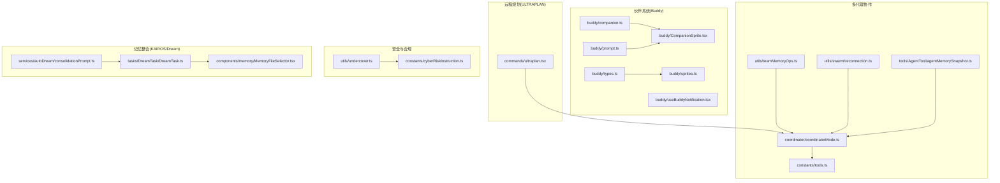
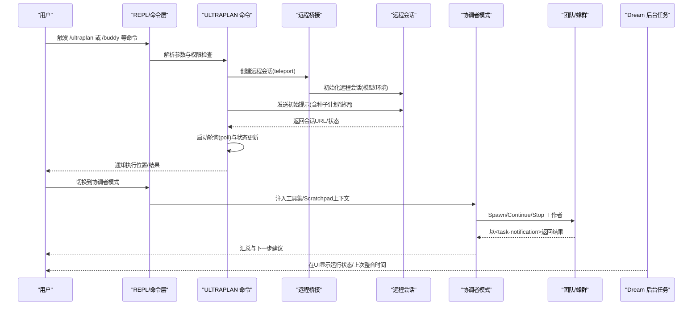
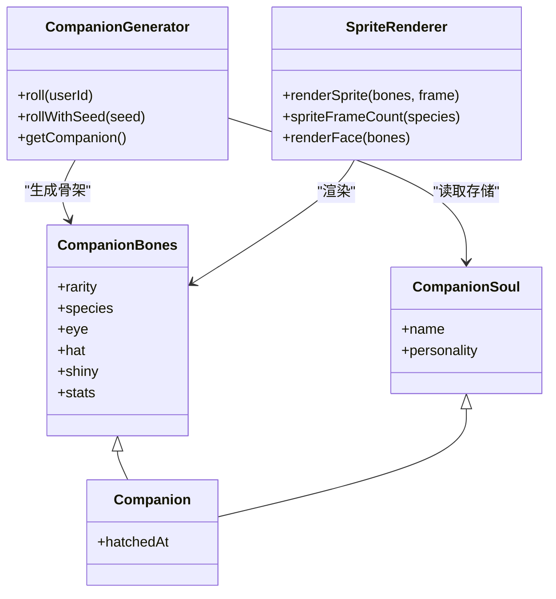
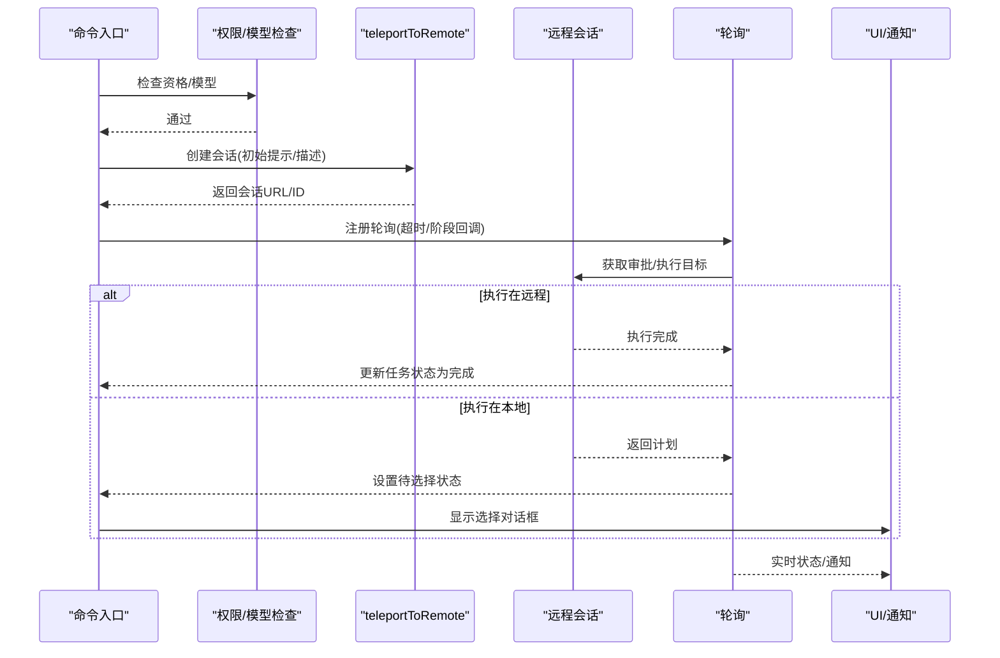
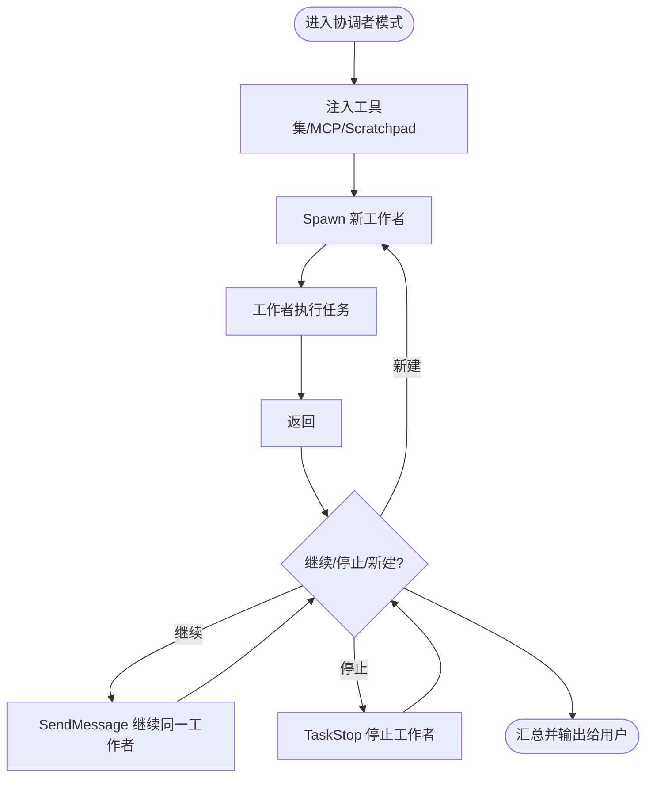
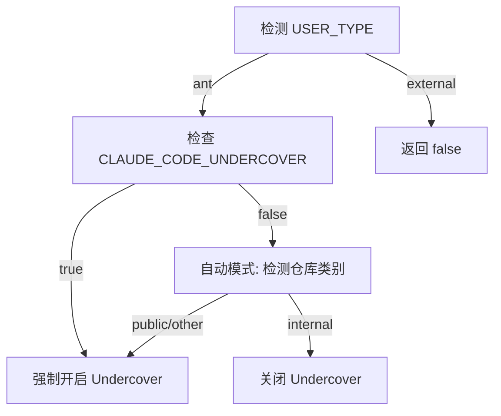
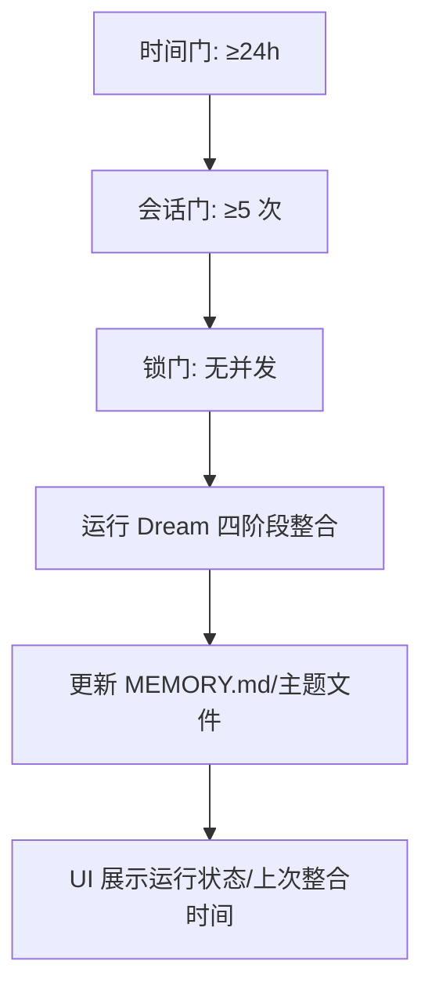
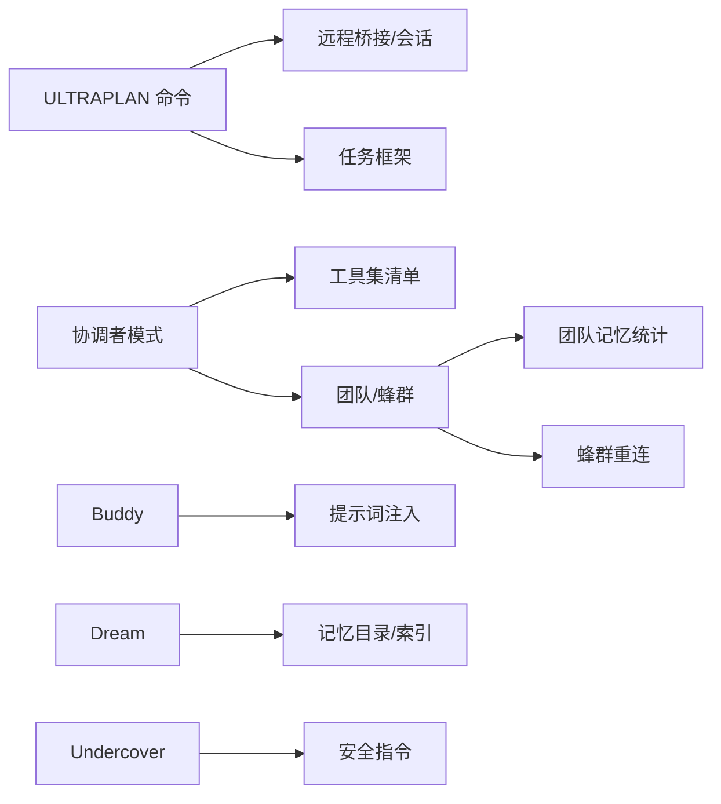

# 高级功能

<cite>
**本文引用的文件**
- [buddy/companion.ts](file://buddy/companion.ts)
- [buddy/types.ts](file://buddy/types.ts)
- [buddy/sprites.ts](file://buddy/sprites.ts)
- [buddy/prompt.ts](file://buddy/prompt.ts)
- [buddy/CompanionSprite.tsx](file://buddy/CompanionSprite.tsx)
- [buddy/useBuddyNotification.tsx](file://buddy/useBuddyNotification.tsx)
- [commands/ultraplan.tsx](file://commands/ultraplan.tsx)
- [utils/undercover.ts](file://utils/undercover.ts)
- [constants/cyberRiskInstruction.ts](file://constants/cyberRiskInstruction.ts)
- [services/autoDream/consolidationPrompt.ts](file://services/autoDream/consolidationPrompt.ts)
- [tasks/DreamTask/DreamTask.ts](file://tasks/DreamTask/DreamTask.ts)
- [components/memory/MemoryFileSelector.tsx](file://components/memory/MemoryFileSelector.tsx)
- [coordinator/coordinatorMode.ts](file://coordinator/coordinatorMode.ts)
- [constants/tools.ts](file://constants/tools.ts)
- [utils/teamMemoryOps.ts](file://utils/teamMemoryOps.ts)
- [utils/swarm/reconnection.ts](file://utils/swarm/reconnection.ts)
- [tools/AgentTool/agentMemorySnapshot.ts](file://tools/AgentTool/agentMemorySnapshot.ts)
- [README.md](file://README.md)
</cite>

## 目录
1. [简介](#简介)
2. [项目结构](#项目结构)
3. [核心组件](#核心组件)
4. [架构总览](#架构总览)
5. [详细组件分析](#详细组件分析)
6. [依赖分析](#依赖分析)
7. [性能考虑](#性能考虑)
8. [故障排除指南](#故障排除指南)
9. [结论](#结论)
10. [附录](#附录)

## 简介
本文件面向高级用户与开发者，系统化梳理 Claude Code 的高级能力：Buddy 伙伴系统、KAIROS 持续助手（Dream 自动记忆整合）、ULTRAPLAN 远程规划、多代理协作（协调者模式与团队/蜂群），以及 Undercover 安全模式与企业级应用实践。文档从架构、数据流、处理逻辑、集成关系、性能优化与故障排除等维度进行深入说明，并提供可操作的配置与定制建议。

## 项目结构
高级功能主要分布在以下模块：
- Buddy 伙伴系统：buddy 目录下的类型定义、生成与渲染逻辑，以及与消息系统的集成提示词。
- ULTRAPLAN 远程规划：commands/ultraplan.tsx 提供命令入口、远程会话创建、轮询与结果落地。
- 多代理协作：coordinator/coordinatorMode.ts 定义协调者模式；constants/tools.ts 限制/允许工具集；utils/teamMemoryOps.ts 团队记忆统计；utils/swarm/reconnection.ts 蜂群重连上下文。
- Undercover 安全模式：utils/undercover.ts 与 constants/cyberRiskInstruction.ts 提供安全指令与自动模式判定。
- KAIROS/Dream 记忆整合：services/autoDream/consolidationPrompt.ts 与 tasks/DreamTask/DreamTask.ts 构成后台记忆整合任务；components/memory/MemoryFileSelector.tsx 展示状态与运行时信息。

图表来源
- [buddy/companion.ts:1-134](file://buddy/companion.ts#L1-L134)
- [buddy/sprites.ts:1-515](file://buddy/sprites.ts#L1-L515)
- [buddy/prompt.ts:1-36](file://buddy/prompt.ts#L1-L36)
- [buddy/CompanionSprite.tsx:187-259](file://buddy/CompanionSprite.tsx#L187-L259)
- [commands/ultraplan.tsx:1-471](file://commands/ultraplan.tsx#L1-L471)
- [coordinator/coordinatorMode.ts:1-370](file://coordinator/coordinatorMode.ts#L1-L370)
- [constants/tools.ts:90-112](file://constants/tools.ts#L90-L112)
- [utils/teamMemoryOps.ts:38-88](file://utils/teamMemoryOps.ts#L38-L88)
- [utils/swarm/reconnection.ts:36-89](file://utils/swarm/reconnection.ts#L36-L89)
- [tools/AgentTool/agentMemorySnapshot.ts:39-197](file://tools/AgentTool/agentMemorySnapshot.ts#L39-L197)
- [utils/undercover.ts:1-90](file://utils/undercover.ts#L1-L90)
- [constants/cyberRiskInstruction.ts:1-24](file://constants/cyberRiskInstruction.ts#L1-L24)
- [services/autoDream/consolidationPrompt.ts:1-66](file://services/autoDream/consolidationPrompt.ts#L1-L66)
- [tasks/DreamTask/DreamTask.ts:1-23](file://tasks/DreamTask/DreamTask.ts#L1-L23)
- [components/memory/MemoryFileSelector.tsx:154-199](file://components/memory/MemoryFileSelector.tsx#L154-L199)

章节来源
- [README.md:172-198](file://README.md#L172-L198)
- [README.md:252-272](file://README.md#L252-L272)

## 核心组件
- Buddy 伙伴系统：基于用户标识的确定性生成与存储分离策略，保证跨版本兼容；通过渲染器与动画帧实现动态外观；在消息系统中注入“同伴介绍”附件以避免重复播报。
- ULTRAPLAN 远程规划：提供“远程计划+审批执行”的工作流，支持本地/远程两种执行路径；具备超时控制、轮询状态更新、失败清理与通知。
- 协调者模式与多代理协作：定义协调者角色、工具集限制、Scratchpad 共享区、任务生命周期与错误处理；支持团队/蜂群上下文初始化与重连。
- Undercover 安全模式：自动检测公共仓库并屏蔽内部信息泄露；提供安全指令与一次性提示对话框。
- KAIROS/Dream 记忆整合：三门限触发（时间、会话数、锁）+ 四阶段整合流程；后台子代理运行，UI 展示运行状态与最近一次整合时间。

章节来源
- [buddy/companion.ts:107-134](file://buddy/companion.ts#L107-L134)
- [buddy/sprites.ts:454-473](file://buddy/sprites.ts#L454-L473)
- [buddy/prompt.ts:15-36](file://buddy/prompt.ts#L15-L36)
- [commands/ultraplan.tsx:74-181](file://commands/ultraplan.tsx#L74-L181)
- [coordinator/coordinatorMode.ts:36-109](file://coordinator/coordinatorMode.ts#L36-L109)
- [utils/undercover.ts:28-90](file://utils/undercover.ts#L28-L90)
- [services/autoDream/consolidationPrompt.ts:10-66](file://services/autoDream/consolidationPrompt.ts#L10-L66)
- [tasks/DreamTask/DreamTask.ts:11-23](file://tasks/DreamTask/DreamTask.ts#L11-L23)
- [components/memory/MemoryFileSelector.tsx:154-199](file://components/memory/MemoryFileSelector.tsx#L154-L199)

## 架构总览
下图展示高级功能之间的交互关系与数据流：

图表来源
- [commands/ultraplan.tsx:314-410](file://commands/ultraplan.tsx#L314-L410)
- [coordinator/coordinatorMode.ts:80-109](file://coordinator/coordinatorMode.ts#L80-L109)
- [tasks/DreamTask/DreamTask.ts:11-23](file://tasks/DreamTask/DreamTask.ts#L11-L23)

## 详细组件分析

### Buddy 伙伴系统
- 数据结构与生成
  - 稀有度权重、属性名、外观部件集合均集中于 types.ts；companion.ts 使用确定性哈希与种子生成器，按用户ID生成“骨架”(bones)，再合并存储的灵魂(soul)得到完整伙伴。
  - 渲染：sprites.ts 将骨架映射为 5 行 12 列字符画，支持眨眼、帽子、多帧闲适动画；CompanionSprite.tsx 根据终端宽度选择单行表情或完整精灵，并根据互动状态切换帧与气泡。
  - 提示词：prompt.ts 在首次出现时注入“同伴介绍”附件，避免重复播报。
- 集成点
  - 与消息系统：通过附件类型“companion_intro”传递同伴信息。
  - 与 UI：CompanionSprite.tsx 响应焦点、反应、抚摸等事件，动态更新帧与气泡。
- 配置与定制
  - 可通过全局配置开关静音、调整外观部件与稀有度权重。
  - 通过提示词扩展同伴个性与对话风格。

图表来源
- [buddy/types.ts:100-149](file://buddy/types.ts#L100-L149)
- [buddy/companion.ts:86-134](file://buddy/companion.ts#L86-L134)
- [buddy/sprites.ts:454-515](file://buddy/sprites.ts#L454-L515)

章节来源
- [buddy/companion.ts:1-134](file://buddy/companion.ts#L1-L134)
- [buddy/types.ts:1-149](file://buddy/types.ts#L1-L149)
- [buddy/sprites.ts:1-515](file://buddy/sprites.ts#L1-L515)
- [buddy/prompt.ts:1-36](file://buddy/prompt.ts#L1-L36)
- [buddy/CompanionSprite.tsx:187-259](file://buddy/CompanionSprite.tsx#L187-L259)
- [buddy/useBuddyNotification.tsx:38-97](file://buddy/useBuddyNotification.tsx#L38-L97)

### ULTRAPLAN 远程规划
- 流程概览
  - 权限与模型选择：读取特性门禁与模型配置，构建初始提示(支持种子计划与说明)。
  - 远程会话：teleportToRemote 创建远程会话，记录会话URL并注册远程任务。
  - 轮询与状态：启动独立轮询线程，更新任务状态与UI阶段；远程执行则直接完成，本地执行则弹出选择对话框。
  - 错误处理：捕获异常、清理孤儿会话、清除URL并发出通知。
- 关键参数
  - 超时：30 分钟；模型：通过特性门禁选择 Opus 系列。
  - 术语：提供 Terms URL 引导合规使用。
- 集成点
  - 与远程桥接：teleport/remote session lifecycle。
  - 与任务框架：registerRemoteAgentTask/updateTaskState。
  - 与通知：enqueuePendingNotification。

图表来源
- [commands/ultraplan.tsx:314-410](file://commands/ultraplan.tsx#L314-L410)
- [commands/ultraplan.tsx:74-181](file://commands/ultraplan.tsx#L74-L181)

章节来源
- [commands/ultraplan.tsx:1-471](file://commands/ultraplan.tsx#L1-L471)

### 多代理协作（协调者模式与团队/蜂群）
- 协调者模式
  - 激活条件：特性门禁与环境变量；匹配会话模式以恢复正确状态。
  - 上下文注入：向工作者暴露工具集、MCP 客户端与 Scratchpad 目录。
  - 工作流：研究-合成-实现-验证；并发原则与错误处理；任务生命周期管理。
- 工具集限制
  - COORDINATOR_MODE_ALLOWED_TOOLS 限定协调者可用工具，避免递归与冲突。
- 团队/蜂群
  - 团队记忆统计：appendTeamMemorySummaryParts 统计读/搜/写次数并生成自然语言片段。
  - 重连上下文：initializeTeammateContextFromSession 从会话恢复团队上下文。
  - Agent 内存快照：replaceFromSnapshot/markSnapshotSynced 支持项目级快照同步与标记。

图表来源
- [coordinator/coordinatorMode.ts:80-109](file://coordinator/coordinatorMode.ts#L80-L109)
- [constants/tools.ts:90-112](file://constants/tools.ts#L90-L112)
- [utils/teamMemoryOps.ts:38-88](file://utils/teamMemoryOps.ts#L38-L88)
- [utils/swarm/reconnection.ts:75-89](file://utils/swarm/reconnection.ts#L75-L89)
- [tools/AgentTool/agentMemorySnapshot.ts:164-197](file://tools/AgentTool/agentMemorySnapshot.ts#L164-L197)

章节来源
- [coordinator/coordinatorMode.ts:1-370](file://coordinator/coordinatorMode.ts#L1-L370)
- [constants/tools.ts:90-112](file://constants/tools.ts#L90-L112)
- [utils/teamMemoryOps.ts:38-88](file://utils/teamMemoryOps.ts#L38-L88)
- [utils/swarm/reconnection.ts:36-89](file://utils/swarm/reconnection.ts#L36-L89)
- [tools/AgentTool/agentMemorySnapshot.ts:39-197](file://tools/AgentTool/agentMemorySnapshot.ts#L39-L197)

### Undercover 安全模式与企业级应用
- 自动模式判定
  - CLAUDE_CODE_UNDERCOVER=1 强制开启；否则自动模式除非命中内部仓库白名单，否则默认开启。
  - USER_TYPE === 'ant' 时才启用；外部构建下函数体被死代码消除。
- 安全指令
  - CYBER_RISK_INSTRUCTION 明确授权范围与禁止项，确保安全测试与防御性安全辅助边界清晰。
- 企业应用要点
  - 在公共/开源仓库默认启用 Undercover，避免内部信息泄露。
  - 结合权限与审计日志，对远程执行与工具调用进行最小授权。

图表来源
- [utils/undercover.ts:28-90](file://utils/undercover.ts#L28-L90)
- [constants/cyberRiskInstruction.ts:1-24](file://constants/cyberRiskInstruction.ts#L1-L24)

章节来源
- [utils/undercover.ts:1-90](file://utils/undercover.ts#L1-L90)
- [constants/cyberRiskInstruction.ts:1-24](file://constants/cyberRiskInstruction.ts#L1-L24)

### KAIROS/Dream 记忆整合与后台运行
- 触发机制
  - 三门限：时间门(≥24h)、会话门(≥5 次)、锁门(无并发)。
- 四阶段整合
  - Orient/Gather/Consolidate/Prune and Index；严格遵循提示词顺序与约束。
- 后台任务
  - DreamTask.ts 将后台子代理纳入任务面板；MemoryFileSelector.tsx 展示运行状态与上次整合时间。
- 配置与定制
  - 调整门限阈值与索引大小限制；自定义额外上下文附加段落。

图表来源
- [services/autoDream/consolidationPrompt.ts:10-66](file://services/autoDream/consolidationPrompt.ts#L10-L66)
- [tasks/DreamTask/DreamTask.ts:11-23](file://tasks/DreamTask/DreamTask.ts#L11-L23)
- [components/memory/MemoryFileSelector.tsx:154-199](file://components/memory/MemoryFileSelector.tsx#L154-L199)

章节来源
- [README.md:172-198](file://README.md#L172-L198)
- [services/autoDream/consolidationPrompt.ts:1-66](file://services/autoDream/consolidationPrompt.ts#L1-L66)
- [tasks/DreamTask/DreamTask.ts:1-23](file://tasks/DreamTask/DreamTask.ts#L1-L23)
- [components/memory/MemoryFileSelector.tsx:154-199](file://components/memory/MemoryFileSelector.tsx#L154-L199)

## 依赖分析
- 组件耦合
  - ULTRAPLAN 依赖远程桥接与任务框架；与模型配置/特性门禁强耦合。
  - 协调者模式依赖工具集清单与 MCP 客户端；与团队记忆统计/蜂群重连协同。
  - Buddy 依赖全局配置与提示词注入；渲染器与类型系统解耦。
  - Undercover 依赖仓库类别缓存与环境变量；安全指令作为常量注入。
  - Dream 依赖记忆目录与索引文件；UI 仅负责展示。
- 外部依赖
  - 特性门禁(GrowthBook)用于动态开关；远程会话通过桥接层管理。
  - 日志与通知系统贯穿各模块，统一事件上报与用户提示。

图表来源
- [commands/ultraplan.tsx:314-410](file://commands/ultraplan.tsx#L314-L410)
- [coordinator/coordinatorMode.ts:80-109](file://coordinator/coordinatorMode.ts#L80-L109)
- [constants/tools.ts:90-112](file://constants/tools.ts#L90-L112)
- [utils/teamMemoryOps.ts:38-88](file://utils/teamMemoryOps.ts#L38-L88)
- [utils/swarm/reconnection.ts:75-89](file://utils/swarm/reconnection.ts#L75-L89)
- [buddy/prompt.ts:15-36](file://buddy/prompt.ts#L15-L36)
- [services/autoDream/consolidationPrompt.ts:10-66](file://services/autoDream/consolidationPrompt.ts#L10-L66)
- [utils/undercover.ts:28-90](file://utils/undercover.ts#L28-L90)
- [constants/cyberRiskInstruction.ts:1-24](file://constants/cyberRiskInstruction.ts#L1-L24)

## 性能考虑
- Buddy
  - 确定性生成与缓存：roll(userId) 缓存最近一次结果，降低重复计算开销。
  - 渲染优化：帧数与眨眼逻辑按帧率节拍更新，避免高频重绘。
- ULTRAPLAN
  - 超时与轮询：30 分钟超时避免长时间挂起；轮询回调仅在状态变化时更新 UI，减少冗余刷新。
  - 远程执行：远程执行直接完成，避免本地等待与对话框开销。
- 协调者模式
  - 并发策略：读取类任务并行、写密集任务串行，验证任务与不同文件区域并行，提升吞吐。
  - 工具集裁剪：仅暴露必要工具，降低上下文与权限检查成本。
- Dream
  - 三门限触发：避免频繁整合；索引维护限制行数与体积，保持检索效率。
- Undercover
  - 环境分支：外部构建下函数体被消除，避免运行时开销。

章节来源
- [buddy/companion.ts:107-113](file://buddy/companion.ts#L107-L113)
- [buddy/sprites.ts:454-473](file://buddy/sprites.ts#L454-L473)
- [commands/ultraplan.tsx:23-34](file://commands/ultraplan.tsx#L23-L34)
- [coordinator/coordinatorMode.ts:211-219](file://coordinator/coordinatorMode.ts#L211-L219)
- [services/autoDream/consolidationPrompt.ts:53-61](file://services/autoDream/consolidationPrompt.ts#L53-L61)
- [utils/undercover.ts:18-22](file://utils/undercover.ts#L18-L22)

## 故障排除指南
- ULTRAPLAN
  - 现象：无法启动/卡住
  - 排查：检查权限资格、模型门禁、teleport 成功与否；查看会话URL是否设置；确认轮询是否因任务被停止而提前退出。
  - 处理：清理会话URL、重新发起；若出现孤儿会话，调用归档接口。
- 协调者模式
  - 现象：工作者无响应/状态不更新
  - 排查：确认工具集是否受限；检查 Scratchpad 是否启用；核对任务ID与继续/停止调用。
  - 处理：使用 TaskStop 停止错误工作者；通过 SendMessage 修正指令后继续。
- Buddy
  - 现象：不显示/不说话
  - 排查：确认 BUDDY 特性门禁开启；检查全局配置静音标志；确认提示词注入是否已发送。
  - 处理：重新触发提示词注入；检查终端宽度与动画帧。
- Dream
  - 现象：未触发/索引过大
  - 排查：检查三门限是否满足；确认上次整合时间；检查索引文件行数与体积。
  - 处理：等待门限满足；手动触发整合；精简索引内容。
- Undercover
  - 现象：仍泄漏内部信息
  - 排查：确认 USER_TYPE 与环境变量；检查仓库类别缓存；核对安全指令是否生效。
  - 处理：强制开启 Undercover；在公共仓库中避免提及内部信息。

章节来源
- [commands/ultraplan.tsx:183-223](file://commands/ultraplan.tsx#L183-L223)
- [coordinator/coordinatorMode.ts:229-238](file://coordinator/coordinatorMode.ts#L229-L238)
- [buddy/prompt.ts:15-36](file://buddy/prompt.ts#L15-L36)
- [services/autoDream/consolidationPrompt.ts:53-61](file://services/autoDream/consolidationPrompt.ts#L53-L61)
- [utils/undercover.ts:28-90](file://utils/undercover.ts#L28-L90)

## 结论
Claude Code 的高级功能围绕“人机协作—多代理—持续学习—安全合规”展开：Buddy 提升交互体验，ULTRAPLAN 实现远程规划与执行，协调者模式与团队/蜂群支撑复杂任务编排，Dream 实现知识沉淀与索引维护，Undercover 确保企业级安全边界。通过特性门禁、任务框架与统一通知体系，这些能力在保证稳定性的同时提供了高度可定制与可观测性。

## 附录
- 配置与定制建议
  - Buddy：调整稀有度权重、外观部件与提示词；在 UI 中启用/禁用。
  - ULTRAPLAN：根据团队 SLA 调整超时与模型；在合规范围内使用 Terms URL。
  - 协调者模式：按项目需求裁剪工具集；启用 Scratchpad 以共享跨工作者知识。
  - Dream：根据项目规模调整门限；定期审查索引质量。
  - Undercover：在 CI/CD 中预设环境变量；结合安全扫描规则。